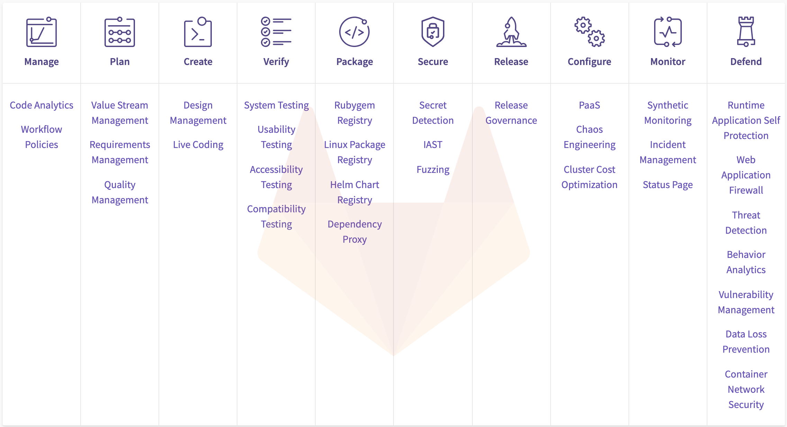

## On this page
{:.no_toc .hidden-md .hidden-lg}

- TOC
{:toc .hidden-md .hidden-lg}

## Acquisition approach
We are open to acquisitions of companies which are interested in joining in our mission to change all creative work from read-only to read-write so that **everyone can contribute**. Our acquisition approach offers a soft landing for your team in GitLab and an opportunity to expand the reach of your technology rather than an "exit" for your company.
Below are a set of criteria and considerations to take into account as you think about what it might look like joining this mission:

## Acquisition strategy
GitLab's goal in pursuing acquisitions:
1. Introduce new product categories and mature early categories faster by acquiring a company with a team that had already built a great product and have the team repeat that in GitLab

Possible benefits:
1. Strengthen our value prop in product categories with high growth and where profits will turn up in the future
1. Influence market perception and create a PR opportunity
1. Win new customers and gain penetration to key accounts

## Acquisition target profile
Below is a set of general, yet not strict, criteria the GitLab acquisition team will work according to when pursuing likely acquisition targets:
1. Located in EMEA
1. Raised under $10M total investment funds, last round being over 3 years ago
1. Team size under 10 people
1. Engineers that meet our [standard hiring guidelines](/job-families/engineering/backend-engineer/)
1. Last YOY growth is low double digits or less, preferably under 30%
1. Must add features or functionalities to GitLab which are on our
[roadmap](/direction/)
1. Ideally bring a solution which accelerates our maturity in a product category
according to our [category maturity](/direction/maturity/) or fits into the [new categories on our roadmap](/direction/new-categories/):

    

1. Built a great product but is missing distribution
1. Willing to [reimplement products into GitLab](/handbook/product/single-application/) in Ruby and Go
1. Willing to sunset old customers within 90 days or less with an option to transition to GitLab. GitLab follows an [open-core model](/install/ce-or-ee/)
1. Aligned to ship on the first month and iterate quickly
1. Founders are integral to the deal

## Considering joining forces with GitLab
1. Please read through our [handbook](/handbook) in detail.
1. [Remote culture](/company/culture/all-remote/) - spend the time understanding if a remote culture is right for you and your team.

## Why join GitLab?
1. Quick transaction - We move fast and aim to close the deal in 1-2 months, money wired in 30 days
1. We take care of people who won't work at GitLab - Every employee will have a soft landing. We will either make them an offer or we will pay up to 3 months or until they find a new job.
1. Reach millions of users - did you build a great product but missing distribution? We can ensure what you made will be used by more than 100,000 organizations and millions of users.
1. Upside - Financial outcome if GitLab is successful (GitLab stock)
1. Your team is in good company - GitLab is a unique place to work at with a
leading product and a fascinating culture.

## What we offer
1. The **total purchase price** of an acquisition will be **up to $1M** (all cash) plus attractive equity for founders, comprised of:
   1. Retention bonuses - We believe talent follows leadership they trust. GitLab will offer cash retention bonus for founders, and engineers, to help in the transition and conditional on employee interviews and offer acceptance:
      1. Each founder with more than 10% ownership of the company will receive up to $250,000 paid as follows: 20% at closing, 40% on the first anniversary of the closing and 40% on the second anniversary of the closing
      1. Each engineer will receive up to $60,000 paid as follows: 20% at closing, 40% on the first anniversary of the closing and 40% on the second anniversary of the closing.
   1. Assets payout - Where relevant, an all-cash payout for the assets in the deal may be included. GitLab stock will not be offered for the assets in the deal.
   1. Triple our normal [stock option grants](https://about.gitlab.com/handbook/stock-options/) for founders
1. Normal cash and [stock option grants](https://about.gitlab.com/handbook/stock-options/) for non-founders
1. Cash bonus on achieving milestones for customer transition to paid GitLab agreements, where relevant

## What happens to your current company?
1. We follow an **asset purchase** and not a stock purchase in order to limit unexpected liabilities
1. We want to ensure a graceful shutdown - we will pay to shut down the entity including paying outstanding bills up to 2 times the estimated amount.

## Post acquisition
1. Decompression retreat to help the new team reflect on the wild ride of winding down a company and joining a new one.
1. Hear from the founders of our previous acquisitions:

  **Andrew Newdigate**, “Throughout Gitter's acquisition process, GitLab was an excellent partner. We started the process in mid-December, and by mid-January, the team were onboard and had joined GitLab's summit in Cancún, Mexico. Compared to previous acquisition attempts that we had been through with other companies, the professionalism and focus of the GitLab team was refreshing. It quickly became apparent to me that Sid, Paul and the team at GitLab were interested in striking a fair deal, and were as concerned about the outcome for the Gitter team as my co-founder and I were. In the year-and-half since, GitLab has continued to be a great home for Gitter and I'm incredibly proud to be part of the team.”

  **Philippe Lafoucrière**, "When GitHub announced they would provide a Security graph and alerts, we knew we would not be able to compete with them. That meant the end of the story for us and our product. It was time to find a new home for the team. We started discussions with GitLab in November 2017 and officially joined the company in mid-January 2018. The whole process was seamless, with a particular care for the team. Expectations from both sides were discussed, with mutual respect and understanding.
  The founders made themselves available for us at anytime, and we had regular meetings for several months until we all estimated the situation stable enough. Onboarding a whole team at once is a challenge: the peopleops team did everything they could to help and to make them feel comfortable with their new positions. They were happy to continue on the foundations we’ve built over the years while being able to contribute to a greater goal. We managed to identify with the management where we could have the best impact, and provide results as soon as possible.
  I don’t see anything GitLab could have done differently to make this acquisition smoother. The most important value to follow in this kind of event is Trust (because you can only lose it once). GitLab, and especially its CEO, was incredibly clear and respectful during all the process and beyond."

  **[Gemnasium: Our GitLab journey](/blog/2019/04/30/gemnasium-our-gitlab-journey/)**

## Keys to successful acquisitions
1. Managing people’s expectations and concerns
1. Successful integration execution
1. Maintain a non-biased view on target companies’ value

## Starting an acquisition discussion with GitLab
If you are interested in starting acquisition discussions with GitLab, please send an email to [Corporate Development](acquisitions@gitlab.com) to connect and start the process. It's important to add that we're open to other types of acquisitions, aside from softlandings, and would be happy to engage in those conversations.

<iframe width="560" height="315" src="https://www.youtube.com/embed/hcAaD3ujlqc" frameborder="0" allow="accelerometer; autoplay; encrypted-media; gyroscope; picture-in-picture" allowfullscreen></iframe>

## Acquisition process
Learn more about our internal [acquisition process](/handbook/acquisitions/acquisition-process) and how you can prepare for an efficient process.

## Performance indicators
See our [performance indicators](/handbook/acquisitions/performance-indicators/).

## Contact us
For additional information contact [Corporate Development](acquisitions@gitlab.com).
