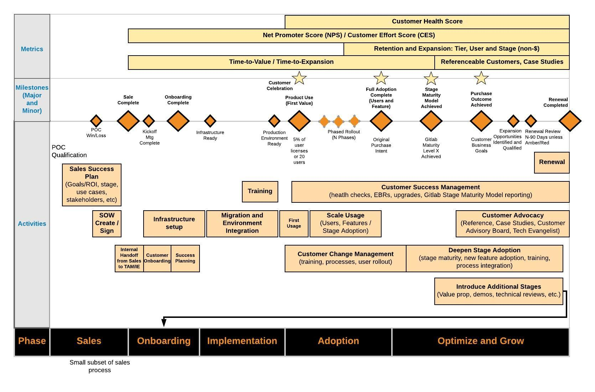
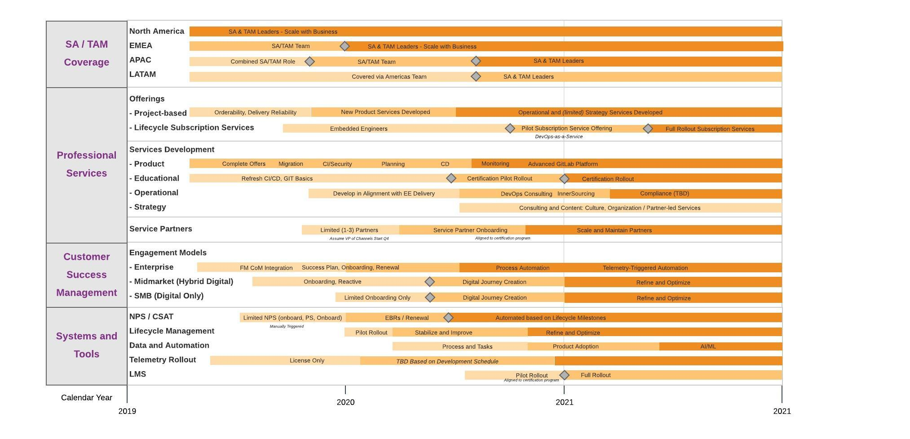
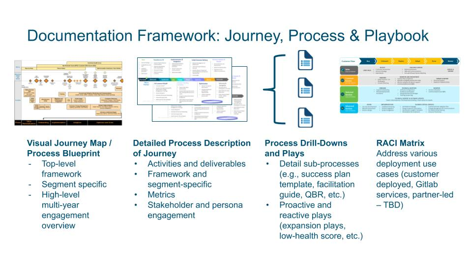

## On this page
{:.no_toc .hidden-md .hidden-lg}

- TOC
{:toc .hidden-md .hidden-lg}

# Vision
*"Customer Success is when customers achieve their desired outcome through interactions with your company with the appropriate experience."* - Lincoln Murphy  

# High-Level Visual of Customer Journey
[Video Introduction to Customer Journey and Process Framework](https://youtu.be/LIroDgZOWLc)

# Capabilities Roadmap 
The following shows the high-level view of the capabilties that we will be developing as mature our customer success team, processes and systems.

# Objective  
Create a company-wide customer success approach, providing an engagement framework for the Customer Success organization and integrating related programs and operations from the GitLab operations (i.e., marketing, sales, customer success, product / engineering and support).  

# Goals   
Deliver faster time-to-value and customer-specific business outcomes with a world class customer experience, leveraging the full capabilities of the GitLab application. Increase average Incremental Annual Contract Value (IACV) as well as Life-Time Value (LTV).

# Measurement and KPIs

## Time-to-Value KPIs
As part of our customer journey, we highly value the customer's initial experience and measure time-to-value. Specifically, we will measure the time in calendar days from the initial transaction to:
* **Kickoff**: Represents our time to engage the customer. Completion defined when the TAM has their first meeting with the customer.
* **Onboarding**: Completion is defined when all the onboarding tasks are done.
* **Infrastructure Ready**: Completion is defined as either 1) production implementation is complete for on-premises installations 2) GitLab.com is integrated into a customer's environment or 3) Cloud and on-premises environments ready for a hybrid deployment
* **First Value**: Represents a small subset of users are using the product in a Production environment. This can be the minimum of one of the following: 10% of licenses, a complete team or region of users. 
* **Outcome Achieved**: Represents delivery to original purchase intent. We want to capture the delivery of outcomes against their original purchase intent. New and changed goals will continue to be tracked with the engagement, but not included in this milestone. 

## Retention and Reasons for Churn
We measure customer success through Net Retention.  

Our [Target](/handbook/finance/financial-planning-and-analysis/#terminology) net retention rate is 180%. This analysis can be found on the [Sales KPI dashboard](https://app.periscopedata.com/app/gitlab/446004/Sales-KPIs?widget=6055135&udv=0). 

Our [Target](/handbook/finance/financial-planning-and-analysis/#terminology) gross retention rate is 90%. This analysis can be found on the [Sales KPI dashboard](https://app.periscopedata.com/app/gitlab/446004/Sales-KPIs?widget=6062086&udv=0).

**Retention, Gross & Net (Dollar Weighted)**

We measure Net and Gross Retention aggregated by month, for the [three levels of customers](/handbook/sales/#customers).

    For an individual customer:

    Gross Retention (%) = C / A * 100%
    Net Retention (%) = B / A * 100%

    **A** = MRR from 12 months ago from active customer
    **B** = Current MRR from the same customer in A
    **C** = Gross retained dollars calculated as min(B, A)

    Individual customer retention calculations cannot be averaged together directly to determine the retention across all customers.
    Because customers have different values, the retention percentages don't represent the same magnitude.

    For all customers, first calculate gross retained dollars for each individual customer and then calculate as follows:

    Gross Retention (%) = sum(C) / sum(A) * 100%
    Net Retention (%) = sum(B) / sum(A) * 100%

    **A** = MRR from 12 months ago from all active customers
    **B** = Current MRR from the same set of customers in A
    **C** = Gross retained dollars for each customer (see individual example)

    
    Example: 
    There are two customers (X and Y) who each have $100 in MRR in the current month (B).
    12 months ago, X had $50 in MRR and Y had $125 in MRR (A).
    
    Gross retention for X is (min(100, 50) / 50) * 100% = 100%
    Net retention for X is (100 / 50) * 100% = 200%

    Gross retention for Y is (min(100, 125) / 125) * 100% = 80%
    Net retention for Y is (100 / 125) * 100% = 80%

    Gross retention across both is sum(min(100, 50), min(100, 125)) / sum(50+125) * 100% = ~86%
    Net retention across both is (sum(100+100) / sum(50+125)) * 100% = 114%

Gross Retention cannot exceed 100%. [Industry guidance](http://www.forentrepreneurs.com/saas-metrics-2/") suggests median gross dollar churn performance for SaaS/subscription companies is 8% per year (or 92% gross retention).

Since MRR values can change on a regular basis, retention can therefore change since it relies on MRR. See [Monthly Recurring Revenue](/handbook/finance/operating-metrics/#monthly-recurring-revenue-mrr) for more details

We need to choose a single retention level to measure for customer success, so the default value used is the Parent Account in that context.

**Reasons for Churn / Expansion, Dollar Weighted**

A measure of the causes for retention (compared to the same time period for the previous year) MRR decreases (churn) or increases (expansion). Churn is specified as Cancellation or Downgrades. Expansion is specified as Seat Expansion, Product Change, Product Change/Seat Change Mix, or Discount/Price Change. These are reported as a percentage using the change in MRR for the given reason over the total MRR change for all types in either the Churn or Expansion category. Trueups are excluded from these metrics.

# Professional Services Standard Cost
We use a standard cost estimate to project margin on PS Statements of Work. The standard rate is calculated by dividing the average annual OTE plus benefits by the estimated annual billable hours. For this calculation, we assume 1,880 billable hours annually. We update the standard cost estimate on a quarterly basis.  

To standardize the cost estimate for projects, make a copy of the [SOW Cost Estimate Calculator](https://docs.google.com/spreadsheets/d/16KFNRFe4E_oaqU7_ZGivoO7eU3-65dkMgVvK5Jvb7ZQ/edit#gid=158441360) and attach it to the issue for the SOW in question.  This calculator will be updated to reflect any changes to the standard cost estimate.

If you need help with determing the standard cost rate or if it is applicable to your project, please contact your [Finance Business Partner](/handbook/finance/financial-planning-and-analysis/#finance-business-partner).

# Scope
*  Processes, procedures, metrics and tools / systems for the Customer Success team
*  Integration of the related processes and operations for other GitLab business groups

# Deliverables

1.  Provide a process blueprint for the customer success engagement processes, including:
    * High-level customer journey (i.e., single stage and stage expansion)
    * High-level multi-year engagement summary
    * Processes, procedures and detailed flowcharts
    * Customer and GitLab-centric metrics
2.  Framework structure that will address specific differences and needs based on:
    * Customer segmentation (Large, SMB, Commercial)
    * Product differences (e.g., stage-specific, use case and/or feature playbooks)
    * Customer personas (e.g., executive sponsor, tools/infrastructure executive, development executive, etc.)
3.  Integrate processes and operations for direct customer engagement processes such as:
    * **Marketing**: messaging alignment and consistency, journey integration with marketing stages (e.g., awareness), customer advocacy, advisory boards, collateral development, digital journey (i.e., tech touch, hybrid digital/TAM engagement)
    * **Sales**: account planning and strategy, POC, success planning, IACV, renewal forecasting and execution, training and enablement
    * **Product / Engineering**: Product telemetry and data insights, UX journey map alignment, in-app adoption (e.g., product-led onboarding), application/stage/use case/feature adoption, "voice of customer" reporting, escalations and defect and enhancement requests
    * **Support**: Customer health, escalation processes
    * **Finance**: Financial metrics and targets (e.g., margins), budget and forecasting
    * **People Operations**: Job types, grades and families
    * **Information Technology**: Customer and operational dashboards, workflow management capabilities (i.e., SFDC, customer success platform), journey automation

# Current Priorities

1) Success planning (sales, post-transaction, tracking and closure)
2) Time-to-value (onboarding, first value, maturity model to full stage/user adoption, cross-stage expansion)
3) Renewal forecasting/sales alignment

# Process Framework

