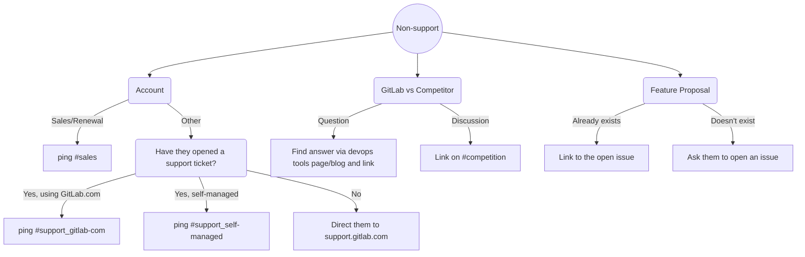
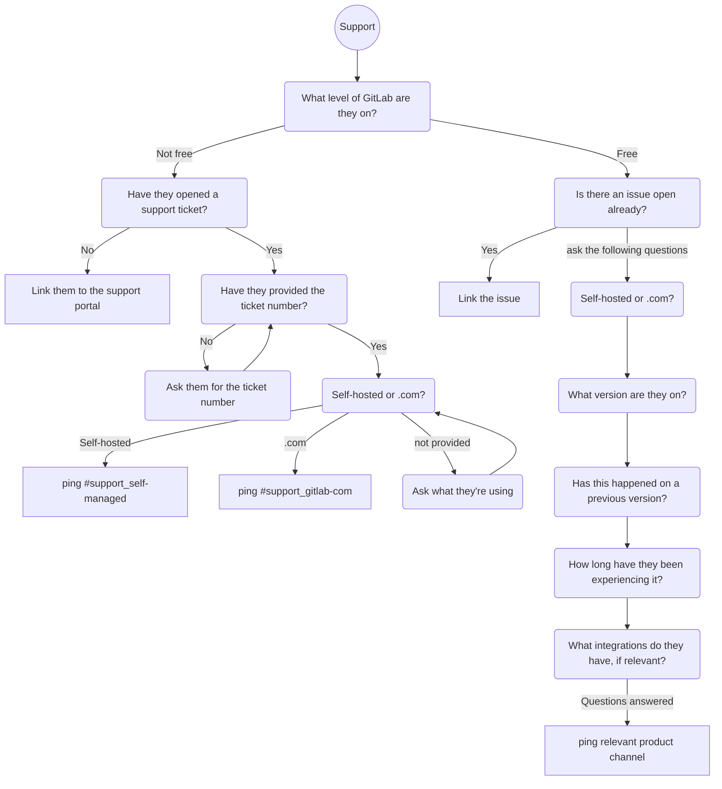

## On this page
{:.no_toc .hidden-md .hidden-lg}

- TOC
{:toc .hidden-md .hidden-lg}

## Overview

New posts to the GitLab forum are brought in to Zendesk and #gitlab-forum on Slack

## Best practices

- Always be courteous, especially if they are a new poster.
- Add a welcome message when replying to new posters. It could be as simple as "Hi, and welcome to the forum! :smile:" at the start of your post.
- Use the like button as much as you can, to thank users for their input and to inspire other users to do the same.

## Administration

Most administration tasks will be done from the [Discourse Admin Dashboard](https://forum.gitlab.com/admin)

### How to grant admin permissions

If you need to add an admin:

1. Go to the [list of forum users](https://forum.gitlab.com/admin/users/list/active)
2. Use the search box to find the user you want to grant admin permissions to
3. Click on the user to modify their profile
4. Scroll down to the `Permissions` section
5. Click on the `Grant Admin` button
6. An e-mail confirmation will be sent to the Admin that granted the permission (i.e. you). Go to your inbox and click on the link to confirm granting Admin permission to the user
7. If all went well, the `Permissions` > `Admin?` section on the user's profile admin should read `Yes`

## Workflow

How to respond to the GitLab forum tickets: 

1. Go through the tickets in Zendesk `GitLab Forum` view
2. See if all comments have received responses
3. Write the response if necessary, involve an expert for assistance if you don't know the answer
4. Post the comment on the original website ([https://forum.gitlab.com](https://forum.gitlab.com), not Zendesk) using the link provided in the ticket
5. Solve the ticket with the `Replied` macro (Replied macro will use the public response field in order to track the first reply time)

Follow the relevant workflow depending on the question:

## Automation

New mentions are brought into Slack and Zendesk via Zapier.
