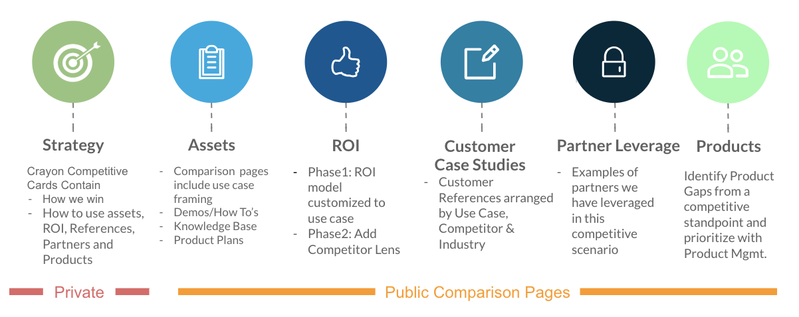
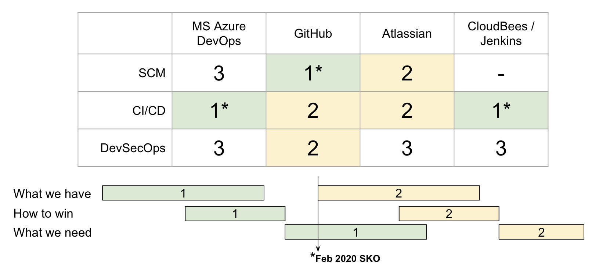

## On this page
{:.no_toc .hidden-md .hidden-lg}

- TOC
{:toc .hidden-md .hidden-lg}

## Competitive Intelligence at GitLab

The Competitive Intelligence function at Gitlab has two primary constituencies (1) Our prospects and customers (2) Our sales organization, which includes partners who assist in sales efforts.

**Prospects and Customers**:  In keeping with a Gitlab core value of **[transparency](/handbook/values/#transparency)**, Competitive Intelligence will ensure that anyone looking to an end-to-end DevOps solution has the information they need to make the right and unbiased decisions that serve the customer's business goal.  To this end, all our product comparison pages are un-gated and available at **[DevOps Tools Comparison Pages](/devops-tools/)**.  Gitlab believes that transparency of competitive intelligence creates a well informed customer and gives  teams the information to be successful during their DevOps journey.

**Sales Team**: Another Gitlab core value is **[results](/handbook/values/#results)**.  Sales is a key constituency that helps Gitlab achieve results.  Hence parts of the Competitive Intelligence material is targeted at helping our sales teams effectively sell to our prospects, thereby delivering value that fulfills the customer's business needs.

## Quick Link - Comparison Assets

All our comparison assets - pages that compare other vendor products with Gitlab are found in the **[DevOps Tools Landscape page](/devops-tools/)**

## Quick Link - Competitive Assets

These assets are for the Gitlab sales team to help them effectively compete in the DevOps space.  These assets are hosted in the Competitive Analysis software - **[Crayon](https://app.crayon.co/intel/gitlab/battlecards/)**.  All Gitlab sales team members have access to this software.  If for some reason a team member cannot access, please log an [Issue](https://gitlab.com/gitlab-com/marketing/product-marketing/issues/new).

## The Comparison Process

At Gitlab, anyone can contribute to the Competitive Intelligence process.   We strive to meet the following goals.

1. **Fair**:  For any CI process to be credible it has to be fair.  That's a reason why we use the **[DevOps Category Maturity](/direction/maturity/)** as a guideline for our comparisons.  This ensures that there's common basis of understanding of each stage in the end to end DevOps lifecycle and it is not a cherry picket set of criteria just to make a vendor look good or bad.
2. **Accurate**: We strive to be as accurate as possible by taking input from websites, product documentation, demo videos, trails where allowed, information from customers, and even competitors.  For example, recently a Product Manager from a competitor reached out to us about a correction to the analysis, which we quickly made.
3. **Easily consumable**:  We make the information easily consumable by making it available on the website.

## Competitors and Products with overlapping functionality

GitLab exists in an ecosystem of **[DevOps tools](/devops-tools)** and might need to interact with any number of these tools. Many have over-lapping capabilities, but that does not mean that we necessarily directly compete with them. A user would need to patch together multiple solutions from this list in order to get all the functionality that is built-in to GitLab as a **[single application for end-to-end DevOps](/)**.

We tend to include those products also in the DevOps Tools comparison pages so customers have a comprehensive understanding of how we view the full landscape, not necessarily in competitive terms. Refer to this handbook page for more information on [who Gitlab competes with](/handbook/product/#who-gitlab-competes-with).

## The Customer's Voice

As always the customer's voice is absolutely critical in this.  Fortunately there are several such third party neutral sites that capture customer feedback about DevOps Tools, including Gitlab.  Here are some sites that have feedback on Gitlab - in the customer's voice.

- [G2](https://www.g2.com/products/gitlab/reviews)
- [TrustRadius](https://www.trustradius.com/products/gitlab/reviews)

## Other comparison sites

Comparison's at a deep level are challenging and time consuming.  We'd like to acknowledge some other sites that have done a sincere and strong effort at comparing DevOps tools.  Some of these are by competitors but in keeping with Gitlab values of transparency and to provide our prospects a comprehensive picture - here they are:

- [CA](https://assessment-tools.ca.com/tools/continuous-delivery-tools/en?embed)
- [XebiaLabs](https://xebialabs.com/periodic-table-of-devops-tools/)
- [CNCF](https://landscape.cncf.io/)
- [Gitea](https://docs.gitea.io/en-us/comparison/).

## ROI Model

We have developed this ROI Model to capture the value provided by GitLab.  The intent is that customers will use this, optionally with help from the GitLab team, to capture the cost of ownership and value provided by GitLab v/s a Competitive product/solution.  This model will be continually revised to include new Use Cases and value drivers as we hear about them from our customers.

[ROI Model in Google Sheets](https://docs.google.com/spreadsheets/d/1KJNnoZ29DHMckYsbuD-OMCDsy7KDZHwWTOWx6EfaWDo/edit?usp=sharing)

NOTE: To prevent customers accidentally sharing information they would not want to we've made this document view only.  Please make a copy of this file  before inserting your numbers.

## Where we are headed

Comparisons at a feature level are a great first step and they form the basis for higher level comparisons.  Customer's ultimately are interested in specific Use Cases and Capabilities that help them solve business problems.  We are working on building on the feature level comparison foundation to showcase how customer defined use cases are accomplished using Gitlab and how it compares to other offerings.  Stay tuned for more updates on this.

### Strategy
The competitive intelligence strategy will evolve to take a use case approach.  We will select key use cases that comprise the "Lovable" category within Gitlab (see below).  Moreover, we will start with analyzing some key competitors, so as to reduce the effort involved (see below).  For each use case-competitor scenario the goal of Competitive Intelligence will be to provide a complete set of assets and other deliverables that enable sales teams to compete and win.
The diagram below captures the overall approach.  The idea is that for each use case-competitor with the exception of the strategy document (hosted in Crayon), all other resources should generally be publicly accessible.  This is in keeping with GitLab value of Transparency.

### Use Cases Scope
Initially we will target the following use cases:
1. SCM
2. CI-CD
3. DevSecOps

### Competitor Scope
Initially we will focus on the following key competitors:

1. MSFT Azure DevOps
2. GitHub
3. Atlassian
4. CloudBees-Jenkins

Even a limited set of Use Cases and Competitors can result in several possible combinations.  To focus our efforts we will prioritize the most common combinations faced in sales situations. 

### Competitor - Use Case Matrix
The following matrix captures the priorities for competitive intelligence, both in the near term leading up to the Sales Kick Off in Feb 2020 and thereafter.  The numbers in the boxes indicate the priority order.  

This matrix does not imply that other scenarios are not important or valuable; this priority matrix is simply to help prioritize our efforts.

For the Sales Kick Off we will ensure that information is assimilated and a clear strategy articulated for the prioritized Competitor-Use Case scenarios.  Critical gaps in assets and other tools will be filled prior to Sales Kick Off.  Other gaps will be addressed on an ongoing basis.

## Who should I contact for competitive intelligence?

- Listed below are responsible individuals within the competitive intelligence team:

  - [Mahesh](/company/team/#Mahesh), Manager, Competitive Intelligence
  - [Ashish](/company/team/#kuthiala), Senior Director, Strategic Marketing
