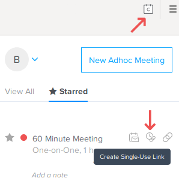

## On this page
{:.no_toc .hidden-md .hidden-lg}

- TOC
{:toc .hidden-md .hidden-lg}

Always use [single-use Calendly links](#generating-a-single-use-calendly-link) when offering a call with customers.

## Calendly setup for Self-Managed Support

You will have set up Calendly as part of your GitLab onboarding, following [the instructions in tools and tips](https://about.gitlab.com/handbook/tools-and-tips/#calendly).

Modify your setup as follows

* [log in](https://calendly.com/login)
* Set up Zoom integration on your Calendly account in [integrations](https://calendly.com/integrations)
* Ensure you have a one-hour event available.
* Edit your Calendly events:
  * Ensure the event names have 'Support' in their title.
  * Consider changing your availability increment (see below)
  * Location may show as 'Zoom conference call' but won't actually be using the integration. Edit the location, and select zoom (with the blue camcorder icon)

### Availability increment. 

Calendly 60 minute meetings default to an 'availability Increment' of 60 minutes.

Only slots starting at the top of the hour are offered. If you’ve got 90 minutes available,
or a (say) a 14:30-15:30 window available, then reducing the increment to 30 minutes increases your availability.

* Log in;  edit the event type
* 'When can people book this event'
* Select 'Advanced' tab under 'Availability' - change 'Show availability in increments of'

If you have any other meeting lengths available, consider whether it makes sense to offer different start times.
You can view your calendly availability using a private/incognito browser session.

## Self managed round-robin

The support team has a Team Support Call event.

We use this to offer customers the choice between meeting with one engineer, or scheduling a meeting with anyone in the team.

Part of your support onboarding, once you're ready, is to ask for your Calendly account to be added to this event.

You'll then also be able to generate a single-use link for this event from your browser plugin.

## Support calls in the team calendar.

We copy customer calls to the *Gitlab Support* Google calendar using a Zapier Zap. For this to work

* Your calendly account must be part of the group account.
* The word 'support' triggers the integration. Ensure 'support' is in the event name in Calendly.

If the Zap is working, you should see the calendar event copied within a minute or two. If the customer cancels, similarly, it'll be removed from the Support calendar.

## Generating a single-use Calendly link

Calendly has a
[Chrome plug-in](https://chrome.google.com/webstore/detail/calendly-meeting-scheduli/cbhilkcodigmigfbnphipnnmamjfkipp)
and a [Firefox extension](https://addons.mozilla.org/en-US/firefox/addon/calendly-meeting-scheduling/)
that makes it easy to generate a single-use link to send to the customer. After adding it to your browser, look for
the Calendly icon at the top right in your browser. Sign in to Calendly, then you will see a list of events. You
probably want to "star" the Team event and perhaps your personal Support Call event to simplify the pop-up window.
Then simply click on the one-time link icon next to the event of your choice to generate a link you can paste into
your message to the customer.



If you do not want to use a supported browser, you can generate a link to the Team Event using this curl command. Replace the
`<your Calendly API token>` placeholder with a token you can get
from [the Calendly Integrations page](https://calendly.com/integrations).

```
curl -v  --header "X-TOKEN: <your Calendly API token>" --data "event_type_uuid=CEGFRWO2Q6R7SAQE" https://calendly.com/api/apps/extension/v1/users/me/event_type_single_use_links
```

## Suggestions

Ben Prescott

* I have a 25 minute and 50 minute meeting available for internal GitLab meetings, and separate 30 minute and 60 minute ones called 'GitLab Customer support'. These are the ones I send links to in Zendesk.
* I offer 60 minutes by default, and changed the description/instructions as follows. I include the last line as we had a customer book for 3am their time, and can only assume Calendly got their time zone wrong.

> This will be a Zoom Meeting.
>
> Let me know via the ticket if you have any questions, will need to use a different conference platform, or if you want a link to schedule a 30 minute call instead (which may be available sooner.)
>
> Check that your time zone and current time are displayed correctly on this page (below the calendar.)

