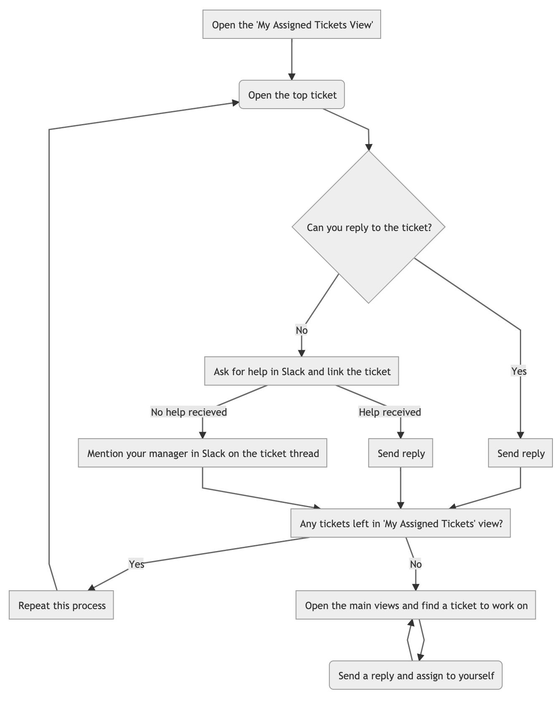

## On this page
{:.no_toc .hidden-md .hidden-lg}

- TOC
{:toc .hidden-md .hidden-lg}

## Modes of Active Support Work

The core responsibility of a Gitlab support engineer is to resolve customer tickets on a daily basis. As part of this core work, Support engineers will update documentation, cut issues to Development teams and submit code fixes as a result of finding and fixing customer problems (and making sure they stay fixed). When a Support engineer has done their fair share of ticket work (we're a team!), there are other Support areas to work on (Hiring, Training, Support Projects etc) and opportunities to contribute to other parts of the company.

We currently have four rotating roles so that people know what to do and have variation in their work:

1. [On call](/handbook/support/on-call/)
1. [First Response Time Hawk](#first-response-time-hawk)
1. [SLA Hawk](#sla-hawk)
1. [My tickets](#my-tickets)

## Tips for handling tickets (all roles)

1. **I'm working on a ticket, how do I let the team know I'm working on a reply?**
    1. It's OK to put a ticket **on-hold** while you work on a reply. This takes it out of the main queue so other engineers won't waste time looking at it
    1. If you do this, the SLA clock is still ticking
    1. You must either then send a reply to the customer and submit as Pending
    1. Or if you don't come up with a public reply, summarise your research in an internal note and set the ticket back to Open so another engineer can pick it up. You're encouraged to pair and discuss in Slack to help get a reply out.
1. **A ticket is close to breaching, I'm working on it, but I need more time for my full reply.**
    1. It's OK to send a short reply to the customer to prevent the ticket breaching.  Let them know you're actively working on their ticket and ask if they have any updates since the last reply.
    1. If we do this we **must be good on our promise and get back to them with a full reply**. Sending the short update will stop the SLA clock, so it's up to you to make sure you follow up. **Don't send a short reply to prevent a ticket breaching if you're not planning to follow up yourself.**


## First Response Time Hawk
### What is a First Response Time Hawk?

This is a rotating role, where someone is "on point" weekly (Monday to Friday), to make sure:

1. new Premium SLA tickets get a first response as soon as possible and do not breach
1. all new tickets are appropriately categorized and prioritized as they arrive

First Response Time Hawks directly drive achievement in our [Service Level Agreement KPI](/handbook/support/#service-level-agreement-sla).

### The Process in Action

1. Every Week on Fridays, Managers will add a First Response Hawk for each region to the Support Week in Review to announce who will be responsible that week.
1. If you are FRT Hawk, you are responsible for:
    1. Premium and Ultimate first replies for tickets created from 9am - 5pm in your time zone
       - **Note:** if you are a US Citizen and have access to the Federal instance, this should also be a part of your rotation.
    1. Triaging tickets to make sure they have:
      * An associated organization
      * [The correct priority](/handbook/support/workflows/setting_ticket_priority.html#setting-ticket-priority)
      * The correct ticket form (such as GitLab.com, if they're asking for GitLab.com support). Take special notice of tickets with form `Other Request`. This is usually because the ticket was created by email. **Change the form to the most appropriate form type and then fill in additional metadata where possible**.
      * The correct **Self-managed Problem Type** selected
1. [Keep an eye on the FRTH View in ZenDesk](https://gitlab.zendesk.com/agent/filters/360060245433)
1. You have full authority to call in and ask others for help if volume is high, or you are stumped.
1. You should expect to see new and different things that you are not an expert in. Where possible, take the time to dive deep and try and understand the problem.

### Things to be mindful of

1. Given that there's a FRT Hawk _per timezone_, your shift will overlap with another hawk.
    * This means you have a teammate within a team; yay! Be sure to communicate with your fellow hawk so you can help each other out in case one of you is stuck on a ticket, and also to make sure you're not
    both quietly working on the same ticket

1. Your focus should be new tickets in the Premium & Ultimate queue, especially high and medium priority. If there are no new tickets in that queue, please [associate needs-org tickets with the appropriate organization](associating_needs_org_tickets_with_orgs.html). From there, you can jump to the Starter & Free queue.

1. You might not cover all the tickets you wanted to cover on your shift, and that's okay
   * Just do your best 
   * Take a break if you need one - making sure your team knows you're stepping away by posting in `#support-team-chat`
   * Ask the rest of the team for help when needed in `#support_self-managed`

1. You may see tickets requesting information that is not in the realm of support. For example, you may get a ticket from a job applicant to GitLab requesting information on their application. In these cases, do your best to direct them to an appropriate contact and close the support ticket. In the case of hiring questions, you can ping the #recruiting channel in Slack to inform them that the candidate reached out, and update the candidate via the ticket.
   * There is a macro called `General::Job Application Questions` for hiring-specific questions in Zendesk.

### Dashboards

You can track your progress and see global results on this [Zendesk Explore Dashboard](https://gitlab.zendesk.com/explore/dashboard/36925DBD1F5E3C7BA541DB38D11AC51E0EAAFDD30DCB63FDE83CF1389E555D96/tab/10602202)

## SLA Hawk
### What is the SLA Hawk role?
The SLA Hawk is a rotating role that you will carry out for one week at a time (Monday to Friday). You can [view the rotations in PagerDuty](https://gitlab.pagerduty.com/schedules#?query=sla%20hawk)

The SLA Hawk is responsible for ensuring that action is taken on the 'most breached' and 'next to breach' tickets in order to meet our SLAs and so that difficult tickets are not ignored. **NOTE:** It is the responsibility of all Support team members to ensure customer tickets are responded to within our SLA times. The SLA Hawk is **not expected to reply to tickets themselves - your job is to find team members to help get a reply out (see below for more info)**

The SLA Hawk should also perform a queue tidy up:
* Ensure tickets are in correct queue
* Tickets have the correct Priority
* Tickets have the correct self-managed problem type
* The Customer has a Support Contract
* Solve the ticket if the support request is solved

SLA Hawks drive achievement via our KPI's for [Service Level Agreement KPI](/handbook/support/performance-indicators/#service-level-agreement-sla) and [Customer Satisfaction](/handbook/support/performance-indicators/#support-satisfaction-ssat) by making sure our customers are updated in a timely manner.

### The Process in Action

1. Each day, sort the Zendesk view for [Self Managed Premium and Ultimate](https://gitlab.zendesk.com/agent/filters/304899127) by '*Next SLA Breach*' ascending, starting with most breached ticket first.
2. Read the ticket yourself and if you feel you know what the next action is, do that (e.g. ask the customer for more information, solve the ticket if the issue is resolved, send your own reply if you have a great idea). There's no need to spend too long at this stage - 10 minutes at most. If the next action requires more work move on to the next step.
3. If you feel the priority does not match our [Definitions of Support Impact](/support/#definitions-of-support-impact) reach out to the customer and agree on the new priority. Use the macro [General::Changed priority](https://gitlab.zendesk.com/agent/admin/macros/360093631494).
4. If a ticket **has an assignee**:
   1. If the assignee is in your Region, link the ticket in `#support-self-managed` and ping them asking if they are able to take a look. We've adopted a convention of prefixing your message in Slack with `[SLAH]` so that folks know you're currently in that role.
   2. If the assignee is from another Region and its during their “office hours” ask them if they could take a look. 
   3. If the assignee is offline and the ticket/customer needs an update, follow the **has no assignee** process below.
   4. If assignee can’t currently work ticket ask them to follow the Process in action for [My Tickets](https://about.gitlab.com/handbook/support/workflows/support-modes-of-work.html#the-process-in-action-2).
5. If a ticket **has no assignee**:
   1. Check to see if an engineer from your region has previously responded on the ticket, if so, ask them would they have the bandwidth to take the ticket.
   2. If you can't locate a specific person, let the team know (e.g. `@support-team-emea` ) about the ticket. Once you have one or two volunteers, let the team know the ticket is taken care of via the thread.
   3. If you’re not getting any traction, and you feel you need help, ping your manager to let them know that noone is available to help.
   4. Once someone has taken ownership of the ticket, ask them if they're happy to assign it to themselves.
6. If there are no imminent breaches (e.g. less than 2 to 4 hours) in the 'Self Managed Premium and Ultimate' queue - repeat the process with the [Starter and Free](https://gitlab.zendesk.com/agent/filters/360062019453) view. 

### Team Responsibilities for the SLA Hawk
* Help the SLA Hawk! If they ask you for help, please acknowledge (You may not be able to help, just let them know). 
* Follow the [Support Modes of Work](https://about.gitlab.com/handbook/support/workflows/support-modes-of-work.html#the-process-in-action-2) for the tickets in your own queue (including finding another engineer to help or takeover the ticket).
* When looking for your next ticket, follow the [same process](/support/workflows/support-modes-of-work.html.md#the-process-in-action-1) as the SLA Hawk above (most breached ticket first).
* If you take a next response ticket and the ticket doesn’t have an assignee, assign yourself to the ticket.

## FAQ about SLA Hawk role

1. **Do I need to do the SLA Hawk role all day every day?** The role is not to work the tickets yourself but rather find an engineer to respond to the ticket. You probably only need to check for breached and breaching tickets 3 or 4 times per day, which fits in with our asynchronous working environment while ensuring that synchronous customer interaction is still maintained. This should make the role light-weight. Between ticket checkins, you can continue with your planned day.
1. **#I feel uncomfortable asking someone else to reply to a ticket** We recommend prefixing your message in Slack with `[SLAH]`, this lets people know that you've been given the role to find people to help. We assume positive intent and the team knows that this is the job of the SLA Hawk.

### Dashboards

You can see how we're doing on [this Zendesk Explore Dashboard](https://gitlab.zendesk.com/explore/dashboard/36925DBD1F5E3C7BA541DB38D11AC51E0EAAFDD30DCB63FDE83CF1389E555D96/tab/10602202).

Look a the 'Self Managed NRT SLA achieved charts' for this week and last week. We're aiming for 85% achievement. If we can get to 95% that would be awesome! The 'this week' chart updates hourly.

## My Tickets
### What is the "My Tickets" workflow?
If you don't have a specialized role this week, you'll be working the "My Tickets" workflow. This is your 'normal' role - you're free to work on what makes most sense to you (including learning, writing up issues, improving docs etc).

The process here explains what to do when you're actively working on tickets in Zendesk. You'll be moving issues along and acting as an escalation point for those in Hawk roles or Emergencies. Additionally, in this mode you'll be acting as a steward of longer running issues - making sure that a single person has the context necessary to **drive tickets to resolution as quickly as possible**.

**By assigning a ticket to yourself, you become the current 'custodian' for the ticket. The whole team will still help and reply to all tickets, so you can expect others to step in and add replies. The reason for taking assignment is to help ensure tickets don't get ignored or stuck. If you have an assigned ticket that's stuck, follow the escalation process described below to get it moving along. You don't need to know how to solve the ticket because it's assigned to you.**

If you're working in "My Tickets", you're driving achievement of our KPI of [Support Satisfaction](/handbook/support/#support-satisfaction-ssat) by helping to resolve tickets as quickly and effectively as possible.

### The Process in Action
1. To find a new ticket to assign to yourself, go to the `Self-Managed MY_REGION & All Regions - Needs assignee` view. There you will find relevant tickets ordered by Problem type that need an assignee.
1. At the start of the day, go to 'My assigned tickets' view and start at the top
1. Try to get a reply out for the top ticket.
1. If you don't know how to respond or can't come up with any additional actions, link the ticket in Slack and ask for help from your team-mates.
1. You can reassign a ticket to another colleague at any time
1. If you don't get any timely help from colleagues, `@mention` your manager in Slack in a thread where you initially linked the ticket and ask them what the next steps should be
1. Go to the next ticket down the list and repeat



### Things to be mindful of
1. Teamwork is no less important with this workflow; be aware of what's happening across the board and jump in! Pairing with someone is a great way to work out complex issues.
1. Assigning a ticket to yourself doesn't mean that you have to know how to solve it; it just means you have to keep the context of the ticket in your mind and help move things forward. If you're unable to do so, you can re-assign tickets to a colleague (with their permission, of course) or escalate to your manager by pinging them in Slack in `#support_self-managed` with a link to the ticket.
1. If you respond to a ticket and set it to `Open` or `On-hold`, ZenDesk will remove the SLA and automatically assign it to you (if it's not already assigned to someone else). If you don't have the expertise to work on the ticket, as usual, take stewardship and ask for help. You can ask an expert if they're willing to take the assignment if needed.
1. For all tickets where the user is waiting on a response or follow up from Support, always provide an update on its status and work that has been done. Ideally, once a day, but at least once every 3 days (the length of the On-hold period).

### FAQ About My Tickets workflow

1. **How many tickets should I have assigned to me?** There's no specific number, but somewhere between three and ten open, pending or on-hold tickets at any one time in your [My Assigned Tickets](https://gitlab.zendesk.com/agent/filters/360062369834) view.
1. **A ticket is assigned to someone else - can I work on it?** Absolutely! We have a hot-queue and we should keep an eye at tickets at the top of the queue. The SLA Hawk will remind us of tickets that need attention!
1. **I'm going on vacation or holiday, what do I do with my assigned tickets?** If possible find someone who is prepared to take them on, or unassign them. Don't worry if you forget - we'll still see them in the hot queue.
1. **A ticket has diverged into more than one problem. What do I do?** It's recommended to keep tickets focused on a single problem that's clearly described by the ticket Title. If the customer asks about another problem, you are encouraged to create a new ticket on behalf the customer that focuses on a single issue and keep the original ticket on the original issue. This helps reduce time to resolution and makes it easier for us to focus on fixing the problem at hand.

## Mermaid Source

#### SLA Hawk

~~~

   ```mermaid

   graph TD
   A[Sort 'Premium and Ultimate view by <br> 'Next SLA Breach'] -->
   B(Open the <br> top ticket)
   B --> C{Can you reply <br> to the ticket?}
   C -->|Yes| D[Send <br> reply] --> H
   C -->|No| E[Ask for help in Slack <br> and link the ticket]
   E -->|Help received| F[Send <br> reply] --> H
   E -->|No help recieved| G[Mention your manager in Slack <br> on the ticket thread] --> H[Go to the next ticket <br> - if no imminent breaches - <br> go to 'Starter and Free' view] --> B
   ```

~~~

#### My Tickets

~~~

   ```mermaid

   graph TD
   A[Open the 'My Assigned Tickets View'] -->
   B(Open the top ticket)
   B --> C{Can you reply to the ticket?}
   C -->|Yes| D[Send reply] --> H
   C -->|No| E[Ask for help in Slack and link the ticket]
   E -->|Help received| F[Send reply] --> H
   E -->|No help recieved| G[Mention your manager in Slack on the ticket thread] --> H[Any tickets left in 'My Assigned Tickets' view?]
   H --> |Yes| I[Repeat this process] --> B
   H --> |No| J[Open the main views and find a ticket to work on]
   --> K(Send a reply and assign to yourself) --> J

   ```
~~~
