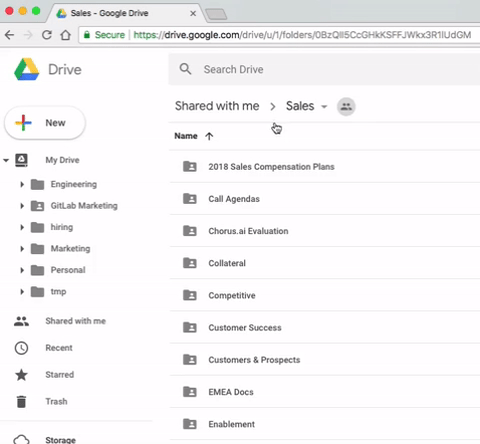
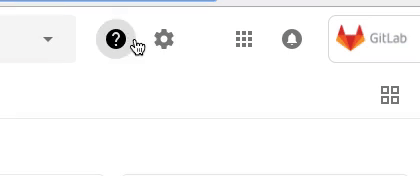

## On this page
{:.no_toc .hidden-md .hidden-lg}

- TOC
{:toc .hidden-md .hidden-lg}

A lot of tools we use are described in the rest of the handbook (GitLab, [Google Docs](/handbook/communication/#google-docs), [1Password](/handbook/security/#1password-guide), etc.). This section is for tools that don't fit elsewhere.

## 2FA debugging

If 2FA stops working unexpectedly (no new phone or computer) it's usually because of improperly configured date & time on either device. Make sure that "Automatic Date & Time" is **enabled** on both devices. If they're already enabled try toggling them off and on again to force an update.
If this doesn't work, request that ITOps reset your 2FA setting.

Links for finding the settings:
- iOS: [Get help with the date and time on your iPhone, iPad, and iPod touch - Apple Support](https://support.apple.com/en-us/HT203483)
- macOS: [If the date or time is wrong on your Mac - Apple Support](https://support.apple.com/en-us/HT203413)
- Linux (using systemd): [systemd-timesyncd - ArchWiki](https://wiki.archlinux.org/index.php/systemd-timesyncd)

For Android there's no definitive link, since most vendors have different UIs for their settings. But in the Settings-app, look for "Date & Time" and there should be a "Automatic Date & Time" toggle.

## Adblockers

Adblockers are handy browser extensions/plugins that can block advertising, prevent user tracking, and other security-related features. A couple of popular ones the Security Team approves and recommends are:
  * **uBlock Origin**
  * **Adblock Plus**

## Ad Privacy

Sharing your screen to get your idea across can be very productive, but having personalized ads show up on a webpage may be undesirable.
Shut off interest based ads by setting your preferences. [Google Ad Settings](https://adssettings.google.com/), [AdChoices](http://optout.aboutads.info)

## Alfred

[Alfred](https://www.alfredapp.com/) is an application launcher and productivity tool for macOS. The core app is free to download and use, but the paid [Powerpack](https://www.alfredapp.com/powerpack/) enables more powerful searching, a fantastic clipboard history feature, app integrations, easy access to shell commands, and more. It's a great tool for developers and and general productivity enthusiasts alike. The clipboard history feature is nicely integrated with many tools, and for example will forget passwords copied from 1Password after they have been pasted.

If you'd like to share your calendar with e.g. your partner you can use the 'Share with specific people' feature and set the permissions to 'See only free/busy (hide details)':

```
https://docs.gitlab.com/search/?q={query}
```

```
https://about.gitlab.com/handbook/#stq={query}&stp=1
```
## Bear

[Bear (Free)](https://bear.app/) is a clean writing tool for notes and long-form writing. [Ulysses $5/month](https://ulysses.app/) is also a great choice.

## Brain.fm

[Brain.fm (free trial)](http://brain.fm) provides music specially designed to help you focus, relax, meditate, recharge, sleep (great for plane rides).
It's not just music though. They use scientifically validated brainwave manipulations to get results. It is AMAZING and really does work.
Make sure to use with headphones, and give it 10-15 minutes for your brain to get used to it. ($6.95/$15.99/$47.40 per month/quarter/year)

## Browser Plugins/Extensions

In general, if a particular application or browser extension (sometimes called a plugin) is referenced in the handbook, it is considered "approved". For example, [1Password](/handbook/security/#1password-guide) is centered around the browser extension. Another application is [Zoom](#zoom), which has a scheduler extension. However, be sure to search for specific information about the application, in case the desktop version is recommended and the browser extension is not (e.g. [Grammarly](#grammarly)).

If you wish to use an extension not referenced in the handbook, consider the following before installing and using it:

  * The extension should be work-related and help your overall productivity.
  * The extension should be available from a reputable source, such as the browser's library of approved extensions.
  * Adblockers are encouraged! Several are [recommended](#adblockers).
  * Ask. Feel free to ask your co-workers about good extensions, and if you have security or privacy concerns about an extension, ask the security team in #security on Slack.

## Calendly

[Calendly](https://calendly.com/) connects to your Google Calendar so people outside GitLab can easily book a time with you. If you are scheduling a meeting with a GitLab team-member, please use Google Calendar and follow handbook guidance when [scheduling a meeting](/handbook/communication/#scheduling-meetings).

1. Set up a [Calendly](https://calendly.com/) account.
1. Link it to your GitLab Google Calendar to make it possible for people to schedule a call with you.
1. Get your personal meeting room URL by going to [Zoom meeting settings](https://gitlab.zoom.us/meeting), selecting the *Personal Meeting Room* tab, and copying *Join URL*.
1. Set up the 45 minute time slot with the following event description text (replacing text in `{}` with your information):

    > This will be a Zoom Meeting at {Zoom personal meeting room URL}
    >
    > Question? Please email me.  {your GitLab email}

1. Change the event link to `45min`.
1. The event description should be copied to the 15, 30 and 60 minute meetings as well.
1. If you intend to use any of the other event types, make sure to add this to their event descriptions as well.
1. For people outside of GitLab Inc, send them your Calendly link that links directly to the 45 minute time slot: "Are any of the times on https://calendly.com/XXXXX/45min/ convenient for you? If so please book one, if not please let me know what times are good for you and we'll find an alternative."
1. Update your availability on [Calendy Event Types](https://calendly.com/event_types/) by clicking the action cog and then the edit option on an event type (For Example: 15 minute meeting) and in the event details clicking on the "When can people book this event?" section then clicking the "Availability" section. Here you can set your working hours during which you want to accept meetings, and on the "Advanced" tab you can set the minimum scheduling notice you want enforced. Although Calendy does synchronize with Google Calendar to show your availability you may wish to set extra restrictions in Calendy. You can use the "Copy Availability From" option on all the other events you have configured one event.

Keep in mind that unlike normal Google Calendar events, Calendly events are not automatically synchronized between both parties when changes are made. If an event needs to be cancelled or modified, make sure to use Calendly to do so.

## Change your username at GitLab.com

- Starting point: let's say your username is `old-mary` and you want it
to be just `mary`.
- **Note:** each GitLab account is tracked by an **userID**, which is a number stored in
a database. If we change the username, the userID does not change. And all the
permissions, issues, MRs, and relevant stuff within GitLab are related to your
**userID**, not with your username.
- **Note:** if you are not a GitLab Team member, the same process applies except
your e-mail ([STEP 2](#change-username-step-2)), which will be different
(will not be @gitlab.com email), so you can replace it with your own email account.

**STEP 1: Request your new username**

- Access the username you want to request via `https://gitlab.com/mary`.
- Check its activity and projects to see if they are an inactive user
[according to the handbook](/handbook/support/workflows/dormant_username_policy.html).
- If you're a team member, Complete the [current process for requesting a dormant username](/handbook/support/internal-support/#i-want-to-claim-a-dormant-username), otherwise send your request to `support@gitlab.com`, explaining the reasons why
you need that username.
- There's no guarantee that the username will be available for you. Please
check the [dormant namespace policy](/support/#dormant-namespace-requests).

**STEP 2: Create a new account with your new username**
{: #change-username-step-2}

- If support replies to you telling that the username is free to use, create a new
GitLab.com account with it. Use a personal email to register your new account and
choose one that has not been used with your old GitLab account.
- Navigate to your [**Profile Settings** > **Emails**](https://gitlab.com/profile/emails),
and add a new email. ⭐️ **Trick** ⭐️ If your email at GitLab is `mary@gitlab.com`,
add the new email as `mary+something@gitlab.com`:
this is a [Gmail trick](https://support.google.com/mail/answer/12096?hl=en)! All
your emails sent to this alias will end up in your GitLab email account. 😃
- Navigate to <https://gitlab.com/profile/notifications> and choose the notifications
email: `mary+something@gitlab.com`.
- Open your old account in one browser and the new one in another browser
(e.g., Chrome and Firefox, or Chrome and Safari) - log in to both accounts at
the same time.

**STEP 3: Let's have some fun (kidding, this is critical!)**

- Navigate to <https://gitlab.com/profile/account> in both your accounts.
- Look for your username. This operation has to be done quickly, otherwise you are
risking to loose your awesome new username to someone else quicker than you. We
need to **swap** the usernames between both accounts, so you'll keep all your
history, your privileges, issues, and MRs assigned to you, etc.
- If you work with 2 monitors, open each browser on one monitor. If you don't,
open them side by side, so that you can keep an eye on both at the same time.
- Rename your new username `mary` to something like `mary-1` and **DO NOT** click
**update username** yet. Rename your old username `old-mary` to your new
username `mary` and **DO NOT** update that either. Just leave them typed into the boxes.
- Make sure you did the previous step right!
- ⚠️ **CRITICAL** ⚠️ Update the first one (`mary` to `mary-1`). Immediately, click
**update** on the other one (`old-mary` to `mary`).
- Immediately, rename the `mary-1` to your old one `old-mary` and click
**update username** again.
- Ta-Da! 🙌

**STEP 4: Move your projects (or not)**

- Now, if you have any personal projects, you might want to import them to
your new account (the one that has your old username now). To do that, in
your new account (the one with the old username), click **Create a New Project**,
give it the very same name as the original one, click **Git - add repo by url**,
and paste the `https://` URL of your project there. To make things easier, make
sure all the projects you want to import are set to `public` view.  You can make
them private afterwards.
- If you have GitLab Pages projects with the default **GitLab.io** url, you will need
to import them to you new account, then make a change to **trigger a build** and
redeploy your site. They will be affected only if you're using a
[CNAME with a subdomain instead of an A record](/blog/2016/04/07/gitlab-pages-setup/#custom-domains).
This won't affect Pages projects that use custom domains, as they all point to
the same Pages server IP via `A` record. Your groups won't be affected either,
as they operate under their own namespace. Add both users as members of your
groups and nothing changes.

That's it! Don't forget to update your username on the
[team page](https://gitlab.com/gitlab-com/www-gitlab-com/blob/master/data/team.yml)
and on the [Marketing Handbook](https://gitlab.com/gitlab-com/www-gitlab-com/blob/master/source/handbook/marketing/index.html.md),
in case you're a Marketing Team member.

## Check which process occupies a given port

When the GitLab Development Kit cannot start using the `./run` command and
Unicorn terminates because port 3000 is already in use, you will have to check
what process is using it. Running `sudo lsof -i -n -P | grep TCP | grep 3000`
will yield the offender so this process can be killed. It might be wise to alias
this command in your `.bash_profile` or equivalent for your shell.

## Clocker

[Clocker (Free / macOS Only)](https://abhishekbanthia.com/clocker/) adds a clean and distraction free world clock to your menu bar so you can check on your fellow teammates across different timezones.

## Create gifs

We have a [dedicated section](/handbook/product/making-gifs) for that in the handbook.

## Disabling OS X Notification Center

During a presentation or screen share, you might want to disable your notifications on OS X to prevent distractions or possible embarrassment.

The Notification Center can be quickly disabled by Option-Clicking the menu bar icon in the top right of your screen. This disables notifications until the next day. Option-Click again to re-enable immediately. Alternatively, click on the Notification Center icon, then scroll _up_ to reveal the "Do Not Disturb" toggle.

If your laptop is a MacBook with a Touch Bar, note that you can assign a handy "Do Not Disturb" button on your Control Strip. In System Preferences, navigate to Keyboard settings and click "Customize Control Strip..." to add this.

## Display current git branch in the console

By adding the below mentioned lines in your `.bash_profile` or any equivalent for your shell, you will be able to view the git branch that you are using currently.
If you are not inside a git repository, it only displays the username and the current directory.

```sh
git_branch() {
    git branch 2> /dev/null | sed -e '/^[^*]/d' -e 's/* \(.*\)/(\1)/'
}
export PS1="\u@\[\033[32m\]\w\[\033[33m\]\$(git_branch)\[\033[00m\]\$ "
```
Doing the following, makes the changes to get reflected in you current terminal:
```sh
source ~/.bashrc
```

## Flash (Do NOT Use)

**Flash**: Due to security flaws, we strongly recommend _not_ using Adobe Flash. Certainly do not install it on your local machine. But even the Google Chrome plugin that let's you see embedded Flash content in websites can pose a security hazard. If you have not already, go to your [Chrome Flash Settings](chrome://settings/content/flash) and disable Flash. For further context, note that [Google Chrome is removing Flash support soon](https://nakedsecurity.sophos.com/2016/05/18/yet-more-bad-news-for-flash-as-google-chrome-says-goodbye-sort-of/), and while the [plugin is better than a local install of Flash](http://security.stackexchange.com/questions/98117/should-flash-be-disabled-or-are-sandboxes-secure-enough), it still leaves vulnerabilities for [zero-day attacks](http://www.pctools.com/security-news/zero-day-vulnerability/).

## Freedom

If you find yourself switching to websites you find distracting, especially during periods that require focus, and you worry it may affect your productivity, consider using
[Freedom](https://freedom.to/why). Their browser extensions, mobile apps, and desktop apps block distracting websites and apps for the duration of a configurable session. If you find
yourself typing `f` and hitting `enter` from muscle memory, you will not be scrolling through endless pages of photos of your friends' lunches.

## GitLab team-members' resources

The [GitLab team-member resources project](https://gitlab.com/gitlab-com/gitlab-team-member-resources) has a wiki for sharing among [GitLab team-members](/company/team/structure/#team-and-team-members).

It's for topics like parenting where people may want to share knowledge, but the handbook is not the best fit.

## GitLab team-members' setups

For engineers interested in using Linux, please see our [Linux tools page](/handbook/tools-and-tips/linux-tools/).

[@tipyn](https://gitlab.com/tipyn)'s [home office equipment and macOS setup](https://gitlab.com/tipyn/tipyn/blob/master/mac-os-setup.md)

## Google Analytics

[Google Analytics (GA)](https://analytics.google.com/) is an essential tool for making
data-driven decisions. It receives data from both about.gitlab.com and docs.gitlab.com websites.
Read through the [Online Marketing Handbook](../marketing/marketing-sales-development/online-marketing/ga-training/)
for more information on GA.

For example, you can look at the GA data to analyze how visited is a certain page, in a period
of your choice. You can also look at the GA referrals data to understand where the users are
coming from and where they go when they leave a certain page.

To see the data for a specific page:

- Open [GA](https://analytics.google.com/analytics/web/), and expand **Behavior** on the sidebar
- Click **Site content > All pages**
- On the top-right, adjust the period of time you'd like to analyze
- On the middle of the page, look for a search bar and paste the URL you'd like to analyze (without `https://`) and click on the magnifier button to search:

    

    Note that you can use the search tool with:

    - A full URL, which will return results for that specific URL
    - Part of an URL, e.g., `/2017/`, which will return the results for all
    the blog posts published on 2017
    - The higher directory on the file tree, which will return the results
    for a range of URLs in that tree. E.g., `docs.gitlab.com/ee/ci/` will
    return the results for all the range of pages contained in the `/ci/` directory

- GA will output the data about the page (or range of pages) you searched for,
including pageviews, unique pageviews, and other data:

    

To find the referrals for a certain page, continue from the steps above.

- Click on one of the website links to look at the data for a page of your choice

    

- Just above the graph, click **Navigation summary**
- GA will output the referrals, including **Previous Page Path** and **Next Page Path**:

    

## Google Calendar

### Finding a time

Please make use of the Find a Time tab in Google Calendar, especially when scheduling events with teammates in other parts of the world:


Find a Time presents a new or existing event's time for all participants, adjusting for time zones as appropriate. To use Find a Time:
1. Create a new event or modify an existing event.
1. Click the "Find a Time" tab. Invited guests will be presented in the availability table and represented by a column.
    * Areas outside of someone's working hours (9:00 AM - 5:00 PM by default) are represented in light grey.
    * Guests who are optional will not appear in the availability table by default. You can add them by checking their name in the "Guests" area on the right hand side.

### GitLab Availability Calendar

The GitLab Availability Calendar has been deprecated to allow for GitLab to scale effectively.  We have created [tools and tips for managing your time off](/handbook/paid-time-off/).

### GitLab Team Meetings Calendar

The GitLab Team Meetings Calendar is available to all team members and can be found in your calendars list. You can find the details for the Company Calls, Group Conversations, 101s, and other teams' meetings here, so you can attend a different team's meeting and ask questions, learn about what they're working on, and get to know the rest of the GitLab functional groups. These meetings are open to everyone in GitLab. If you are creating a new team meeting, please copy it to the GitLab Team Meetings calendar, and reach out to People Ops Specialists with any questions.

To copy an event to this calendar:

1. Open this calendar's settings from the [Google Calendar](https://calendar.google.com/calendar/r) sidebar.
1. Find the `@group.calendar.google.com` style Calendar ID under "Integrate calendar".
1. Finally, invite this calendar as a guest to your existing event.

### Managing invite responses

Add a filter to remove invites responses from your inbox with the following query:

`*.ics subject:("invitation" OR "accepted" OR "rejected" OR "updated" OR "canceled event" OR "declined") when where calendar who organizer`

### Modifying Events

Please click 'Guests can modify event' so people can update the time in the calendar instead of having to reach out via other channels. You can configure this to be checked by default under [Event Settings](https://calendar.google.com/calendar/r/settings).)


### Restore Deleted Calendar Items

(This assumes you are using [Google's new Calendar](https://support.google.com/calendar/answer/7541906)).

When you have accidentally deleted something from the Team Meetings calendar, you can recover it by:

* Go to [Google Calendar](https://calendar.google.com/calendar/r) and click the gear icon at the top left of your screen.
* Choose the [Trash](https://calendar.google.com/calendar/r/trash).
* Make sure you are on the correct calendar, by clicking on the name of the calendar in the left sidebar.
* Hover over the item you'd like to restore and click the arrow to "Restore".

### Sharing

We recommend you set your Google Calendar access permissions to 'Make available for GitLab - See all event details'. Consider marking the following appointments as 'Private':
  * Personal appointments
  * Confidential & sensitive meetings with third-parties outside of GitLab
  * 1-1 performance or evaluation meetings
  * Meetings on organizational changes

There are several benefits and reasons to sharing your calendar with everyone at GitLab:
1. Transparency is one of our values and sharing what you work on is in line with our message of "be open about as many things as possible".
1. Due to our timezone differences, there are small windows of time where our availabilities overlap. If other members need to schedule a new meeting, seeing the details of recurring meetings (such as 1-1s) will allow for more flexibility in scheduling without needing to wait for a confirmation from the team member. This speaks to our value to be more efficient.


If you'd like to share your calendar with e.g. your partner you can use the 'Share with specific people' feature and set the permissons to 'See only free/busy (hide details)':


### Speedy Meetings

Enable speedy meetings to automatically provide a buffer at the end of events you schedule. This thoughtfully allows participants with back-to-back events the opportunity to use the restroom or grab a cup of coffee without being late to their next function.


### World Clock

Add as many time zone world clock as you wish by going to Settings -> World Clock.


## Google Cloud Platform

See the [Engineering handbook](/handbook/engineering/#resources) for a listing of cloud
resources and how to gain access to them.

## Google Drive/Docs

### First, an important message - Don't use Google Drive/Apps (unless you have to)
We would be remiss if we didn't start this section off with this IMPORTANT message:  **Your default storage place for information that needs to persist and be available to others in the company should be ON THE WEBSITE/IN THE COMPANY HANDBOOK and not in Google Drive and Google Apps files!!** This is from the top. This is how we operate, because Google Docs/Apps can only be found and contributed to by team members, and not by users, customers, advocates, future employees, Google handbook searches, or developers.

### Which files and rules to using Google Drive/Apps
Having said that, there is content which doesn’t make sense to be created on the website directly (eg. large collections of data in tables, spreadsheets for calculations, etc) or for which Google Drive storage makes sense. For these, when creating or storing files in Google Drive, the web/handbook should have a link to this content and effectively be the index for finding things of relevance that are stored in the Google drive.

There are a few ways to do this to maintain proper levels of privacy:

#### Link from handbook but view for GitLab only
{:.no_toc}

Rarely, but sometimes, it is appropriate to store files in Google Drive but **NOT** let those outside GitLab see it. In general, this is when there is information which we need to keep, but which we are under obligation to not share. Examples of this are:
* Any work with partner, customer, or investor information which we have not been cleared to share
* Analyst reports and related information that are not redistributable
* Customer interview videos which have not been approved for distribution

#### Link from handbook, everybody view, but GitLab edit only
{:.no_toc}

Everything else should be viewable by the public, although not necessarily editable by them. Examples of this content are:
* Meeting notes
* WIP mockups/graphics

Following are some tips for how to use Google Drive for the instances where it makes sense to.

### Keeping it organized
It is important that we not just throw files into random or general places in the shared Google Drives. Doing so makes it harder for others to find and work with the content. Here are some guidelines to organizing the Google Drive content:
* First by department (eg. strategic marketing)
* then by subject (eg. analysts relations)
* then by sub-subjects as deep as necessary (eg. Gartner -> 2018 ARO MQ)

### Using Google Drive
For starters, when your GitLab Google company account is created you automatically get a Google Drive with unlimited storage allocation in your own "home" directory (called My Drive). You can get to it by:
1. (optional) Login to your GitLab account in your browser (if you are using Chrome)
2. Open your web browser to https://drive.google.com
3. If you're not already logged in as your GitLab account (Chrome users should be) then login to Google using your GitLab account
4. This will take you to your Google Drive (called My Drive) which is like your home directory. If you create Google files using Google Apps and don't specify where to store them, they will be put in this home directory.

This is great for storing your own working files. As already stated, **this should never be the final resting place for shared files** that are meant to be used by the rest of the company (or beyond).

### Existing GitLab Google Drive repositories
There are a few Google Drive repositories of GitLab shared files (there might be more, please add if not listed here):

- [GitLab Marketing Drive](https://drive.google.com/drive/u/0/folders/0Bz6KrzE1R_3helZZQlV3ajFNTzg) - This houses all shared files from the entire Marketing organization. The best practice is for sub-organizations to have their own directory inside this space (eg. [Strategic Marketing](https://drive.google.com/drive/u/0/folders/0Bz6KrzE1R_3hNjJMNUt2LUJGREU)).
- [Sales Drive](https://drive.google.com/drive/u/0/folders/0BzQII5CcGHkKSFFJWkx3R1lUdGM) - This houses all the shared files from the Sales organization. The best practice is for some sub-organizations to have their own directory inside this space (eg. [Customer Success](https://drive.google.com/drive/u/0/folders/0B3MA-pZf8fAYdUl6Nk5ObzlQbjQ)).
- [GitLab Alliance Drive](https://drive.google.com/drive/folders/1ElkWOoepL1eAGi2WfxPNM3W9uEMx62US) - This houses all shared files from the entire Alliance organization. The best practice is for sub-organizations to have their own directory inside this space (eg. [Partner Discussions](https://drive.google.com/drive/folders/1tAmu6pnw0cwR7dXj1Yeylrpt-ijerXyQ)).

How do you use these? You don't have to remember these URL's. To add these links to your Google Drive My Drive directory, do the following:



1. Make sure you are logged into your GitLab account in Google Drive in your browser
2. Open the link of interest (from above) to go to that directory
3. Find the directory path across the top (under the "Search Drive" field)
4. Find the name of directory in that path that you want to add to your drive (eg. Sales)
5. Click on the down arrow next to it
6. From the resulting pop-up menu, select "Add to My Drive"
7. From now on you can get to that directory by first going to your drive (https://drive.google.com) and then opening that link

### Adding Google Drive to your Mac
To really make your Google Drive easier to access, you can have your Google Drive show up on your Mac Finder as a regular drive. With this it is easier to store and view files such as videos, analyst reports (PDFs), etc.

Here's how to do this:



1. Make sure you are logged into your GitLab account in Google Drive in your browser
2. Go to your Google Drive (https://drive.google.com)
3. Click on the "Settings" icon (Gear) to the right of the search field
4. From the resulting menu, select "Download Drive File Stream for Mac"
5. It might pull up a new page/tab and use your personal login. If it does this you won't see "Download & install Drive File Stream" on the page. Switch to your GitLab account.
6. Download and install

### Google Docs Pro Tips
1. Quickly create a new Google Doc in chrome: type "docs.new" in the chrome address bar. Likewise "sheets.new" for a Google Sheet etc...
1. While in a document with many other editors, click on the image or icon of any user at the top of the document to move focus to their cursor and what they are typing in the document.  This is great when someone is speaking about something they are typing on a video call and you are not sure where they are in the document.

## Google Forms

Use these [Gitlab branded form templates](https://drive.google.com/open?id=0BxrZ6azkqZ1bVDl1TTZuelFOb1k) when creating internal or external surveys or forms. Make a copy of the form and only edit the copy; do not edit the template itself.

## Google Hangouts

Computers with older CPUs (pre-2016/Skylake) may be missing hardware acceleration for [VP9](https://en.wikipedia.org/wiki/VP9#Hardware_encoding.2Fdecoding_support).
In Chrome, this can cause excessive CPU due to use of the codec.
On MacOS switching to Safari or using [h264ify](https://github.com/erkserkserks/h264ify) ([Chrome Web Store](https://chrome.google.com/webstore/detail/h264ify/aleakchihdccplidncghkekgioiakgal)) solves this since it will use h264 that is hardware accelerated.

To check the status of acceleration on Chrome, see the "Video Encode" option in [about://gpu](about://gpu) (type the address about://gpu directly into the browsers address bar as the hyperlink will not work).

## Google Mail (Gmail)

### Auto-advance

If you use the archive function, you normally return to your overview.
With Auto-advance you can select whether to advance to the next or previous message.
"Auto-advance" can be enabled from the Advanced section under Settings.
This reveals the Auto-advance settings in the General section under Settings.
The default setting of showing the previous (older) message is usually preferred.

### Email signature

Set up an [email signature](https://support.google.com/mail/answer/8395) which includes your full name and job title so people can quickly know what you do.

#### Example

 *Note: You can copy and paste the template below to use it in your own signature.*

<span style="font-family: serif;font-size: small;display: block;">John Doe</span>
<span style="color: #999999;font-family: sans-serif;font-size: small;display: block;">Frontend Engineer | GitLab</span>


### Filters

#### Apply label on mention

It might be useful to add a Gmail filter that adds a label to any GitLab
notification email in which you are specifically mentioned, as opposed to a
notification that you received simply because you were subscribed to the issue
or merge request.

1. Search for `@your_gitlab_username`.
2. Click the down arrow on the right side of the search field.
3. Click **Create filter with this search**.
4. Check **Apply the label:** and select a label to add, or create a new one, such
   as "Mentioned".
5. Check **Also apply filter to matching conversations**.
6. Click **Create filter**.

#### Apply label to all GitLab-generated emails

GitLab issues and merge requests can generate a lot of email notifications
depending on your settings and how in-demand your attention is. It can be useful
to apply a label to these generated emails and move them out of your immediate
inbox.

1. Search for `from:gitlab@mg.gitlab.com`.
1. Click the down arrow on the right side of the search field.
1. Click **Create filter with this search**.
1. Check **Skip the Inbox (Archive it)**.
1. Check **Apply the label:** and select a label to add, or create a new one, such
   as "GitLab.com".
1. Check **Also apply filter to matching conversations**.
1. Click **Create filter**.

You can learn more about how to use Gmail filters to organize your inbox in [Productivity Hack video](https://www.youtube.com/watch?v=YOgm-vZVqng). To import downloaded [filter export](https://drive.google.com/file/d/1vm_psZOXjYZ9ulKYmdMqrTk435KcR1DL/view) go to Gmail => Settings => Filters and Blocked Addresses => Import filters.

### Keyboard shortcuts

Keyboard shortcuts only work if you've turned them on in Gmail Settings.

Steps below:

- In "Settings" scroll down to the "Keyboard shortcuts" section
- Turn Keyboard shortcuts "on"
- Scroll down and Save Changes

[Here are some shortcuts you can use](https://support.google.com/mail/answer/6594?hl=en&ref_topic=3394150)

### Split screen

List your inbox and preview mails in one view with this configuration change:

- Cog/settings top right of inbox.
- Settings option.
- Advanced tab
- Preview pane: enable
- Save changes
- Back to inbox
- There's now a new drop down toggle just left of the settings cog .. offering you no split, horizontal split, or vertical split.

## Google Slides

Use this general [GitLab branded slide template](https://docs.google.com/a/gitlab.com/presentation/d/16FZd01-zCj_1jApDQI7TzQMFnW2EGwtQoRuX82dkOVs/edit?usp=sharing) when creating slide decks for internal and external use. Make a copy of the slide deck and only edit the copy; please do not edit the template itself.

### Updating your slide deck theme

Here are a few quick steps for updating your slide decks to match the most recent template:

1. In the top toolbar click `Theme` which will open the Themes panel (on the right-hand side).

1. At the bottom of the Themes panel, click `Import theme`.
1. In the Import theme dialog box type `GitLab deck template` into the search field.
1. Find the `GitLab-Deck-Template` and click the `Select` button in the bottom left to apply the theme to your slide deck.
1. Minor adjustments may be needed once the new theme is applied; the 'Layout' button in the toolbar will help you find the right slide layout for your content.

## Grammarly

[Grammarly](https://www.grammarly.com) is a good tool for those who want to feel more comfortable drafting written communication in English (American or British). There is a free and premium version.

_Warning_: Grammarly browser extensions are discouraged, Grammarly will have access to everything you type in your browser, and they have had [a security problem](https://gizmodo.com/grammarly-bug-let-snoops-read-everything-you-wrote-onli-1822740378). If you want to use it to check non-confidential text manually, you should download the [desktop version](https://www.grammarly.com/native/mac) instead.

## Gravatar

Link your GitLab email address to an easily recognizable photo of yourself on GitLab, Slack, and [Gravatar](https://en.gravatar.com/). It is company policy to use a photo, and not an avatar, a stock photo, or something with sunglasses for any of your GitLab accounts, as we have a lot of GitLab team-members and our brains are comfortable with recognizing people; let's use them.

## JetBrains

We have a central account for managing licenses of JetBrains' products like RubyMine or GoLand.
If you want to use one of their products, please log an [Access Request](https://gitlab.com/gitlab-com/access-requests) and select the best option for your situation (single user, bulk user, etc.) and assign to the System Provisioner listed in the [Tech Stack](https://docs.google.com/spreadsheets/d/1mTNZHsK3TWzQdeFqkITKA0pHADjuurv37XMuHv12hDU/edit#gid=0) for this system. Once your Access Request has been approved, you will receive a link with which you can redeem your license.
Make sure to use your company email address when creating your Jetbrains account.  If at some point in the future you do not want to use the product anymore, please notify us via `jetbrains@gitlab.com`, so that we can assign the license to someone else.

Useful plugins:
- [GitLink](https://plugins.jetbrains.com/plugin/8183-gitlink/) - It provides a shortcut to open a file or commit in GitLab.

## Keeping You Awake

[Keeping You Awake (Free & Open Source)](https://github.com/newmarcel/KeepingYouAwake) is a macOS utility application that can prevent your Mac from entering sleep mode for a predefined duration or as long as it is activated.

## Krisp

[Krisp](https://krisp.ai/) will mute background noise when you're in a noisy environment so you can hear and be heard more easily on calls.

## Lock Screen on your Mac Menu Bar

1. Open up the `Keychain Access` application
2. In the menu bar (next to the apple logo), click on `Keychain Access`
3. Click on `Preferences`
4. Check the box `Show keychain status in menu bar`
5. The lock icon should now show up on your menu bar

You can lock your screen by clicking the lock icon on the menu bar and clicking `Lock Screen`

## Lock Screen on your Mac Touch Bar

1. Open `System Preferences > Keyboard`
1. Click `Customize Touch Bar`
1. Drag the `Screen Lock` icon to the Touch Bar
1. Done!

## Long haul flights

Note: you have to pay for these items yourself.

- [Quiet comfort 35 Bose over ear noise canceling headphones](https://www.bose.com/en_us/products/headphones/over_ear_headphones/quietcomfort-35-wireless-ii.html)
- [Shaped sleep mask](https://www.amazon.com/gp/product/B01HYIER7W/ref=oh_aui_search_detailpage?ie=UTF8&psc=1) (so it doesn't touch your dried out eyes)
- Custom molded ear plugs (can be up to $200 hearing aid store but are usable in many situations, there are also [DYI kits](https://www.amazon.com/Radians-CEP001-Custom-Molded-Earplugs/dp/B003A28P4I) but Sid has not tried that)
- [Melatonin](https://www.webmd.com/vitamins-supplements/ingredientmono-940-melatonin.aspx?activeingredientid=940) (possible unsafe during pregnancy and breast-feeding)
- Sleeping pills (over the counter is fine)

## Loom

[Loom (Free)](https://www.useloom.com/) is a handy Chrome plugin tool for video walkthroughs. Nice tool for demo recordings and internal/external documentation.

## Mac Tips

Here are some useful [tips](https://support.apple.com/explore/new-to-mac) if you are new to Mac.  Even if you are not new, these [keyboard shortcuts](https://support.apple.com/en-us/HT201236) may come in handy.

If you are switching from Windows to Mac, these [tips](https://support.apple.com/en-us/HT204216) may be useful.

## Methodology

Page counts are determined through a simple two-step process:

1. Count the number of words in the handbook. This can be done by running `find source/handbook -type f | xargs wc -w` from the root directory of the repository.
1. Submit the word count to [WordCounter](https://wordcounter.net/words-per-page) for conversion to a page count.

## MobileDay

If you install [MobileDay (Free)](https://mobileday.com/) on your phone and give it access to your Google Calendar it can dial into conference calls for you. It is very good at detecting the number and password from the calendar invite.

## One Tab

[One Tab (Free)](https://www.one-tab.com/) tames tabs into a list which can be sorted and exported.

## Paste

[Paste for OS X](https://pasteapp.me/) is a clipboard manager that stores everything you copy and optionally syncs across all your devices.
It allows you to organize frequently copied data in pinboards, so that you do not need to copy the same data over and over, provides search, multiple paste and has nice visual user interface. It really increases your productivity.

## Pomodoro Technique

The [Pomodoro Technique](https://en.wikipedia.org/wiki/Pomodoro_Technique) is a simple time management process that can be used to boost productivity by dividing time into "work" and "break" intervals. In brief, each half-hour block of time is divided into a 25 minute work session followed by a 5 minute break session. Do this twice per hour until the day is done and marvel at how much you've finished.

Various [Chrome extensions](https://chrome.google.com/webstore/search/pomodoro "Chrome Web Store - pomodoro"), [Firefox add-ons](https://addons.mozilla.org/en-US/firefox/search/?q=pomodoro "Search results for \"pomodoro\" – Add-ons for Firefox (en-US)"), mobile apps, desktop apps, and even fancy physical alarm clocks are available to help you track your intervals, but you can use almost any timer you have on hand&mdash;even and especially that cute little tomato timer in your kitchen.

## Prototyping in the browser

Sometimes you only need to capture small textual or visual changes in a web page as part of a bug report or a feature proposal. You can use [development tools](https://en.wikipedia.org/wiki/Web_development_tools) that are usually built-in in most browsers which allow you to select and edit page element attributes as well as move around page elements like buttons or links.

You can also make the entire web page editable, using the [`designMode`](https://developer.mozilla.org/en-US/docs/Web/API/Document/designMode) attribute, by typing `document.designMode="on";` in the development tools console or creating a bookmarklet by dragging the button below to your Bookmarks Bar.

<a href="javascript:document.body.contentEditable='true'; document.designMode='on'; void 0" class="btn btn-primary">Edit page</a>

## RSS Feed Reader

If you would like to receive daily notifications on newly opened issues, the chrome extension [RSS Feed Reader](https://chrome.google.com/webstore/detail/rss-feed-reader/pnjaodmkngahhkoihejjehlcdlnohgmp) is an excellent tool for accomplishing this task. After installing the extension, access the project page you are interested in following, under the project issues click on the "Subscribe to RSS feed" button which you can find in the top right corner of the page.

## Screen capture / screenshots

On a mac, there are a few screen shot key shortcuts that can be very helpful:

* `command + shift + 3` - takes a screen shot of your entire screen(s - it will create an image for each screen you have)
* `command + shift + 4` - allows you to select an area on the screen to take a screen shot (it will create one image of your selected are)
* `command + shift + 5` - brings up a tool that allows you to do all of these things as well as create a video of all or part of your screen.

In the case of `command + shift + 3` and `command + shift + 4`, if you also hold your control key (so, `command + shift + contol + 3`), your screen shot will be in your clipboard which means you can paste it with `command + v` in a lot of applications.

If you have a screen shot in your clipboard, you can open the `Preview` and then create an image from the clipboard using the `File -> New from clipboard`.

## Minimizing Google Chrome's resource usage

To minimize Google Chrome browser's memory and CPU usage, you can enable [Tab Freeze](chrome://flags/#proactive-tab-freeze) which suspends tabs after five minutes of
inactivity.

## Prototyping in the browser

Sometimes you only need to capture small textual or visual changes in a web page as part of a bug report or a feature proposal. You can use [development tools](https://en.wikipedia.org/wiki/Web_development_tools) that are usually built-in in most browsers which allow you to select and edit page element attributes as well as move around page elements like buttons or links.

You can also make the entire web page editable, using the [`designMode`](https://developer.mozilla.org/en-US/docs/Web/API/Document/designMode) attribute, by typing `document.designMode="on";` in the development tools console or creating a bookmarklet by dragging the button below to your Bookmarks Bar.

<a href="javascript:document.body.contentEditable='true'; document.designMode='on'; void 0" class="btn btn-primary">Edit page</a>

## Searching GitLab Like a pro
On [this](/handbook/tools-and-tips/searching/) page we give you many tips on how to search GitLab documentation, issues, merge requests and many more.  There are [Advanced Solutions](/handbook/tools-and-tips/searching/#advanced-solution) like using the `site:` technique and creating search engine shortcuts in your browser.


## SessionBox (Chrome, Firefox 51+, Opera)

[SessionBox](https://sessionbox.io/discover) is a browser extension that helps you deal with multiple sessions. It binds a particular session to a tab. This is particularly useful for testing with different users in the same browser.

## ShareX

[ShareX (Free / Windows only)](https://getsharex.com/) is the ultimate screen capture toolbox for Windows, which includes many different options to record your screen and automate your workflow with automatic uploading, resizing and much more.

## Shell aliases

Use command aliases in your shell to speed up your workflow. Take a look at [these aliases](https://gitlab.com/sytses/dotfiles/blob/master/zsh/aliases.zsh) and others in [Sid's dotfiles project](https://gitlab.com/sytses/dotfiles/tree/master). For example, by adding the following to your `.bash_profile` or equivalent for your shell, you can just type <kbd>s</kbd> to checkout the `master` branch of this website, pull the latest changes, and open the repository in Sublime Text:

```sh
alias gco='git checkout'
alias gl='git pull --prune'
alias gca='git commit -a'
alias gp='git push origin HEAD'
alias www='cd ~/Dropbox/Repos/www-gitlab-com/source'
alias s='www;subl .;gco master;gl'
```

After editing, you can just type <kbd>gca</kbd> to commit all of your changes, followed by <kbd>gp</kbd> to push them to the remote branch.

## Shush

[$4.99 tool for OS X](http://mizage.com/shush/) that lets you set a hotkey (e.g. `fn`) to mute your microphone ("push-to-talk" or "push-to-mute").
Never again will you have to switch your window focus to Google Hangouts or Zoom to speak or mute.
The icon will show the current state of your mic input (x means muted).
With a right click (or your configured hotkey) you can switch from push to talk to push to mute.
Don't forget to unblock your mic in Zoom/Google Hangouts immediately after joining.
Be warned that page up with fn+down arrow will activate it.
Use space for page down instead of fn+up arrow.
**Warning**: Check your [headset compatility](http://mizage.clarify-it.com/d/jv2enz) before purchase. Many usb headsets are unmutable.

### Shush alternative for Linux

If you use Linux (e.g. [Arch](https://www.archlinux.org/), [Ubuntu](https://www.ubuntu.com/) or [Fedora](https://getfedora.org/)) you can create a system-wide keyboard shortcut to mute/unmute your mic.
Please note that it only works for Linux distributions which use [ALSA](http://alsa-project.org) for sounds (most popular Linux distributions use ALSA). All you need to do is go to your desktop environment's _Keyboard Settings_ and create a custom shortcut with the command `amixer set Capture toggle` and assign a key combination of your choice (e.g. `Pause Break` key). Once this is done, you can mute/unmute your mic using the assigned keyboard shortcut while you're in any application. Refer to this original answer on [Askubuntu](http://askubuntu.com/a/13364/12242) to learn more.

## Simplenote

[Simplenote](https://simplenote.com/) is a free, open source note taking app which is cross platform, and syncs across all devices.

## Slack

### Do Not Disturb Hours

Slack now supports "Do Not Disturb Hours" so you won't be pinged in the middle of the night or while you are dealing with family matters. You can set your "Do Not Disturb Hours" by clicking on the bell at the top of the left pane in the Slack app. You also have the option of snoozing for 20 minutes or up to 24 hours. Note: Do Not Disturb can be overridden in the event of an emergency. See Slack documentation for more information.

### Browse Channels

You can browse all available GitLab channels by clicking on "Channels" on the left pane in the Slack app. From there, you can see every channel, who created it, and how many members there are. Feel free to ask for recommendations from other team members for their favorite channels. Every team member is automatically added to `company-announcements`, where announcements are made and information for the entire company is shared. There are also a few default channels that every new hire is added to, such as: `#celebrations`, `#new_labbers`, `#questions`, `#random`, & `#thanks`; these channels are optional, but we think they are a great place for team members to interact and get to know each other.

### Channels Access

In addition to GitLab team-members, designated groups such as the [Core Team](/community/core-team/) members and advisors outside of GitLab may be granted access to our Slack channels. However, internal channels that start with `#a_` will be restricted to GitLab team-members who have been invited to those channels only. Any confidential conversations regarding our customers should be restricted only to `#a_` channels. The rationale for internal channels is that it could be a breach of many of our contracts for third parties to have knowledge of GitLab customers. This is especially the case when third parties could be customers' competitors.

### Slack Status

Slack allows you to set your [status](https://slackhq.com/set-your-status-in-slack) for your fellow GitLab team members by using your choice of standard messages such as "Away" and "Lunch" or a custom message and your choice of emoji. If you're off work for a holiday or vacation you can update your status by using [PTO Ninja](/handbook/paid-time-off/#pto-ninja). This is a great way to let your team know whether you are available. 

To have your Slack status automatically set to "In a meeting" based on your Google Calendar, add the [Google Calendar app](https://gitlab.slack.com/apps/ADZ494LHY-google-calendar?next_id=0) to your Slack account.

### Invite

There are [multiple ways](https://get.slack.help/hc/en-us/articles/201980108-Invite-members-to-a-channel) to invite people into a Slack channel.
The easiest way is to use the invite command by typing `/invite @jenny`. Avoid inviting people through a mention message. E.g. `@jenny` as it
can create a message that distracts others.

### Quick Switcher

Quick Switcher is a great feature to know about if you want to get productive with Slack. As the name suggests, it allows you to switch between channels and direct messages quickly.
Invoke it with <kbd>Cmd</kbd> + <kbd>k</kbd> on Mac or <kbd>Ctrl</kbd> + <kbd>k</kbd> on Windows or Linux and start typing the name of the person to chat with or the channel you are interested in. You can then navigate the suggestions with <kbd>↑</kbd> and <kbd>↓</kbd> keys and hit <kbd>enter</kbd> to select.

### Hide conversations with no unread activity

With lots of channels and direct messages, Slack can become overwhelming. To help keep track of activity on Slack, and to simplify the interface, consider [hiding conversations with no unread activity](https://get.slack.help/hc/en-us/articles/212596808-Manage-your-sidebar-display#hide-conversations-with-no-unread-activity).

### Minimize Visual Distractions

Animated images and emoji can add meaning to conversation, but they can also be distracting. If you would prefer to have static images and emoji, disable the animation. For details, see [Manage animated images and emoji](https://get.slack.help/hc/en-us/articles/228023907-Manage-animated-images-and-emoji).

### Sort channels and direct messages with stars

To sort direct messages and channels, open the direct message or channel and click on the star icon. For details, see [Star channel or direct message](https://get.slack.help/hc/en-us/articles/201331016-Star-channels-messages-or-files#star-a-channel-or-dm).

### Unfurling Links in Messages

Slack has a built-in feature to [Unfurl](https://api.slack.com/docs/message-link-unfurling) links included in messages posted to Slack.  This will post a preview of the link alongside the message.  You can remove the unfurled preview of the link by hitting the "x" in the top-left of the preview.  This will then prompt you to confirm removing the attachment, which you can hit "Yes, remove".


In the confirmation prompt you may also see a checkbox to _"Disable future attachments from this website"_.  As a workspace admin if you select the disable option **this will blacklist the link/domain across the workspace and will impact every user**.  If you do happen to blacklist a link or a domain, they can be modified in the Workspace admin portal under [Settings & Permissions](https://gitlab.slack.com/admin/attachments).

### Change Group DMs to Private Channels

If you are in a group direct message with multiple people, you can [change it to a private channel](https://get.slack.help/hc/en-us/articles/217555437-Move-group-DMs-to-a-private-channel), in order to avoid extra pings and allow additional team members to be added or removed to the channel.

### Custom theme

The interface colors can be customized in Slack. This is especially useful when using multiple slack accounts, setting up different themes makes it really easy to differentiate them instantly.
The theme selector is available under Preferences > Themes.

In order to setup a Gitlab theme, send yourself the following message: `#643685,#634489,#FC6D26,#ffffff,#71558f,#ffffff,#FCA326,#e24329`, and press the `Switch sidebar theme` button.

### Slack Apps

Many applications can integrate with Slack. Recommended apps:
1. Google Calendar - By integrating your calendar with Slack, you'll get notifications about meetings directly in Slack. Most important - 1 minute before a meeting begins, you'll receive a message with the meeting info, including a link to join meetings that are occurring in Zoom. You can set up the integration by typing /gcal into any message field.

### Slack Reminders

Slack reminders help you to remember things without having to keep it all in your head.
You can set reminders for yourself or other team members.  You will receive a notification at the specified time.

You can use natural language with the `/remind` command. Type `/remind help` to get some tips.
For full information on Slack reminders [see the Slack help](https://get.slack.help/hc/en-us/articles/208423427-Set-a-reminder).

## Status Clock (UTC)

[Status Clock](https://itunes.apple.com/us/app/status-clock/id552792489?)
is a free, easy tool to place a second clock into the macOS Menu Bar, e.g. for showing the UTC time.
Perfect for anyone doing sysadmin work or tasks that require referencing UTC (or any secondary timezone).

## Sublime text

Putting the following in Preferences.sublime-settings - User will among other things ensure that if you open the www-gitlab-com website you're not opening the output files by accident:

```
{
    "font_size": 18,
    "spell_check": true,
    "translate_tabs_to_spaces": true,
    "trim_trailing_white_space_on_save": true,
    "folder_exclude_patterns": ["public"]
}
```

## Teampaper Snap

[Teampaper Snap (Free / Mac only)](http://teampaper.me/snap/) is the ultimate screen capture tool for Mac to voice your thoughts on anything you can see on a screen.

## Tool Specific Tips

- [`git`](/handbook/tools-and-tips/git/)
- [`rubocop`](/handbook/tools-and-tips/rubocop/)

## TripMode

[TripMode ($7.99)](https://www.tripmode.ch/) lets you control which apps can use the internet. Especially useful when you're working on a cellular/metered connection.

## Quitter

[Quitter (Free)](https://marco.org/apps) will switch off apps for you after some period of inactivity. Consider using this to hide Slack after a while to reduce your urge to check new messages all the time.

## Visual help to differentiate between GitLab servers

If you are working on multiple GitLab instances and want to have a visual differentiation, you can change the default [Navigation theme](https://docs.gitlab.com/ee/user/profile/preferences.html#navigation-theme) to a different color.

## Webex

If people want to use Webex instead of Zoom consider installing their [native app](https://www.webex.com/downloads.html).
Before attending a Webex meeting you can test to ensure your Webex is setup correctly by joining a [test meeting](https://www.webex.com/test-meeting.html).
With the in-browser plugin the screen sharing sometimes doesn't work.

## Whereby

[Whereby](https://whereby.com/) allows you to instantly create a free video chat room for up to 4 participants with no login and no installation. It also offers a free reliable mobile video conference app.

## Wi-Fi usage
When using unsecured Wi-Fi, consider a personal VPN.  We [don't have a corporate VPN](/handbook/security/#why-we-dont-have-a-corporate-vpn) but consider [purchasing one](/handbook/spending-company-money/) if you travel for GitLab or use unknown networks often. Two popular choices include [ExpressVPN](https://www.expressvpn.com/) and [NordVPN](https://nordvpn.com/), with the former having a slight edge in an internal poll of the Security Team.

Remember that if your job has restrictions based upon geolocation (for example supporting customers with specific data restrictions and country-based access), a personal VPN may not be the best choice as often the VPN vendor routes traffic through other countries. If this restriction applies to you, consider tethering. [Tethering](https://en.wikipedia.org/wiki/Tethering) is when you set up your mobile phone as a hotspot and connect your laptop up to it via Wi-Fi, avoiding the unsecured Wi-Fi network. There is more information [here](https://www.computerworld.com/article/2499772/how-to-use-a-smartphone-as-a-mobile-hotspot.html) on the subject, and as long as your data plan supports it, you should be good to go. Double check before international travel, as it may be supported but have hidden costs.

When connecting to a network with a [captive portal](https://en.wikipedia.org/wiki/Captive_portal), most websites will not load as modern sites use HTTPS, and captive portals interrupt that process.  Your device will try and compensate for this, but it can be tough to manage manually.  If you have trouble, try connecting to [http://captive.apple.com/](http://captive.apple.com/) first, which is intentionally only HTTP and will load the captive portal.

## Window Resizing/Arrangement Tools

### Rectangle

[Rectangle](https://rectangleapp.com/) is a free, open source windows move and resize in macOS using keyboard shortcuts or snap areas (based on the no longer supported Spectacle).

### Divvy

[Divvy](https://mizage.com/divvy/) allows you to quickly and efficiently “divvy up” your screen into exact portions and save arrangements to shortcuts and keybinds.

## WorkFrom
[WorkFrom](https://workfrom.co/) is a crowd-sourced resource of coffee shops and other such places that are remote-work friendly.

## Zoom

To set up a Zoom meeting, sign up for your default Zoom Pro account in Okta, and share the link for your "personal meeting room" with your participants. Please make sure that you customize your Personal link to be `gitlab.firstnamelastname` under `profile > personal link`.

Tip: Zoom can be [minimized](https://support.zoom.us/hc/en-us/articles/201362323-How-Do-I-Change-The-Video-Layout-#mini) during a meeting (`cmd-m` on macOS) to a small window staying on top of all applications. This tip is very handy when using a small screen: it allows to see the participant(s) and use other applications at the same time without worrying about the screen layout.

### Adding your title to your name

 Since Zoom doesn't display the job title field during meetings, it is recommended that you add your job title as part of your last name in the last name field. For example, if your name is Art VanDelay and your role is Engineer, you can write first name: `Art` and last name: `VanDelay - Engineer`.

### Using your personal link versus a unique/random link

Your personal link is a great way to provide a consistent, easy-to-read-and-remember meeting room for colleagues and customers. However, there are some drawbacks to reusing the same meeting, such as participants joining an ongoing meeting when two are scheduled back to back. In some cases it may be better to use a unique meeting link.

Here are some good use cases for the personal link:

- Recurring or standing meetings, especially those with a large or frequently changing attendee list.
- First meeting with a customer, where a simple and readable link is helpful for ease of participation and branding.
- Webinar or training session where your Zoom link may be shared in a display (non-clickable) format, and will need to be typed in manually by attendees.

Here are some good use cases for a unique link:

- Meetings scheduled in rapid succession or back-to-back, to ensure only the invitees for each meeting arrive to the right session.
- A meeting where privacy is a principal concern (this dovetails with the first bullet point)
- A meeting where most attendees will be joining via a shared link or calendar invite, and will not need to type the link manually.

Use your best judgement on when to use each type of link. Not all situations will fit cleanly into any of the given scenarios, and your needs may vary.

### Recording in Zoom

In order to be able to record your Zoom meetings you must first enable recordings in your Zoom profile. You can access this page at https://zoom.us/profile/setting?tab=recording. You need to be signed in to have the ability to record. 

To auto-record meetings set up [cloud recording](https://support.zoom.us/hc/en-us/articles/202921119-Automatic-Recording). You can also configure Zoom to save to the cloud automatically. Go to "My Meeting Settings" and find the "Recording" section, then click on "Cloud Recording".
Setting the topic of the meeting is important, otherwise all meetings will be recorded with a generic name. Once recording is complete, your videos will not appear in the “Recordings” section of your Zoom account. Your recordings will automatically be saved to a folder on Google Drive under "GitLab Videos".

Consider setting your default recording view to "Gallery view". To do this:
      1. Login to zoom.us.
      1. Click the Settings tab on the left side bar, then the Recording tab on the top horizontal options.
      1. Make sure you have `Record gallery view with shared screen` selected
      1. Unselect `Record active speaker with shared screen` and `Record active speaker, gallery view and shared screen separately`. Remember to save.

You can also read through General information on recording on the zoom support [here](https://support.zoom.us/hc/en-us/sections/200208179-Recording)

Our Zoom account has [End-to-End Encryption](https://gitlab.com/gitlab-com/peopleops/issues/223) enabled. This may impact performance, so if you run into any issues, let People Ops know.

If there is a meeting active, a new meeting cannot start until the host ends the meeting or all participants leave. The People Ops or IT Ops teams can force end a meeting can force end a meeting by logging into Zoom with the credentials in 1Password, going to My Meetings, finding the meeting they would like to end, then selecting "End." This will allow the next meeting to begin.

#### How to identify the meeting host with the permission to record

You can use one of the below methods to find this information after joining the meeting.
1. Via participants sidebar.
   1. Navigate to the participants icon on the bottom of the window.
   1. You will be presented with the list of participants on the right panel of the window.
   1. The host will be listed in parentheses at the end of their name. (A resize of the participants window may be needed).
1. Via meeting info pop-up.
   1. Navigate to the upper left corner, where you will be presented with an i icon.
   1. Select the icon to locate the meeting host who will have the ability to record the call.

### How to share a presentation in Zoom

At some point, you may need to give a slide presentation using Zoom. Ideally, you should be able to see your speaker notes while participants see your slide show. This is fairly easy to do with two monitors by using presenter view and sharing the monitor which contains the slides. If you have only one monitor, it is still possible using the following steps:

1. Open your slide deck in Google Slides. Make sure to close any other tabs you may have open. Participants will be able to see these tabs when it comes time to present.
1. Select `Presenter view`. This will make your presentation take up the entire window for participants, but not your entire monitor. If you want to switch to this view from the standard `Present` view you can simply press the `a` key.
1. Hover near the bottom of your presentation and you will see a pop up menu. From this menu, select the `Toggle Full Screen` option, third button from the right, next to settings. This will end full screen mode without leaving the presenter view.
1. To see your speaker notes, hover at the bottom of your presentation window again and select `Presenter View` from the menu.
1. You will now have a presenter view pop-up window which allows you to see your speaker notes as well as advance the slides.
1. In another browser window enter the Zoom meeting room.
1. Once in the meeting, select `Share Screen` from the options at the bottom of the screen.
1. Do not share your desktop. From the options, select the browser window containing your Google Slides deck. This will allow you to share just the browser window containing your slides.
1. If you would also like to see the Zoom chat, hover your cursor at the top of the screen containing your Zoom meeting. A menu will appear, from this menu select More > Chat.
1. Position the windows any way you need to see the presentation and speaker notes.
1. Make sure to change slides using the presenter view pop up window. This will advance the presentation for your viewers as well as advancing your speaker notes.

If you would like to practice presenting, you can do so using your own private Zoom room.

1. Open the Zoom app and click `Start with video`.
1. Click `Record`.
1. Repeat the steps above.
1. Stop and watch the recording. You'll see what the participants would see.

### How to test audio and video in Zoom

Before using Zoom for the first time, it is recommended to [test your audio]( https://support.zoom.us/hc/en-us/articles/201362283-Testing-Computer-or-Device-Audio) as well as [test your video](https://support.zoom.us/hc/en-us/articles/201362313-How-Do-I-Test-My-Video-). Zoom even has its own [test](https://zoom.us/test) that you can utilize to ensure everything is set up correctly.

### Enabling the "Waiting Room" for your Personal Meeting Room

For GitLabbers that are interviewing candidates, it's a good practice to enable the [Waiting Room](https://support.zoom.us/hc/en-us/articles/115000332726-Waiting-Room) feature for your personal meeting room to prevent others from joining (in the event of back-to-back meetings, for example).
There are a few steps to get this enabled for personal meetings:

1. Open up "Zoom Settings" in the app, then click the link "Advanced zoom settings" which will open in the browser.
1. Find the option "waiting room" under "In Meeting (Advanced)" and enable it for all participates. Note: This will enable the waiting room but _NOT_ for the personal meeting
1. Navigate to the sidebar link "Meetings" and select the top tab "Personal Meeting Room".
1. Click "Edit this meeting" and check the "Waiting Room" box.

Now all meetings that use your Personal Meeting ID (PMI) will require you to "admit" anyone who joins the meeting.

### Zoom on Linux using FOSS (Firejail)
While Zoom works on Linux, the application is not free software. As a result,
some might be wary of running this directly on their computer. One way of
running Zoom without worrying about what it does is to use
[firejail](https://firejail.wordpress.com/).

To use Zoom with Firejail, first install Zoom or download the archive. Zoom
offers standalone binaries that you can download should your distribution not
have a package for Zoom. Once installed, install firejail.

Once both firejail and Zoom are installed we need two things:

1. A firejail profile for Zoom
2. A directory we can use as the home directory for Zoom, preventing it from
   messing with your home directory

You can use the following firejail profile and store it in
`~/.config/firejail/zoom.profile`:

```
noblacklist ~/.config/zoomus.conf

include /etc/firejail/zoom.local
include /etc/firejail/disable-common.inc
include /etc/firejail/disable-programs.inc
include /etc/firejail/disable-devel.inc

whitelist ~/.zoom

caps.drop all
netfilter
nonewprivs
noroot
protocol unix,inet,inet6,netlink
seccomp

private-tmp
```

Next we need a home directory for Zoom. For this example we'll use
`/opt/zoom/home`:

```bash
sudo mkdir -p /opt/zoom/home
sudo chown -R $USER /opt/zoom
```

With this in place we can start Zoom using firejail as follows:

```bash
firejail --quiet --profile=~/.config/firejail/zoom.profile --private=/opt/zoom/home /path/to/zoom/ZoomLauncher
```

Note that you must start the `ZoomLauncher` binary and not the shell script
wrapper called `zoom`.

### Using a phone to connect to audio

Especially when talking with customers, it's good to make a good impression! One way is to use a phone to dial in, which can increase reliability of your audio connection and reduce latency. In general, a landline has the lowest latency, a mobile phone is next, and internet audio is variable. Here are some tips for quick and effective telephone connections to Zoom meetings.

- Some meeting rooms have the "Call me" option; others don't. To make it easier to dial in, keep Zoom as a contact so you can dial it quickly.
- If you dial in, Zoom will ask for the Meeting ID. If the meeting hasn't started yet, the Meeting ID won't appear in the Zoom client. But it's in the URL, and you can still connect to the audio with the phone. Then when the meeting starts, your audio and video will both connect instantly.
- If the meeting URL has a name rather than an ID, just click the URL and get the ID from the browser URL bar (might not work in Safari?); the name is just a redirect, and with the Meeting ID you can connect on the phone quickly.
- The phone will also ask for your Participant ID. If you don't give it when you first connect, your audio and video might appear in separate boxes in the Zoom window, as if you're in the meeting twice. That's confusing to others, as your video won't be highlighted when you talk. To merge the two connections, on your phone, press the `#`, followed by your Participant ID, followed by `#` again. Zoom will merge the two connections without annoying others on the call.
- Even if you're using the phone for audio, use the mute button in the Zoom client for muting. That tells others on the call that you're muted.

### Virtual background

Using a [green screen](https://www.amazon.com/dp/B00JSAOGWG/ref=psdc_3443951_t1_B0053EBFRU), you can create [virtual backgrounds](https://support.zoom.us/hc/en-us/articles/210707503-Virtual-Background) so that you don't have to worry about what's behind you while on a video call and you can use a [nice](http://incurs.us/sites/default/files/2016-07/gitlab-wallpaper-1.png) [background](/images/press/gitlab-summit-south-africa.jpg).

1. In your Zoom [In Meeting (Advanced)](https://zoom.us/profile/setting#advanced_meeting_options) settings, enable `Virtual background`
1. In your Zoom application on your computer, open settings and click on the `Virtual Background` setting
1. Select a background you want to use, or click the \[+] to add a picture from your computer.
1. A video on how to set up a `Virtual Background` with Zoom is available [here](https://www.youtube.com/watch?time_continue=5&v=YL736HaaJCk)

### External webcams and DSLRs

It is possible to achieve high quality video output with a professional [bokeh](https://en.wikipedia.org/wiki/Bokeh) effect by using a DSLR or external webcam.  External webcams are generally a good alternative to your built in Macbook webcam as they allow for more control such as advanced color and light correction including white balance and contrast adjustments.  External webcams also allow you to crop your live image concentrating on a certain part of your video i.e. your face.

1. An up to date list of Mac compatible external webcams can be found [here](https://www.imore.com/best-webcams-mac).
1. Setting up a DSLR to work as a webcam with your Mac can be quite complicated and will generally require additional hardware such as adapters.  A simple video tutorial of how to set up your DSLR as a webcam with your Mac can be found [here](https://www.youtube.com/watch?v=9kQJXQ25SmQ).

### Considerations when presenting on Zoom

#### Maintaining audience engagement

Check in with your Audience: There are multiple stages throughout your Zoom presentation or video conference which are prime points to engage the audience with a simple check-in.

- At the beginning of the presentation: You could check in with your audience as soon as you have explained the upcoming meeting/presentation agenda, this will help to make sure that everyone understands the journey you’re about to take them on.
- After delivering the initial value prop: You should most certainly check in after delivering GitLab’s value proposition or key message.  It’s generally best to use people’s names e.g. John, Ryan, please let me know if there is anything you would like me to clarify in more detail?  By using names in this way will force a response, show that you are engaged with them directly and keep the audience tuned in.

#### Involve the remote audience when presenting

There are a number of simple methods presenters can use to involve the participants throughout your presentation.

- Direct Reference: ‘As most of you will be aware…’ or ‘Some of you might be wondering…’ and good phrases to grab your participants' attention and make them feel involved as well as reinforce your own position as a subject matter expert.
- Rhetorical Questions: Rhetorical questions generally encourage the participant to formulate answers to your question for discussion at a later point in the presentation.  This method can be good to highlight a point that you want the participant to recall later during the presentation.
- Acknowledge Challenges: Acknowledging the impact of your message upon the audience to help enforce you as a trusted GitLab representative of their interests.

#### Keeping a Remote Audience on Track

- Always have an agenda: Having a clear agenda will help set expectations.  With longer presentations, you may wish to summarize where you’ve been and where you are up to within your agenda.
- Put emphasis on your key message: Because of the constant barrage of emails, texts, calls, and social media updates, participants joining via Zoom (or any video conferencing tool) can easily get distracted and quickly tune out.  Bring their attention back to you and your presentation by making sure you really emphasize your key message.  You will sound much more focused, and thereby, help remote attendees relate points and examples back to the core of your presentation or meeting.
- Refer Directly to Your Slides: Refer directly to your presentation or meeting slides, particularly those that are more complex and which you should spend more time explaining (e.g. with graphs graphics or flow diagrams).  It’s important to verbally indicated to the audience where you are on the slide by using the mouse cursor or virtual laser dot.

#### Remember to Breathe

Harness the power of pausing to help people keep up and absorb what you’re sharing is even more important in a removed presenting environment.  That’s because, without an audience in front of us, we tend to speed up and truncate our pauses even more. So be extra mindful of this and of your audience.  At the end of the day, listeners lost means a missed opportunity to get your message across.

#### Make the participant experience an enjoyable one

Video calling via Zoom and other technologies is incredibly useful and convenient but can make presentations dull and boring for both the audience and the presenter.  For this reason, it’s even more important to find ways to build rapport and to have fun and inject some humor into the meeting (if possible).  It’s important that you give yourself, and the audience, the permission to have some banter and moments of ‘lightness’ during the presentation.  Don’t take the entire experience too seriously or you’ll bleed the presentation dry of any interactivity.

Therefore it is good to allow your natural personality to shine through.  This will refresh the presentation with an air of genuine spirit, much needed when your audience is remote and cannot interact with you in person.  Remember, if you sound like you’re enjoying hosting the meeting, the audience is more likely to enjoy listening to it.


#### Zoom and silencing the Chrome "Open Zoom Meetings" popup

Video calling with Zoom and Chrome often has the anoying popup before every call where you have to click the popup "Open Zoom Meetings".  There used to be a `checkbox` in Chrome that you could select in order to tell Chrome to **Always open thse types of links in the assocated app** - Zoom.  The `checkbox` option was removed in Chrome in September 2019 according to this [Chrome support thread](https://support.google.com/chrome/thread/14193532?hl=en), this meant that every time you started a Zoom meeting from Chrome, you would have to click the popup and 'Open Zoom Meetings' a second time for the meeting to actually start the meeting. 

In the above Chrome support thread, the following MacOS solution is listed:

> For macOS:
>
> Open Terminal and enter:
>
>  `defaults write com.google.Chrome ExternalProtocolDialogShowAlwaysOpenCheckbox -bool true`
>
> Quit and restart Chrome to see the checkbox
 
 Once you do this, when you start your next Zoom meeting, just check the box to always trust Zoom and you'll never see it again.

### Google Calendar Add-on for Zoom

To make it easy to set up Zoom sessions for your calendar events, enable the [Google Calendar add-on for Zoom](https://support.zoom.us/hc/en-us/articles/360020187492-Google-Calendar-Add-On). This adds a dropdown option right inside of Google Calendar to add Zoom to the event. When users view the event, they will see specially formatted Zoom details that includes the link to the meeting, and a clickable phone number if they are dialing in. The add-on will also follow your preferences in your Zoom account for [using your personal link or a unique link](#using-your-personal-link-versus-a-uniquerandom-link).