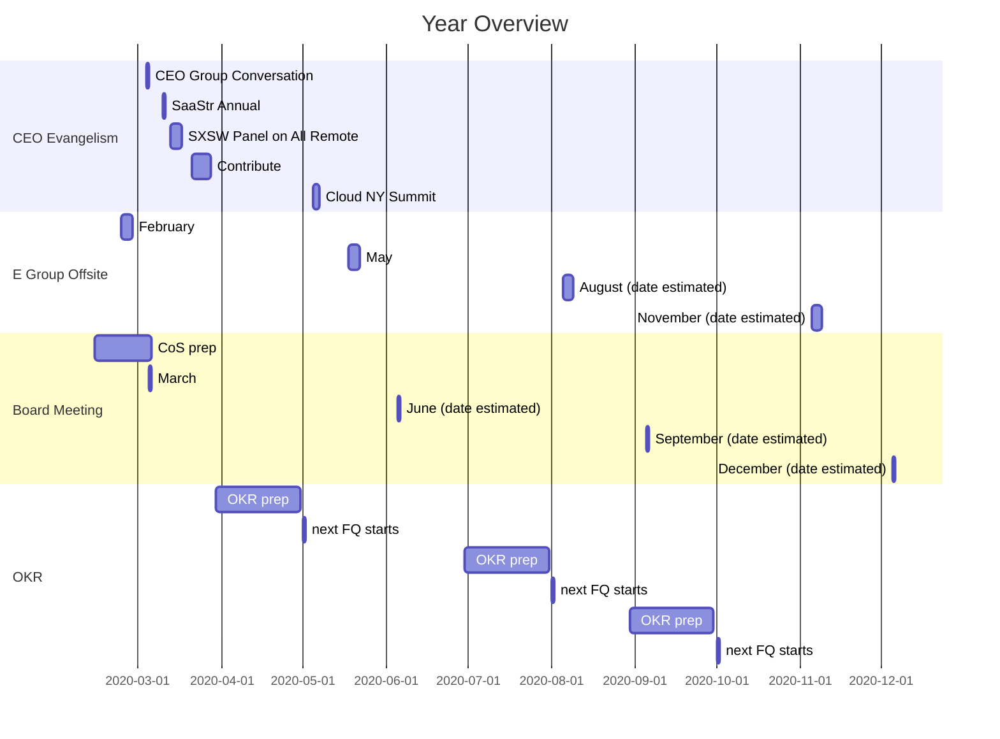

## On this page
{:.no_toc .hidden-md .hidden-lg}

- TOC
{:toc .toc-list-icons .hidden-md .hidden-lg}

{::options parse_block_html="true" /}

----

## Quick Links and Fun Facts
* [Chief of Staff Job Family](/job-families/chief-executive-officer/chief-of-staff/)
* [Internal Strategy Consultant Job Family](/job-families/chief-executive-officer/internal-strategy-consultant/)
* [Project](https://gitlab.com/gitlab-com/cos-team/)
* CoS = Chief of Staff
* CoST = Chief of Staff Team
* [Project](https://gitlab.com/gitlab-com/cos-team/)

## Contact Us
* [chief-of-staff-team](https://gitlab.slack.com/archives/CN7MPDZF0/p1568035351000200) on Slack

## What projects does the CoST work on?

The Chief of Staff and their team may work on projects that fit *any combination* of the following: 
* projects that are many-functional
* projects that are important but not urgent or are under resourced
* projects that are so broad that it can't live within a function but are too much work for the CEO
* projects that are important to the CEO

This is not an exhaustive list of the types of work the CoS might do.

The CoST works closely with the [CEO](/job-families/chief-executive-officer/), the [E-Group](/handbook/leadership/#e-group), the [EBA to the CEO](/job-families/people-ops/executive-business-administrator/), and [CEO Shadows](/handbook/ceo/shadow/).

#### Many Functional

GitLab is a [functional organization](/handbook/leadership/#no-matrix-organization), which means the [people are organized by function](/company/team/org-chart/).
Usually, when a project arises between two functional groups, they can work something out on their own.
When a project arises between three or more functional groups, the Chief of Staff will be the point person to execute.
In many cases, the Chief of Staff will be the [directly responsible individual (DRI)](/handbook/people-group/directly-responsible-individuals/).
Whether it's a product feature proposal, a new CI job for job families, or questions from the board, the CoS is the person who can be trusted to get things done, get them done quickly, and get them done right.

Examples of a cross-functional project:
* Helping shepherd KPI and/or OKR progress
* Learning and development initiatives shared by the Sales Enablement teams and the People org
* Helping ensure job families have the required parts

#### Underresourced

As GitLab grows, projects will come up that are important but are under resourced. 
Chiefs of Staff are known for their ability to become 80% effective on any subject quickly. 
They are generalists at their core and, while they bring special skills to the table, they are meant to be able to address important problems as they come up. 
A CoS might help source candidates for a strategic hire, fix grammatical errors in the handbook, and build a financial model all in the same day based on what is important or top of mind for the CEO at a given point. 
The goal of the CoS is not to do the work of other teams, but help address work that those teams may not have bandwidth to address but are important to the organization and/or the CEO.

An example of an underresourced project might be:
* CEO Evangelism until an Executive Comms person is hired

#### No clear leader

There may be projects with no clear leader for a myriad of reasons, including we're still hiring the point person or the lead is on leave. 
Because of the CoS's ability to come up to speed quickly, they may be tasked something totally out of their domain with the expectation that they bring their leadership experience to the table, will do the work to make good decisions, and will lean on team members who are SMEs. 

Examples of a project with no clear leader:
* Learning and development initiatives shared by the Sales Enablement teams and the People org
* CEO Evangelism until an Executive Comms person is hired

#### Broad 

Some projects or initiatives are very broad and cross-functional and *make sense* to belong to the CEO but are not a stregic use of the CEO's time. 
OKRs are a prime example. OKRs need to happen and are key to the business but it is not efficient for the CEO to shepherd the process along. 
The CoST is the shepherd for these sorts of projects and collaborates with all team members at GitLab to achieve success on such initatives. 

Examples of broad projects:
* E-group offsite prep
* Board meeting prep
* OKR shepherding

#### Important to the CEO
The CEO will have other projects that come up that he will task the CoST with, such as following up on something or carrying on a conversation on his behalf.

Examples of tasks that are important to the CEO:
* Handbook MRs
* Values updates
* Prepping for calls

## How to Work

The CoST works through a doc titled "Chief of Staff, Cheri, and Sid."
It's format is structured like the [1-1 Suggested Agenda Format](/handbook/leadership/1-1/suggested-agenda-format/).
Many of the tasks on the sheet are quick asks- handbook MRs, formatting changes, or questions to be answered.
Small asks should be handled as quickly as possible. 
Other asks, such as OKR-related planning or an initiative that requires alignment with multiple stakeholders, requires forethought and more appropriate timing.
Some amount of time each week needs to be spent moving these sorts of tasks forward. 

As a rule, everything in the doc is a TODO for the CoST. 
When tasks are DONE, they should be labelled as such. 
The CEO will review and delete the item once it's been assessed as completed. 

We work from the bottom up in agendas, unless told to prioritize otherwise. 

### When to ping the CEO

Handbook changes that come through the doc can be converted to DONE in the doc with the MR linked if they are merged by the CoS or ISCs.
MRs related to the board, what is not public, or the [CEO's reponsibilities](/job-families/chief-executive-officer/) should be staged and merged by the CEO. 
If these occur in the doc, they become DOTOs, as they're action items for the CEO. 
Asks that come through Slack should have the MR linked in the appropriate thread, so that there is a closed loop in Slack. 

## Board Meetings

The Chief of Staff plays a key role in support Board Meetings. 

The Board Meetings page is the single source of truth for information on the Board, but some of the responsibilities of the Chief of staff include: 
As per the [timeline](/handbook/board-meetings/#timeline):
1. reaching out before the meeting to collect questions from the board members.
1. sending reminders, preparing the agenda and chairing the meeting.
1. sends a reminder to the e-group two weeks in advance of the meeting.
1. distributing the board materials the Friday before the meeting.
1. ensuring that PDF versions of the materials including presentations, exhibits, minutes, option grants are stored in the Board of Directors folder on Google Drive in a folder labeled with the date of the meeting.
1. coordinating the [CEO Video](/handbook/board-meetings/#ceo-video)
1. grouping questions in the [Agenda](/handbook/board-meetings/#agenda)

## CEO Evangelism

The CEO Evangelism process follows what is outlined in the [Executive Technical Evangelism] Process, whether or not it's technical evangelism. 

The initial content review for the CEO should be in bullet points only. 
Then the CEO can talk through the slides and a team member can capture the CEO's tone of voice as he talks through the talk.
This helps ensure the talk track is in the CEO's voice.

### General Group Conversation

The Chief of Staff prepares the General Group Conversation slides for the CEO. 
During the General Group Conversations, please help facilitate the flow and ask team members to verbalize. 

## Daily Standup

On the CoST, we use [Geekbot](https://geekbot.com) for our Daily Standups.
These are posted in #chief-of-staff-team-standups in Slack.  
Once team members are added to the daily standup list, they will receive a message from Geekbot via DM once they've been active on Slack after 6 AM in their local timezone. 
There is no pressure to respond to Geekbot as soon as it messages you. 
When Geekbot asks, "What will you do today?" try answering with specific details.
Give responses to Geekbot that truly communicate to your team what you're working on that day, so that your team can help you understand if some priority has shifted or there is additional context you may need.

## Dates to Keep Track of

This is not the SSOT for these dates and is meant only for informational/organizational purposes. 

**CEO Evangelism**
* 2020-03-04 CEO Group Conversation
* 2020-03-10 SaaStr Annual
* 2020-03-13-17 SXSW Panel on All Remote
* 2020-03-21-27 Contribute Keynote
* 2020-05-06 CloudNY Summit

**Informal Board Meetings**
* 2020-02-21
* 2020-03-20
* 2020-04-17
* 2020-05-15
* 2020-06-19

**NomGov Meetings**
* 2020-02-28
* 2020-03-27
* 2020-04-24

**Board Meetings**
* March (in 2020, it will be 2020-03-05)
* June
* September
* December

**E-group Offsites**
* February 
* May
* August
* November

## Performance Indicators

<iframe class="dashboard-embed" src="https://app.periscopedata.com/shared/bcfef667-7d2b-45d7-9638-a23e196e2067?embed=true" height="1200"> </iframe>

### Throughput

Thoughput for the CoS team is measured as all MRs in [across GitLab Company namespaces](https://gitlab.com/gitlab-data/analytics/tree/master/transform/snowflake-dbt/macros#get-internal-parent-namespaces) divided by the number of team members.

### Executive Time for the CEO

Executive Time is measured through the CEO calendar. [Sid's Calendar Export](https://docs.google.com/spreadsheets/d/1xVaH7zrY8MIwI2TbZrcQnc8yepuHFFk87Ga7KZTB28o/edit?usp=drive_web&ouid=113483692538021736976) is a private google sheet built of a google apps script. 
The script is triggered to download all of the Calendar data every time it is run. 
The `filtered_columns` tab on this sheet pulls only the relevant columns for analyses. 
This tab is then pulled by [SheetLoad](/handbook/business-ops/data-team/#using-sheetload) into the SheetLoad drive and then ingested into [Snowflake](/handbook/business-ops/data-team/#-data-warehouse). 
Events [are categorized based on the event name and sender](https://gitlab.com/gitlab-data/analytics/blob/master/transform/snowflake-dbt/models/sheetload/base/sheetload_calendar.sql#L20), as outlined by the [EBA team best practices](/handbook/eba/#eba-team-best-practices).
All personal events are filtered out.
Those categories are applied to our [OKRs](/company/okrs/). 
Every event only gets one category. 
This is hard since some events may arguably fall into multiple. 
For example, a 1:1 with a CRO could go towards IACV, but since it's a 1:1 it goes towards Great Team, like all 1:1s.

## Resources on the CoS Role
* [The Unrepentent Generalist: How to Be a Great Chief of Staff in Tech](http://www.nehrlich.com/blog/2019/10/31/how-to-be-a-great-chief-of-staff-in-tech/)
* [NYT: Hail to the Chief of Staff](https://www.nytimes.com/2019/11/07/style/what-does-a-chief-of-staff-do.html)
* [Emilie Schario's Notes on the CoS Book](https://docs.google.com/document/d/1ZjWmqhv78eic57gxR825FvC9GMHo91pYakb3Jc7ximU/edit?usp=sharing)
* [Chief of Staff Tech Network](https://costechnetwork.com/)
* [Chief of Staff Resources](https://www.chiefofstaff.expert)
* [Prime Chief of Staff](https://primechiefofstaff.com)

### Good reads that apply to the role
* [The First 90 Days](https://medium.com/@robdickins/a-90-day-impact-plan-for-a-new-chief-of-staff-97768d9b04bd)
* [I’ve Logged 10,000 Hours as a Chief of Staff in a Large Tech Company](https://medium.com/@robdickins/ive-logged-10-000-hours-as-a-chief-of-staff-in-a-large-tech-company-here-s-my-pov-on-the-role-7c4aa095f5e8)
* [The Role of a Corporate Chief of Staff](https://medium.com/cos-tech-forum/part-1-the-role-of-a-corporate-chief-of-staff-8db0142318f1)
* [Better CoS: Decision Making](https://medium.com/@robdickins/better-cos-decision-making-5d97d14152e3)
