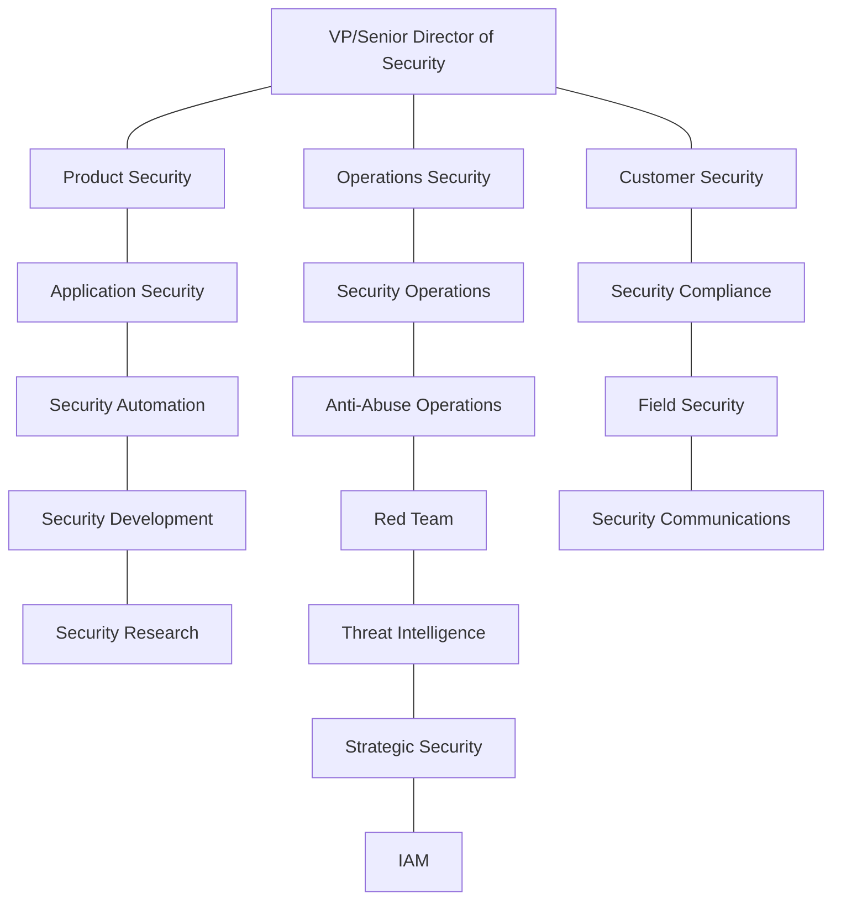
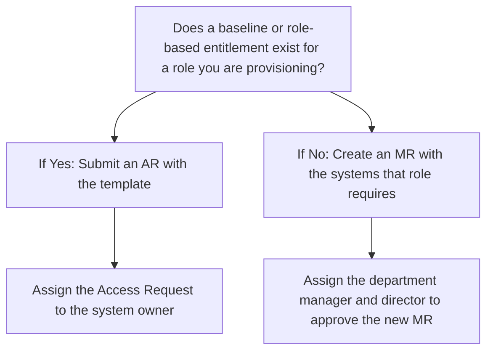
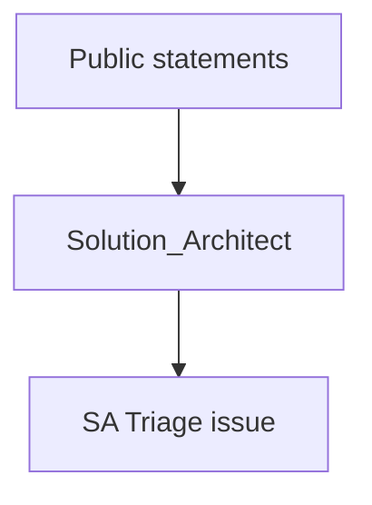

### On this page
{:.no_toc .hidden-md .hidden-lg}

- TOC
{:toc .hidden-md .hidden-lg}

## Engaging the Security On-Call

If you identified an urgent security issue, if something feels wrong, or you need immediate assistance from the Security Department, you have two options available:
* Slack: use the `/security Hi security, I have a concern! Please see the following URL ...` command.
* Email: send an email with a brief description of the issue to page-security@gitlab.com.

Please be aware that the Security Department can only be paged internally. If you are an external party, please proceed to [Vulnerability Reports and HackerOne](/handbook/engineering/security/#vulnerability-reports-and-hackerone) section of this page.

Both mechanisms will trigger the very same process, and as a result, the Security responder on-call will engage in the relevant issue within the appropriate SLA. If the SLA is breached, the Security manager on-call will be paged. When paging security a new issue will be created to track the incident being reported. Please provide as much detail as possible in this issue to aid the Security Engineer On Call in their investigation of the incident. The Security Engineer On Call will typically respond to the page within 15 minutes and may have questions which require synchronous communication from the incident reporter. It is important when paging security to please be prepared to be available for this synchronous communication in the initial stage of the incident response.

For lower severity requests or general Q&A, GitLab Security is available in the `#Security` channel in GitLab Slack and the Security Operations team can be alerted by mentioning `@sec-ops-team`. If you suspect you've received a phishing email, and have not engaged with the sender, please see: [What to do if you suspect an email is a phishing attack](/handbook/security/#what-to-do-if-you-suspect-an-email-is-a-phishing-attack). If you have engaged a phisher by replying to an email, clicking on a link, have sent and received text messages, or have purchased goods requested by the phisher, page security as described above.

> **Note:** The Security Department will never be upset if you page us for something that turns out to be nothing, but we will be sad if you don't page us and it turns out to be something.
***IF UNSURE - PAGE US.***

Further information on GitLab's security response program is described in our [Incident Response](./sec-incident-response.html) guide.

## External Contact Information

The security department can be contacted at `security@gitlab.com`. External researchers or other interested parties should
refer to our [Responsible Disclosure Policy](/security/disclosure/) for more information about reporting vulnerabilities.  The `security@gitlab.com`
email address also forwards to a [ZenDesk queue](/handbook/support/channels/#security-disclosures) that is monitored by the Field Security team.

For security team members, the private PGP key is available in the Security 1Password vault.  Refer to [PGP process](/handbook/security/pgp_process/)
for usage.

## Security Mission and Vision Statements

Our Mission is to be most Transparent Security Group in the world with a results oriented approach.

By embracing GitLab values and being active in engaging with our customers, our staff and our product, we enhance the security posture of our company, products, and client-facing services. The security department works cross-functionally inside and outside GitLab to meet these goals.

Our Vision is as follows:
1. GitLab Security as a business enabler
    with a focus on
* Improving time to market (new features getting into releases faster and prevent slippage)
* Creating Product and competitive differentiation
* Reducing internal roadblocks and delays
* Improving security’s risk based approach to decision making through decentralization and managing appropriate levels of acceptable risk

2. Strengthen GitLab's enterprise grade security
    with a focus on
* Achieving industry recognized security certifications
* Reducing the time required to pass customer security reviews
* A Direct impact to increasing contract size and volume
* Closing the gap between customer security requirements and GL’s Security posture

3. Reduce GitLab's threat landscape
    with a focus on
* Reducing the likelihood of breach
* Reducing the exposure and severity of vulnerabilities
* Reducing the cost associated with service vulnerabilities

## Security Hiring

The company-wide mandate is justification for mapping Security headcount to around 5% of total company headcount. Tying Security Department growth headcount to 5% of total company headcount ensures adequate staffing support for the following (below are highlights and not the entire list of responsibilities of the Security Department):

* Security releases. At GitLab, the Security Department is DRI for critical and non-critical security releases.
* Detection/response for security incidents, which will increase as GitLab.com users increase.
* Preparation for upcoming IPO.
* Running the GitLab public bug bounty program.
* Dogfooding and contributing to our product.
* Improving and maintaining the security of GitLab.com and related services.

## Security Department

As the Security Department has evolved, so has the area of engagement where Security has been required to provide input. Today, the Security Department provides an essential security service to the Engineering and Development Departments, and is directly engaged in Security Releases. However, the functions that the Security Department provides to the rest of the business are more consultative and advisory in nature - while the Security Department is a key player in the security questions raised throughout the business, it is not directly responsible for all of the administration of execution of functions that are required for the business to function while minimising risk.

This is expected - the security of the business should be a concern of everyone within the company and not just the domain of specialists. In addition, the role of the Security Department has expanded to assure customer, investor and regulator concerns about the security and safety of using GitLab as an enterprise-ready product, both through compliance certifications and through assurance responses directly to customers, and as we continue to encourage enterprise customers to use GitLab.com.

To reflect this, we have structured the Security Department around three key tenets, which drive the structure and the activities of our group. These are :

* Secure the Product
* Protect the Company
* Assure the Customer

### Secure the Product

This reflects the Security Department’s current efforts to be involved in the Application development and Release cycle for Security Releases, Security Research, our HackerOne bug bounty program, Security Automation and Vulnerability Management.

The term “Product” is interpreted broadly and includes the GitLab application itself and all other integrations and code that is developed internally to support the GitLab application for the multi-tenant SaaS. Our responsibility is to ensure all aspects of GitLab that are exposed to customers or that host customer data are held to the highest security standards, and to be proactive and responsive to ensure world-class security in anything GitLab offers.

### Protect the Company

This encompasses protecting company properties as well as to prevent, detect and respond to risks and events targeting the business and GitLab.com. This includes Security Operations and Anti-Abuse functions, Security Strategy, Threat Intelligence and Identity and Access Management Teams.

These functions have the responsibility of shoring up and maintaining the security posture of GitLab.com to ensure enterprise-level security is in place to protect our new and existing customers.

### Assure the Customer

This reflects the need for us to provide resources to our customers to assure them of the security and safety of GitLab as an application to use within their organisation and as a enterprise-level SaaS. This also involves providing appropriate consulting, services and resources to customers so that they trust GitLab as a Secure Company, as a Secure Product, and Secure SaaS

### Tenets Overlap between all Teams

It’s important to note that the three tenets do not operate independently of each other, and every team within the Security Department provides an important function to perform in order to progress these tenets. For example, Application Security may be strongly focused on Securing the Product, but it still has a strong focus around customer assurance and protecting the company in performing its functions. Similarly, Security Operations functions may be engaged on issues related to Product vulnerabilities, and the resolution path for this deeply involves improving the security of product features, as well as scoping customer impact and assisting in messaging to customers.

## Department Structure

Broadly speaking, teams are aligned under three Sections (Product, Operations and Customer) which reflect the tenets that are their primary focus. The Graph below illustrates how the teams within the Department are managed.



## "Secure the Product" Teams

The teams below are primarily focused on Application Security or other functions related to Securing the Product.

### Application Security

[Application Security](/handbook/engineering/security/application-security/) specialists work closely with development, product security PMs, and third-party groups (including paid bug bounty programs) to ensure pre and post deployment assessments are completed. Initiatives for this specialty also include:

 *  Pre and post deployment security assessments/tests
 *  Capture of flaws in software environment configuration
 *  Malicious code detection
 *  Patch/upgrade
 *  IP filtering
 *  Lock down executables
 *  Monitoring of programs at runtime to enforce the software use policy
 *  Developing and implementing a Secure Software Development Lifecycle (S-SDLC)
 *  Training and coaching developers on current security best practices

### Security Automation

[Security Automation](/handbook/engineering/security/automation/) specialists help us scale by creating tools that perform common tasks automatically. Examples include building automated security issue triage and management, proactive vulnerability scanning, and defining security metrics for executive review. Initiatives for this specialty also include:

 *  Assist other security specialty teams in their automation efforts
 *  Assess security tools and integrate tools as needed
 *  Define and own metrics and KPIs to determine the effectiveness of security programs
 *  Define, implement, and monitor security measures to protect GitLab.com and company assets

### Security Development

The Security Development team provides engineering and development capabilities for security teams. The Security Development team implements and deploys changes when security teams need changes or additional features to any of the products' codebases.

Furthermore, Security Development can design, plan, and build new products or services to aid and improve security of the product and company.

The Security Development team works closely with all of the other development teams (product teams, Secure, Defend) and is knowledgable about the company's development standards, processes, best practices, and codebases.

### Security Research

Security research specialists conduct internal testing against GitLab assets, and against FOSS that is critical to GitLab products and operations. Initiatives for this specialty also include:

*  Conduct vulnerability research against all GitLab and GitLab.com assets
*  Research FOSS tools that are integrated with GitLab
*  Develop proof-of-concept code to be included in security findings
*  Report findings to tool developers and track mitigation process
*  Follow [GitLab's responsible disclosure policy](/security/disclosure/#external) for community disclosure
*  Author blog posts on vulnerabilities discovered

## "Protect the Company" Teams

These teams are primarily focused on Protecting GitLab the business and Gitlab.com.

### Security Operations

The Security Operations team is here to manage security incidents across GitLab, which includes events that originate from outside of our infrastructure. This is often a fast-paced and stressful environment where responding quickly and maintaining ones composure is critical.

More than just being the first to acknowledge issues as they arise, Security Operations is responsible for leading, designing, and implementing the strategic initiatives to grow the Detection and Response practices at GitLab.  These initiatives include:

 * Work with the internal and external partners to ingest logging and alerting into our centralized monitoring solution
 * Triage and analysis of alerting to determine validity, how to remediate and/or prevent incidents, then act accordingly
 * Coordinate localized or company-wide response to security incidents
 * Define and lead vulnerability management for GitLab Team Members and the production/pre-production environments as part of GitLab.com
 * Incorporate current security trends, advisories, publications, and academic research into our security practices
 * Deploy and maintain security monitoring and analysis solutions for GitLab.com

Security Operations can be contacted on slack via our handle `@sec-ops-team` or in a Gitlab issue using `@gitlab-com/gl-security/secops`. If your request requires immediate attention please review the steps for [engaging the security on-call](#engaging-the-security-on-call).

### Abuse Operations

Abuse Operations specialists investigate and mitigate the malicious use of our systems, which is defined under Section 3 of the [GitLab Website Terms of Use](/terms/#gitlab_com). This activity primarily originates from inside our infrastructure. Initiatives for this specialty include:

 * Three main abuse types:
   * Continuous Integration
   * Content
   * Spam
 * DMCA Notice and Counter-Notices (dmca@gitlab.com)
 * Mitigation of abusive/non-responsive customers
 * Verifying the proper classification of abuse reports
 * Escalating to stakeholders while continuing to monitor
 * Monitoring logs and queues for trends
 * Research and prevention trending abuse methodologies

 For more information please see our [Resources Section](/handbook/engineering/security/#abuse-operations-resources)

***Code of Conduct Violations*** are [handled](/handbook/marketing/community-relations/community-advocacy/workflows/code-of-conduct-enforcement) by the [Community Advocates](/handbook/marketing/community-relations/community-advocacy/) in the [Community Relations Team](/handbook/marketing/community-relations/). For more information on reporting these violations please see the [GitLab Community Code of Conduct](/community/contribute/code-of-conduct/) page.

### Red Team

GitLab's internal [Red Team](/handbook/engineering/security/red-team) emulates adversary activity to better GitLab’s enterprise and product security. This includes activities such as:

* Performing exercises with SecOps to collaboratively and rapidly iterate on improving GitLab's security posture. These exercises will be referred to as purple team exercises merging blue (secops) and red teams together.
* Performing exercises to reflect simulated adversarial attempts to compromise organizational mission/business functions and provide a comprehensive assessment of the security state of information systems and organizations.
* Simulating adversarial attempts to compromise organizational missions/business functions and the information systems that support those missions/functions may include technology-focused attacks (e.g., interactions with hardware, software, or firmware components and/or mission/business processes) and social engineering-based attacks (e.g., interactions via email, telephone, shoulder surfing, or personal conversations).

### Threat Intelligence

Threat intelligence specialists research and provide information about specific threats to help us protect from the types of attacks that could cause the most damage. Initiatives for this specialty also include:

*  Collect and analyze threat intelligence reports covering new threats, vulnerabilities, products, and research
*  Author threat intelligence reports, driven by our security operations team's own incidents, analysis, and adversary engagements
*  Evolve monitoring operations by extracting data from threat intelligence and create new content, signatures, and understanding of adversary TTPs
*  Analyze event feeds and collected malware over long term to trend and correlate

### Strategic Security

Strategic security specialists focus on holistic changes to policy, architecture, and processes to reduce entire categories of future security issues. Initiatives for this specialty also include:

*  Cluster related historical security issues and examine them as a larger set
*  Identify and generate trends associated with each set
*  Propose actionable changes to GitLab architecture, processes, and infrastructure to mitigate future issues within each set
*  Generate metrics which measure the effectiveness of each mitigation implemented

### Identity and Access Management (IAM)

The Identity and Access Management (IAM) team manages policy and implementation around tooling used to identify and manage access rights for GitLab team-members. This includes managing access requests, provisioning and deprovision processes for GitLab team-members, and managing the governance and auditing of access rights to applications and services used by GitLab.

Areas in scope for this team would include:

* Ownership, business guidance and approval over IAM across GitLab
* Management of the Access Request processes and procedures
* Management of the identity and authentication functions for onboarding and offboarding of GitLab team-members.
* Quarterly access review for compliance and governance
* Building and extending access management governance software and tooling
* Application and Group Management within the Okta platform, including application integration and integration of Device Trust and User Behaviour Analytics
* Tracking of user activity for suspicious behaviour, development of identity-based IOCs with engagement from the Security Operations team.

## "Assure the Customer" Teams

The teams below target Customer Assurance projects among their responsibilities.

### Security Compliance

Compliance enables Sales by achieving standards as required by our customers and help to verify that the outcomes the security department is trying to achieve are actually being met. This includes SaaS, on-prem, and open source instances. Initiatives for this specialty also include:

 * Develop roadmap based on customer needs _e.g._
   * GDPR
   * SOC 2
   * FIPS 140-2
 * Align other security specialist activities with the compliance roadmap
 * Develop relationships with key government personnel and policy makers
 * Assist work of internal and external auditors or advisors as needed
 * Propose compliance features for the GitLab product in order to help our customers more easily achieve their compliance goals

 For additional information about the compliance program see the [Security Compliance team handbook page](./compliance.html) or refer to [GitLab's security controls](/handbook/engineering/security/sec-controls.html) for a detailed list of all compliance controls organized by control family.

### Field Security
The Field Security team serves as the public face for GitLab's Security Department. The Field Security team works closely with multiple teams within GitLab including:

*  Customers
*  Sales
*  Support
*  Engineering
*  Compliance

Areas of responsibility for the Field Security team include:

*  Present information and assurance to our teams and customers to promote Trust and knowledge of GitLab's security functions
*  Evangelize Security Best Practices to customers and teams
*  Improve Security Department's capacity to respond to security questions and incidents
*  Escalate security issues to appropriate teams and drive to resolution
*  Provide training to GitLab team-members
*  Provide guidance for securing GitLab assets
*  Monitor and participate in community forums and Slack channels

### Security External Communications

The External Communications Team leads customer advocacy, engagement and communications in support of GitLab Security Team programs. Initiatives for this specialty include:

* Increase engagement with the hacker community, including our public bug bounty program.
* Build and manage a Security blogging program.
* Develop social media content and campaigns, in collaboration with GitLab social media manager.
* Manage security alert email notifications.
* Collaborate with corporate marketing, PR, Community Advocates and Technical Evangelism teams to help identify opportunities for the Security Team to increase industry recognition and thought leadership position.


## Security Department Collaborators

### Secure Team

The Security department will collaborate with development and product management for security-related features in GitLab.
The [Secure team]( ../ops/secure) must not be mistaken with the Security Teams.

*  Develop real-world security use cases
*  Ideation of compelling security features and products
*  Test and provide product feedback

### External Security Firms

We work closely with bounty programs, as well as security assessment and penetration testing firms to ensure external review of our security posture.

*  One security assessment firm is rotated periodically to gain new perspectives
*  One security assessment firm is engaged every quarter to build expertise in GitLab
*  We maintain a public bug bounty program via [HackerOne](https://hackerone.com/gitlab)

## Resources

### Information Security Policies

Information Security Policies are reviewed annually. Policy changes are approved by the Senior Director of Security and Legal. Changes to the Data Protection Impact Assessment Policy are approved by GitLab's Privacy Officer.

- [GitLab Internal Acceptable Use Policy](/handbook/people-group/acceptable-use-policy/)

- [GitLab Password Policy](/handbook/security/#gitlab-password-policy-guidelines)

- [Access Management Policy](/handbook/engineering/security/#access-management-process)

- [Data Classification Policy](/handbook/engineering/security/data-classification-policy.html)

- [Data Protection Impact Assessment Policy](/handbook/engineering/security/dpia-policy/)

- [Penetration Testing Policy](/handbook/engineering/security/penetration-testing-policy)

- [Audit Logging Policy](/handbook/engineering/security/audit-logging-policy.html)

### Information Security Policy Exception Management Process

Information security considerations such as regulatory, compliance, confidentiality, integrity and availability requirements are most easily met when companies employ centrally supported or recommended industry standards. Whereas GitLab operates under [the principle of least privilege](/handbook/engineering/security/index.html#principle-of-least-privilege), we understand that centrally supported or recommended industry technologies are not always feasible for a specific job function or company need. Deviations from the aforementioned standard or recommended technologies is discouraged.  However, it may be considered provided that there is a reasonable, justifiable business and/or research case for an information security policy exception; resources are sufficient to properly implement and maintain the alternative technology; the process outlined in this and other related documents is followed and other policies and standards are upheld.

In the event an employee requires a deviation from the standard course of business or otherwise allowed by policy, the Requestor must submit a [Policy Exception Request](https://gitlab.com/gitlab-com/gl-security/compliance/compliance/issues/new?issue%5Bassignee_id%5D=&issue%5Bmilestone_id%5D=) to IT Security,  which contains, at a minimum, the following elements:

*  Employee Name and contact
*  Requested access that is beyond standard, entitled scope
*  Time period for the extended access (deviations should not exceed 90 days)
*  Formal proof that the head of Requestor’s department approves the expanded, requested access
*  The exception being requested, i.e. which policy or procedure is affected by the proposed deviation
*  Any alternative, lesser solution can be provided
*  The business justification for the proposed deviation
*  Compensating controls which will be implemented to ensure proper oversight.

The [Policy Exception Request](https://gitlab.com/gitlab-com/gl-security/compliance/compliance/issues/new?issue%5Bassignee_id%5D=&issue%5Bmilestone_id%5D=) should be used to request exceptions to information security policies, such as the password policy, or when requesting the use of a non-standard device (laptop).

The Director of Security approves or denies IT Security Policy Exceptions. Security Operations must review and approve all device exceptions.

If the business wants to appeal a decision by the Director of Security, such appeal will be sent to Legal at legal@gitlab.com. Legal will draft an opinion as to the proposed risks to the company if the deviation were to be granted. Legal’s opinion will be forwarded to the CEO and CFO for final disposition.

Any deviation approval must:
* Recommended compensating controls to reduce exposure and/or harm (i.e. admin rights to financially significant system may require audit logs and review of users activity within the system)
* Be captured in writing
* Sent to Internal Audit for oversight

### GitLab.com Groups and Projects

- [@gitlab-com/gl-security](https://gitlab.com/gitlab-com/gl-security/) is the primary group for @'mentioning the entire Security Department.
- [@gitlab-com/gl-security/security-managers](https://gitlab.com/gitlab-com/gl-security/security-managers) is the primary group for @'mentioning all managers in the Security Department.
- [public (!) Security Engineering](https://gitlab.com/gitlab-com/gl-security/engineering/) for Security Department initiatives, `~meta` and backend tasks, and catch all for anything
not covered by other projects.
- [@gitlab-com/gl-security/compliance](https://gitlab.com/gitlab-com/gl-security/compliance) is the primary group for @'mentioning the Compliance team.
- [@gitlab-com/gl-security/appsec](https://gitlab.com/gitlab-com/gl-security/appsec) is the primary group for @'mentioning the Application Security team.
- [@gitlab-com/gl-security/secops](https://gitlab.com/gitlab-com/gl-security/secops) is the primary group for @'mentioning the Security Operations team.
- [@gitlab-com/gl-security/automation](https://gitlab.com/gitlab-com/gl-security/automation) is the primary group for @'mentioning the Security Automation team.
- [@gitlab-com/gl-security/abuse-team](https://gitlab.com/gitlab-com/gl-security/abuse-team) is the primary group for @'mentioning the Abuse Operations team.
- [@gitlab-com/gl-security/field-security](https://gitlab.com/gitlab-com/gl-security/field-security) is the primary group for @'mentioning the Field Security team.
- [Security Operations (private)](https://gitlab.com/gitlab-com/gl-security/secops/operations) for
- [security runbooks (private)](https://gitlab.com/gitlab-com/gl-security/runbooks) -
**NOTE**: The [production runbooks](https://gitlab.com/gitlab-com/runbooks) should
be the first location considered for any process or documentation. `gl-security/runbooks`
should only be used for documenting specifics that would increase risk and/or
have customer impact if publicly disclosed.
- [Incident-Tools (private)](https://gitlab.com/gitlab-com/gl-security/incident-tools)
for working scripts and other code during or while remediating an incident.
If the tool is applicable outside of the `GitLab.com` environment, consider
if it's possible to release when the `~security` issue becomes
non-confidential. This group can also be used for private demonstration projects for
security issues.
- [security-tools (mostly private)](https://gitlab.com/gitlab-com/security-tools/) contains some
operational tools used by the security teams. Contents and/or configurations
require that most of these projects remain private.

### Slack Channels

- [#security](https://gitlab.slack.com/archives/security); Used for general
  security questions and posting of external links for the great discussions.
  Company wide security relevant announcements are announced in #company-announcements
  and may be copied here.
- [#security-department](https://gitlab.slack.com/archives/security-department) - Daily questions
  and discussions focused on work internal to the security department. Can be used for
  reporting when unsure of where to go.
- [#abuse](https://gitlab.slack.com/archives/abuse) - General Abuse questions or discussions.  Can be used for reporting suspected abuse activity/content. Use `@abuse-team` in the channel to alert the team to anything urgent.
- `#security-department-standup` - Private channel for daily standups.
- `#incident-management` and [other infrastructure department channels](/handbook/engineering/infrastructure/#common-links)
- `#security-alert-manual` - New reports for the security department from various intake sources, including ZenDesk and new HackerOne reports.
- `#hackerone-feed` - Feed of most activity from our HackerOne program.
- Other `#security-alert-*` and `#abuse*` - Multiple channels for different notifications
  handled by the Security Department.
- Use the **@sec-ops-team** mention in any Slack channel to tag the members of the Security Operations team.
- Use the **@sec-compliance-team** mention in any Slack channel to tag the members of the Security Compliance team.
- Use the **@appsec-team** mention in any Slack channel to tag the members of the Application Security team.
- Use the **@abuse-team** mention in any Slack channel to tag the members of the Abuse Operations team.
- Use the **@field-security** mention in any Slack channel to tag the members of the Field Security team.

### Other Frequently Used GitLab.com Projects

Security crosses many teams in the company, so you will find `~security` labelled
issues across all GitLab projects, especially:

* [gitlab-foss](https://gitlab.com/gitlab-org/gitlab-foss/issues/)
* [gitlab](https://gitlab.com/gitlab-org/gitlab/issues/)
* [infrastructure](https://gitlab.com/gitlab-com/gl-infra/infrastructure/issues/)
* [production](https://gitlab.com/gitlab-com/gl-infra/production/issues/)

When opening issues, please follow the [Creating New Security Issues](#Creating-New-Security-Issues) process for using labels and the confidential flag.

### Other Resources for GitLab Team Members

- [Security Best Practices](/handbook/security/), using
1Password and similar tools, are documented on their own [security best
practices page](/handbook/security/).
- GitLab.com and GitLab Hosted [data breach notification policy](/security/#data-breach-notification-policy).
- GitLab Internal Acceptable Use [Policy](/handbook/people-group/acceptable-use-policy/).
- For GitLab.com, we have developed a [Google Cloud Platform (GCP) Security Guidelines Policy](https://docs.google.com/document/d/1BBTWC5OpIqrva7DqH4nkjYUmNZ3UFbc6erqV89P_N-o/edit?usp=sharing) document, which outlines recommended best practices, and is enforced through
our security automation initiatives.
- GitLab Security Tanuki for use on security release blogs, social media and security related swag as appropriate:
     - [Web-RGB](https://gitlab.com/gitlab-com/marketing/corporate-marketing/tree/master/design/gitlab-brand-files/gitlab-logo-files/gitlab-security-logo/web-rgb)
     - [Print-CMYK](https://gitlab.com/gitlab-com/marketing/corporate-marketing/tree/master/design/gitlab-brand-files/gitlab-logo-files/gitlab-security-logo/print-cmyk)
     - and one [exclusively for stickers](https://gitlab.com/gitlab-com/marketing/corporate-marketing/blob/master/design/gitlab-brand-files/gitlab-logo-files/gitlab-security-logo/print-cmyk/pdf/sticker/gitlab-security-icon-diecut-sticker-3x2_78in.pdf).

### How to track OKR related work scheduled by quarter

The Security Department tracks their OKRs using the boards in the table below.
These boards aggregate work from the many subgroups and projects under `gitlab-com/gl-security`
used by the various subteams to track their work and projects. High level issues
and open issues that map directly to an OKR should be added to the board for the
quarter to provide visibility into the current work of the security department.

When creating an issue that maps to an OKR, apply the following group level labels
so that it appears in the board:

* The label for the assigned (usually the current) quarter. For example: `~FY20Q3`
* The scoped `Security Management::` label for the appropriate team. For example: `~Security Management::Security Automation Team`

These labels can also be applied to MRs related to the work.

| Quarter | Board |
|---------|-------|
| `~FY20Q4` | [Board link](https://gitlab.com/groups/gitlab-com/gl-security/-/boards/1367370?label_name[]=FY20Q4) |
| `~FY20Q3` | [Board link](https://gitlab.com/groups/gitlab-com/gl-security/-/boards/1218177?label_name[]=FY20Q3) |
| `~FY20Q2` | [Board link](https://gitlab.com/groups/gitlab-com/gl-security/-/boards/1122898?label_name[]=FY20Q2) |

### How We Plan, Assign, and Execute Work

Any work that is related to an OKR is tracked with an issue in the appropriate
team or project tracker and linked to the OKR issue as related.

Larger initiatives that span the scope of multiple teams or projects may require
a [Planning](./planning) handbook page to further developer requirements.

## Security Releases

The definitions, processes and checklists for security releases are described
in the
[release/docs](https://gitlab.com/gitlab-org/release/docs/blob/master/general/security/process.md)
project.

The policies for backporting changes follow [Security Releases](https://docs.gitlab.com/ee/policy/maintenance.html#security-releases)
for Gitlab EE.

For critical security releases, refer to [Critical Security Releases](https://gitlab.com/gitlab-org/release/docs/blob/master/general/security/process.md#critical-security-releases) in `release/docs`.

## Issue Triage

The Security team needs to be able to communicate the priorities of security related issues to the Product, Development, and Infrastructure teams. Here's how the team can set priorities internally for subsequent communication (inspired in part by how the [support team does this](/handbook/support/workflows/issue_escalations.html)).

### Creating New Security Issues

New security issue should follow these guidelines when being created on `GitLab.com`:

 * Create new issues as `confidential` if unsure whether issue a potential
   vulnerability or not.  It is easier to make an issue that should have been
   public open than to remediate an issue that should have been confidential.
   Consider adding the `/confidential` quick action to a project issue template.
 * Always label as `~security` at a minimum.
 * Add any additional labels you know apply. Additional labels will be applied
   by the security team and other engineering personnel, but it will help with
   the triage process:
   * `~bug` or `~feature` if appropriate
   * Team or devops lifecycle labels
   * `~customer` if issue is a result of a customer report
   * `~internal customer` should be added by team members when the issue
     impacts GitLab operations.
 * Issues that contain customer specific data, such as private repository contents,
   should be assigned `~keep confidential`. If possible avoid this by linking
   resources only available to GitLab employees, for example, the originating
   ZenDesk ticket.  Label the link with `(GitLab internal)` for clarity.

Occasionally, data that should remain confidential, such as the private
project contents of a user that reported an issue, may get included in an
issue. If necessary, a sanitized issue may need to be created with more
general discussion and examples appropriate for public disclosure prior to
release.

For review by the Application Security team, @ mention `@gitlab-com/gl-security/appsec`.

For more *immediate* attention, refer to [Engaging security on-call](#engaging-the-security-on-call).


### Severity and Priority Labels on `~security` Issues

The presence of `~security` modifies the standard [severity labels](https://gitlab.com/gitlab-org/gitlab-foss/blob/master/CONTRIBUTING.md#severity-impact-guidance)(`~S1`, `~S2`, `~S3`, `~S4`)
by additionally taking into account
likelihood as described [below](#security-severity-labels), as well as any
other mitigating or exacerbating factors. The priority of addressing
`~security` issues is also driven by impact, so in most cases, the priority label
assigned by the security team will match the severity label.
Exceptions must be noted in issue description or comments.

The intent of tying `~S/~P` labels to remediation times is to measure and improve GitLab's
response time to security issues to consistently meet or exceed industry
standard timelines for responsible disclosure. Mean time to remediation (MTTR) is
a external
metric that may be evaluated by users as an indication of GitLab's commitment
to protecting our users and customers. It is also an important measurement that
security researchers when choosing to engage with the security team, either
directly or through our [HackerOne Bug Bounty Program](#hackerone-process).

| Severity  | Priority  | Time to mitigate    |Time to remediate      |
|-----------|-----------|---------------------|-----------------------|
| `~S1`     | `~P1`     | Within 24 hours     | On or before the [next security release](/blog/categories/releases/)   |
| `~S2`     | `~P2`     | N/A                 | Within 60 days        |
| `~S3`     | `~P3`     | N/A                 | Within 90 days        |

### Due date on `~security` Issues

For `~S2` and `~S3` `~security` issues, the security engineer assigns the `Due date`,
which is the target date of when fixes should be ready for release.
This due date should account for the `Time to remediate` times above, as well as
monthly security releases on the 28th of each month. For example, suppose today is October 1st, and
a new `S2` `~security` issue is opened. It must be addressed in a security release within 60 days,
which is November 30th. So therefore, it must catch the November 28th security release.
Furthermore, the [Security Release Process deadlines](https://gitlab.com/gitlab-org/release/docs/blob/master/general/security/process.md#release-deadlines)
say that it should the code fix should be ready by November 23rd. So the due date
in this example should be November 23rd.

`~S1` `~security` issues do not have a due date since they should be fixed as soon
as possible, and a security release made available as soon as possible to accommodate
it. These issues are worked by a security engineer oncall to mitigate the risk within 24 hours. This means the risks relevant to our customers have been removed or reduced as much as possible within 24 hours. The remediation timeline target is never greater than our next [security release](/blog/categories/releases/) but remediation in this case would not impact customer security risk.

Note that some `~security` issues may not need to be part of a code release, such as
an infrastructure change. In that case, the due date will not need to account for
monthly security release dates.

On occasion, the due date of such an issue may need to be changed if the security team
needs to move up or delay a monthly security release date to accommodate for urgent
problems that arise.
#### ~feature

Security issues which would be triaged as `~S4`, are most likely `~feature`s
that should be triaged and prioritized by a product manager. This
includes suggestions without a well-defined path for implementation or
requiring complex changes to the application or architecture to address.
`~S4/~P4` may be used for `~feature`s as assigned by a product
manager and do not need assignment to a release.

#### ~"security request"

The security team may also apply `~internal customer` and [~`security request`](https://gitlab.com/groups/gitlab-org/-/issues?scope=all&utf8=%E2%9C%93&state=opened&label_name[]=security%20request) to issue as an
indication that the feature is being requested by the security team to meet
additional customer requirements, compliance or operational needs in
support of GitLab.com.

#### Transferring from Security to Engineering

The security engineer must:

 * Add [group label](https://gitlab.com/gitlab-org/gitlab-foss/blob/master/doc/development/contributing/issue_workflow.md#group-labels) (`~group::editor`, `~group::package`, etc.)
 * Add [stage label](https://gitlab.com/gitlab-org/gitlab-foss/blob/master/doc/development/contributing/issue_workflow.md#stage-labels)
 * Any additional labels, such as `~merge request`.
 * Mention the product manager for scheduling, such as `@pm for scheduling`.
 * The engineering team lead should be @ mentioned and followed up with when necessary as
noted below for different severity levels.

The product manager will assign a `Milestone` that has been assigned a due
date to communicate when work will be assigned to engineers. The `Due date`
field, severity label, and priority label on the issue should not be changed
by PMs, as these labels are intended to provide accurate metrics on
`~security` issues, and are assigned by the security team. Any blockers,
technical or organizational, that prevents `~security` issues from being
addressed as [our top priority](/handbook/engineering/workflow/#security-is-everyones-responsibility)
should be escalated up the appropriate management chains.

**Note that issues are not scheduled for a particular release unless the team leads add them to a release milestone *and* they are assigned to a developer.**

Issues with an `S1` or `S2` rating should be immediately brought to the
attention of the relevant engineering team leads and product managers by
tagging them in the issue and/or escalating via chat and email if they are
unresponsive.

Issues with an `S1` rating have priority over all other issues and should be
considered for a critical security release.

Issues with an `S2` rating should be scheduled for the next scheduled
security release, which may be days or weeks ahead depending on severity and
other issues that are waiting for patches. An `S2` rating is not a guarantee
that a patch will be ready prior to the next security release, but that
should be the goal.

Issues with an `S3` rating have a lower sense of urgency and are assigned a
target of the next minor version.  If a low-risk or low-impact vulnerability
is reported that would normally be rated `S3` but the reporter has
provided a 30 day time window (or less) for disclosure the issue may be
escalated to ensure that it is patched before disclosure.

#### Security issue becoming irrelevant due to unrelated code changes

It is possible that a ~security issue becomes irrelevant after it was initially triaged,
but before a patch was implemented. For example, the vulnerable functionality was removed
or significantly changed resulting in the vulnerability not being present anymore.

If an engineer notices that an issue has become irrelevant, he should @-mention the person
that triaged the issue to confirm that the vulnerability is not present anymore. **Note that
it might still be necessary to backport a patch to previous releases according to our
[maintenance policy](https://docs.gitlab.com/ee/policy/maintenance.html#security-releases)**.
In case no backports are necessary, the issue can be closed.

## Secure Coding Training

For information on secure coding initiatives, please see the [Secure Coding Training](./secure-coding-training.html) page.

## Access Management Process

Centralized access management is key to ensuring that the correct GitLab team-members have access to the correct data and systems and at the correct level. GitLab access controls are guided by the principle of least privilege and need-to-know. These controls apply to information and information processing systems at the application and operating system layers, including networks and network services.

The [access request project](https://gitlab.com/gitlab-com/access-requests) is used to request and track the following access-related activities:

1. [New Access Requests](https://gitlab.com/gitlab-com/access-requests/issues/new?issuable_template=Single%20Person%20Access%20Request)
2. [Access Removal Requests](https://gitlab.com/gitlab-com/access-requests/issues/new?issuable_template=Remove%20Access%20Request)
3. [Access Reviews](https://gitlab.com/gitlab-com/access-requests/issues/new?issuable_template=Access%20Review)
4. [New Service Account Requests](https://gitlab.com/gitlab-com/access-requests/issues/new?issuable_template=New%20Service%20Account%20Request)

Usage guidelines for each of the access templates is outlined on the [IT Operation's handbook page](/handbook/business-ops/it-ops-team/access-requests/#single-person-access-request).

These templates should be used during the [onboarding process](/handbook/general-onboarding/) and throughout the employment tenure of a GitLabber. Access required as part of the team member's onboarding should be requested using the [New Access Requests](https://gitlab.com/gitlab-com/access-requests/issues/new?issuable_template=Single%20Person%20Access%20Request) or if applicable, one of the available [Role-based entitlements templates](/handbook/business-ops/it-ops-team/access-requests/#role-entitlements-for-a-specific-job).

### Access Control Policy and Procedures

* All new access or permissioning change requests require a [New Access Request](https://gitlab.com/gitlab-com/access-requests/issues/new?issuable_template=Single%20Person%20Access%20Request).

* Shared accounts may not be used for customers.gitlab.com, dev.gitlab.org, Shopify, Stripe, and Zuora in order to comply with PCI-DSS requirements. Currently, GitLab's financial controls prohibit the use of shared accounts within the following applications: NetSuite.

* Shared and group credentials are restricted. Any systems that require shared accounts or credentials and are not yet implemented or configured into Okta must have an Access Request approved and an exception to this policy for each user. Bulk access requests are not allowed for shared or group credentials.

* All access requests must be approved by the team member's manager with the exception of:

   - ARs for G-Suite email distribution lists for internal GitLab team members
   - ARs for Slack groups for internal GitLab team members
   - ARs using a role based template

  Please note that ARs for access to internal systems for "external to GitLab individuals" (eg. customers, prospects) require managerial approval. This includes access to G-Suite security groups also require managerial approval.

* Access requests are required when requesting a role above developer (i.e. maintainer, owner) on the following GitLab repositories and Groups:

- Repos:
   - www-gitlab-com
   - [GitLab CE and GitLab EE](https://gitlab.com/gitlab-org/gitlab) (aka single Rails repository)

- Groups:
   - gitlab.com and gitlab.org - top level group permissions

* Access requests should be submitted when requesting explicit access to private groups, sub-groups, and repositories in order to facilitate deprovisioning.

* Requests for access to Infrastructure assets (servers and databases) require a second layer of approval from Infrastructure Management.

* All access requests must be provisioned as approved. An AR that is approved without a role specified should not be provisioned until the role being requested is identified and re-approved.

* Administrative permissions should be considered operational in nature. This means that they are granted for the sole purpose of system management, configuration, and support. They should be recognized as privileged accounts and as such, activities must be logged and the logs protected and regularly reviewed.

* Time-based access may be provided if administrative action is required for a set period of time. This should be documented as part of the Access Request SLAs.

* All requests for new service accounts require a [New Service Account Request](https://gitlab.com/gitlab-com/access-requests/issues/new?issuable_template=New%20Service%20Account%20Request)

* All requests for new service accounts must be approved by a member of Infrastructure Management.

* In regard to support during or prior to provisioning, please do not tag the Security Operations team in the AR issue; to ask Security for help with AR assignments, please use the #it_help channel.

* If admin-level access is being requested, the request must be approved by the team member's manager and Infrastructure Management if applicable.

### Access Control Process Exceptions

* An access request is not required for Google Drive folders or files.

* Managerial approval is not required when requesting access to:

  - ARs for G-Suite email distribution lists for internal GitLab team members
  - ARs for Slack groups for internal GitLab team members
  - ARs using role based templates

### Bulk Access Requests

* Bulk access requests are those that are for multiple GitLab team-members. Bulk requests can be submitted for the following three types of requests:

  - Email aliases/forwarding in GSuite.
  - The adding of team members to Slack groups.
  - All GitLab team-members listed on the Access Request have the same manager and the same level of access is being requested.

  Please note that the above use cases do not apply to ADMIN-level access, which needs to be submitted using the  **one** issue per GitLab team-member rule.


### Access Requests and Onboarding

During the onboarding process, the manager should determine which email and slack groups the new team member should be added to. Also determine if new team member will need access to the `dev` server, which is used by engineers to prepare fixes for security issues and also allows for access to version.gitlab.com and license.gitlab.com. If so, request the creation of a [new dev.GitLab.org account](https://dev.gitlab.org/admin/users/new) *with the same username the team member has on gitlab.com* and an invitation to the [gitlab group](https://dev.gitlab.org/groups/gitlab/group_members) as a Developer. Fill out one [access request](https://gitlab.com/gitlab-com/access-requests/issues/new?issuable_template=Single%20Person%20Access%20Request) for both the groups and Dev account if needed.

### Principle of Least Privilege

GitLab operates its access management under the [https://csrc.nist.gov/glossary/term/least-privilege](principle of least privilege). Under least privilege, a team member should only be granted the minimum necessary access to perform their function. An access is considered necessary only when a GitLabber cannot perform a function without that access. If an action can be performed without the requested access, it's not considered necessary. Least privilege is important because it protects GitLab and its customers from unauthorized access and configuration changes and in the event of an account compromise by limiting access.

### Least Privilege Reviews for Access Requests

* A least privilege review should be performed by a system's administrator and the manager of the team member for whom access is being requested. System administrators should be provided security training that includes specific training on least privilege and its application.

* To perform a least privilege review, compare the rationale provided for the service(s) to which access is being requested with the level of access being requested.

  - Consider whether the access requested provides the team member access beyond what is required per the information provided in the `rationale` section of the access request.

* If the access requested provides the team member only the access they require to perform what's in the `rationale` section of the access request, the access request should be approved. In this case, simply proceed with approving the access request. An access request approval is considered confirmation the request has been reviewed for least privilege. Once your approval has been submitted, there's no more action for you to take for the least privilege review.

* If the access requested provides the team member **access beyond what is required** in the information provided in the `rationale` section of the access request, the request doesn't align with the principle of least privilege and the request should be temporarily rejected until the appropriate access can be defined. To reject an access request on the basis of least privilege, respond to the issue with the following information:

  - Which service(s) are being requested excessive permissions.
  - A specific example of why the the requested access is excessive. For example, a team member is requesting Super Admin access on GSuite only for provision user accounts, but the Super Admin role provides access far beyond just user account provisioning.
  - An alternative level of access and brief explanation how the new level of access allows the team member to fulfill their role. For example, a User Admin role on GSuite allows the team member to provision user accounts while not also providing all the other access a Super Admin role would. If no alternative can be given, the access request should be approved in the interest of the team member's productivity.

* Should there be disagreement on an access request rejection on the basis of least privilege, an [exception request](/handbook/engineering/security/index.html#information-security-policy-exception-management-process) should be submitted. An exception request is important because it provides a clearly defined escalation process, promotes transparency, and allows us to appropriately track any deviations from policy.

### Deprovisioning

* In the case of a separation from the company, all access will be deprovisioned within 3 business days from the date on which the offboarding request is submitted unless otherwise specified.

* All attempts will be made for individual access removal requests to be processed within the SLA requested. If no SLA is noted, access will be deprovisioned within 3 business days of the submission of the issue.

* If access removal needs to occur immediately, please follow the [panic email procedures](/handbook/security/#panic-email), which will alert the Security Team on-call.

### Job Transfers

* An access review should be documented and performed as part of a [formal job transfer](https://about.gitlab.com/handbook/engineering/security/guidance/IAM.1.05_role_change_access_deprovisioning.html). The review should be perfomed by the new manager of the team member who is transferring to a new role.

* Upon notification of a reassignment or transfer, management reviews the GitLabber's access for appropriateness. Access that is no longer required is revoked and documented.

### Access Reviews

* Access reviews will be formally documented using the [Access Reviews](https://gitlab.com/gitlab-com/access-requests/issues/new?issuable_template=Access%20Review) template.

  - The Security Operations team will periodically perform an access review of **GitLab infrastructure** accounts, to include a [least privilege review](/handbook/engineering/security/index.html#least-privilege-reviews-for-access-requests).
  - The Internal Audit team will periodically perform an access review of **financial application** accounts, to include a [least privilege review](/handbook/engineering/security/index.html#least-privilege-reviews-for-access-requests), as part of routine audits. A comprehensive access audit may be performed based on an annual risk assessment.
  - Quarterly access reviews and access recertifications are performed for all applications that are determined by Internal Audit to be [SOX-in-scope](/handbook/internal-audit/sarbanes-oxley/).
  - For source code security, access reviews for `gitlab.org` owners and maintainers will be performed quarterly by the Security Compliance team and verified by Infrastructure for appropriate permissions.

* As part of an access review, existing access may be modified or revoked. New access (not modification of existing access) requires the submission of a [New Access Request](https://gitlab.com/gitlab-com/access-requests/issues/new?issuable_template=Single%20Person%20Access%20Request).


* An access review includes two parts:
  - review current access and access level appropriateness, i.e. Does team member need access and are the system entitlements that they have appropriate?
  - recertification of appropriateness of access and entitlements, i.e. Approve continued access to system at the same level

* Please note that access reviews should include a [least privilege review](/handbook/engineering/security/#least-privilege-reviews-for-access-requests). This is considered as part of the review of appropriateness of system entitlements, aka access level.

* Review and recertification is generally performed by team member's manager or someone above them in their reporting hierarchy. For example, review can be performed by a Director and include their direct reports' direct reports.

* If reviewer is not the manager of team member, reviewer should be the system owner or the data owner, or an individual with sufficient understanding of the system(s), the system entitlements, and the ability to assess the appropriateness of the access granted.

* Reviewers must never recertify their own access; this must be reviewed and recertified by an alternate system administrator, system owner, or the primary reviewer's manager (or someone above them in their reporting hierarchy).

* An access review should be documented and performed as part of a formal job transfer. This should be initiated by the team member transferring and their new manager.

#### Access Listing Generation Validation

* If you are performing an access review, you must review the [Access Review Guidelines, including Access List Generation procedures](https://gitlab.com/gitlab-com/access-requests/blob/master/README.md#additional-access-review-and-access-list-generation-guidelines) prior to starting the review process, which includes the user list generation procedures. It is important to understand the population generation requirements so completeness and accuracy of the listing and the review performed can be evidenced.

From the [Access Review](https://gitlab.com/gitlab-com/access-requests/issues/new?issuable_template=Access%20Review) template:

* Please attach a system-generated access list along with evidence of how listing was produced, which should include date data was pulled. Timestamp should include the day, month, and year the listing was pulled.
* Evidence of how the listing was pulled generally takes the form of screenshots from within the system interface; the screenshots document the steps taken within the system to generate the user listing.
* If a query was used to generate the list, please provide the query along with a screenshot of system used to pull data, e.g. PostgreSQL query window, making sure screenshot evidences date/time query was run and raw row count. This will be used to evidence completeness of the population.
* To evidence completeness and accuracy, where technically feasible, include a row count or a screen shot of the row count or the generated file hash.

##### How to provide a desktop timestamp screenshot:
1. Please make sure that your workstation system clock (date and time) is visible in your screenshots.


1. To enable this, if you are using a Mac, click on the time in the top right corner of your Mac:


Open Date & Time Preferences and add date:


##### How to hash files for list validation:

GCloud:
1. Open the [Google Cloud console terminal](https://console.cloud.google.com/) and use the hash command to calculate the hashes of local files `gsutil hash [-c] [-h] [-m] filename...`


2. Download the file to desktop
3. Open the Terminal app, change directory to location of the file
4. Use the md5 command to calculate the hash of the the file `md5 filename...`


5. The values should be identical, if not, start over at step 1

#### Timing of Quarterly Access Reviews

* The quarterly access review cycle starts after the close of each fiscal quarter and is performed as a "look back", i.e. the review of the appropriateness of the access and the access permissions is performed retroactively for the previous quarter.

* Quarterly access reviews should be initiated as close to first day of the new month after the end of the fiscal quarter, and be completed by the end of that month. In other words, the quarterly access review cycle should take no longer than 28-31 days, depending upon the number of days in the month.

### Baseline Role-Based Entitlements Access Runbooks & Issue Templates

The goal of baseline and role-based entitlements is to increase security while reducing access management complexity by moving towards [role-based access control](https://csrc.nist.gov/projects/role-based-access-control). The basic idea is that if we configure all of our systems for access based on the specific [job families](/handbook/hiring/job-families/) that require access to each system, then as we scale we can simply add new GitLab team-members to these pre-defined groups and system-level access will be granted automatically. The difficult part in this implementation is accurately defining the access each role should have and collecting/maintaining all related approvals. The GitLab solution to this challenge is to use baseline and role-based entitlements. These entitlements define what systems each role should have access to and to pre-approve access to those systems so provisioning can be sped up. Okta will be a huge help in this process as we continue to build out that tool, but these baseline entitlements can still define pre-approved access to systems not managed by Okta. Baseline and role-based entitlements can also help automate access reviews since we will have a solid source of truth for what access should exist for each role and which GitLab team-members should be a part of each role.

The basic workflow for using a baseline or role-based entitlement is:



The hope with the above workflow is that everyone will contribute to the creation of the baseline and role-based entitlements and they will be prioritized based on how frequently the roles have access provisioned for them. The other benefit of this approach to access is that each access request template for the specific baseline or role-based entitlement role can have very specific instructions and links.

* For certain roles, role-based entitlement templates have been created and can be used during onboarding. [Links for the roles](/handbook/business-ops/it-ops-team/access-requests/#role-entitlements-for-a-specific-job) that have templates can be found on the IT Operation's Access Request page.

* The [directory `issues_templates`](https://gitlab.com/gitlab-com/access-requests/tree/master/.gitlab/issue_templates) in the Access Request project is used to document the configuration and approvals for the baseline and role-based entitlements. Any changes to these approved configurations require the approval of the management groups outlined in each of the runbooks.


#### Runbooks, Baseline, and Role-based Access Request Templates have been established for the following roles:

##### Baseline Entitlements (All GitLab team-members):

  - 100% of team-members should have access to the following systems at the following levels of access as part of their work at GitLab. This list has been pre-approved so if any team-member needs access to these systems they can reach out directly to the [system admin(s)](https://docs.google.com/spreadsheets/d/1mTNZHsK3TWzQdeFqkITKA0pHADjuurv37XMuHv12hDU/edit#gid=0) and request access based on this pre-approval.

| System Name | Business Purpose | System Role (What level of access) | [Data Classification](/handbook/engineering/security/data-classification-policy.html) |
|---|---|---|---|
| 1Password | User Password Management | Team Member | RED |
| BambooHR | Human Resource Platform | Employee | RED |
| Calendly | Add-in for meeting Scheduling | Employee | YELLOW |
| Carta | Shares Management | Employee | RED |
| CultureAmp | 360 Feedback Management | User | YELLOW |
| Expensify | Expense Claims and Management | Employee | ORANGE |
| GitLab.com | Gitlab Application for Staff | Employee | RED |
| Greenhouse | Recruiting Portal | Interviewer | RED |
| Gsuite | Email, Calendar, and Document sharing/collaboration | GitLab.com Org Unit | RED |
| Moo | Business Cards | User | YELLOW |
| NexTravel | Travel booking | Employee | ORANGE |
| Sertifi | Digital signatures, payments, and authorizations | User | YELLOW |
| Slack | GitLab async communications | Member | RED |
| Sisense | Data Analysis and Visualisation | User | RED |
| Will Learning | Staff Training and Awareness Portal | User | YELLOW |
| ZenDesk (non US Federal instance | Customer Support - Incident Management | [Light Agent](/handbook/support/internal-support/#light-agent-zendesk-accounts-available-for-all-gitlab-staff)| RED |
| Zoom | For video conferencing / meetings | Pro | RED |

### Access Control Procedure Activities

GitLab's access controls include the following control activities:
1. user registration and de-registration
2. user access provisioning
3. removal of adjustment of user access rights
4. management of privileged access rights
5. management and use of secret authentication information
6. review and recertification of user access rights
7. secure log-on procedures
8. management of passwords and tokens
9. access to privileged utility programs
10. access to program source code

### Account Naming Conventions

- GitLab.com Administrator Account Naming Convention:
 - Use user's GitLab G-Suite email `+admin@gitlab.com` as the email address: **username+ADMIN@gitlab.com**
 - GitLab.com admin account name should the user's normal account with `-admin` appended: **username-admin**
 - The admin account "Full name" should include text to indicate it is an admin account: **First Last (Admin)**

- Temporary Contractor Account Naming Convention: **username-CTR@gitlab.com**

### Automated Group Membership Reports for Managers

If you would like to check whether or not a team-member is a member of a Slack or a G-Suite group, you can view the following automated group membership reports:

[G-Suite Group Membership Reports](https://gitlab.com/gitlab-com/security-tools/report-gsuite-group-members)

[Slack Group Membership Reports](https://gitlab.com/gitlab-com/security-tools/report-slack-group-members)

### Unique Account Identifiers

Every service and application must use unique identifiers for user accounts and prevent the re-use of those identifiers.

For example, if a user account is identified with a username, there can only be one account with that username. Accounts may eventually be deleted and that username (or other unique identifier) intentionally released for re-use, but that new account may not have the same permissions or access as the first account that was deleted. This doesn't preclude the use of shared accounts (except where it is strictly forbidden, like in-scope PCI systems) and applies to both individual and shared accounts. If a shared account is used, that account must have a unique identifier in the same way an individual, non-shared account does.

This is required to allow the actions of any given account to be associated back with that particular account. If two accounts share an identifier, if a malicious action were taken, we'd have no way of identifying which of the two accounts performed that malicious action. It's also important to preserve the confidentiality of information; if access or permission are given to an account, they should only be given to the specific account for which they were intended.

## Internal Application Security Reviews

For systems built (or significantly modified) by functional groups that house customer and other sensitive data, the Security Team should perform applicable application security reviews to ensure the systems are hardened. Security reviews aim to help reduce vulnerabilities and to create a more secure product.

### When to request a security review?

1. If your changes are processing, storing, or transferring any kind of [RED or ORANGE data](https://docs.google.com/document/d/15eNKGA3zyZazsJMldqTBFbYMnVUSQSpU14lo22JMZQY/edit
), it *should* be reviewed by the [application security team](https://gitlab.com/gitlab-com/gl-security/appsec).
1. If your changes involve implementing, utilizing, or is otherwise related to any type of **authentication**, **authorization**, or **session handling** mechanism, it *should* be reviewed by the [application security team](https://gitlab.com/gitlab-com/gl-security/appsec).
1. If your changes have a goal which requires a **cryptographic function** such as: confidentiality, integrity, authentication, or non-repudiation, it *should* be reviewed by the [application security team](https://gitlab.com/gitlab-com/gl-security/appsec).

### How to request a security review?

There are two ways to request a security review depending on how significant the changes are. It is divided between individual merge requests and larger scale initiatives.

#### Individual merge requests or issues

Loop in the application security team by `/cc @gitlab\-com/gl\-security/appsec` in your merge request or issue.

These reviews are intended to be faster, more lightweight, and have a lower barrier of entry.

#### Larger scale initiatives

To get started, create an issue in the [security tracker](https://gitlab.com/gitlab-com/gl-security/engineering/issues), add the `app sec review` label, and submit a [triage questionnaire form](https://docs.google.com/forms/d/e/1FAIpQLScIpq-vmfRTN3ClvETGP1B68C91FDXoiYhkSSzIpN7IFiGlWQ/viewform?usp=sf_link). The complete process can be found at [here](https://gitlab.com/gitlab-com/gl-security/engineering/issues/16).

Some use cases of this are for epics, milestones, reviewing for a common security weakness in the entire codebase, or larger features.

### Is security approval required to progress?

No, code changes do *not* require security approval to progress. Non-blocking reviews enables the freedom for our code to [keep shipping](/handbook/ceo/#how-do-we-keep-shipping) fast, and it closer aligns with our values of [iteration and efficiency](/handbook/values/#iteration). They operate more as guardrails instead of a gate.

### What should I provide when requesting a security review?

To help speed up a review, it's recommended to provide any or all of the following:

* The background and context of the changes being made.
* Any documentation or diagrams which help provide a clear understanding it's purpose and use cases.
* The type of data it's processing or storing.
* The security requirements for the data.
* Your security concerns and a worst case scenario that could happen.
* A test environment.

### What does the security process look like?

The current process for larger scale internal application security reviews be found [here](https://gitlab.com/gitlab-com/gl-security/Engineering/issues/16)

### My changes have been reviewed by security, so is my project now secure?

Security reviews are not proof or certification that the code changes are secure. They are best effort, and additional vulnerabilities may exist after a review.

It's important to note here that application security reviews are not a one-and-done, but can be ongoing as the application under review evolves.

## Abuse Operations Resources
### Common forms of Abuse
**1. Malware:** Defined as software that is designed and distributed with the intention of causing damage to a computer, server, client, or computer network.

Making use of GitLab.com services to deliver malicious executables or as attack infrastructure is prohibited under the [GitLab Website Terms of Use](/terms/#gitlab_com) (**Section 3, “Acceptable Use of Your Account and the Website”**).
We do however understand that making such technical details available for research purposes can benefit the wider community and as such it will be allowed if the content meets the following criteria:
  - The Group and Project descriptions must clearly describe the purpose and author of the content.
  - Further details about specific project content that can be independently verified by the **GitLab Security** department must be present in the project `README.md` file; for example, links to supporting materials such as a blog post describing the project.
  - All malicious binaries/files are stored in password protected archive files, with the passwords clearly documented; for example, placed in the repository’s `README.md`.
     * Example: https://github.com/ytisf/theZoo
     * `git-lfs` is available for use for binary files on GitLab.com.
  - Non-profit open source projects may meet the requirements to qualify for our [GitLab for Open Source](/solutions/open-source/program/) program.

**2. Commercial Spam:** An account that's been created for the purpose of advertising a product or service.

**3. Malicious Spam:** An account that’s been created for the purpose of distribution of fraudulent, illegal, pirated or deceptive content.

**4. CI Abuse:** Making use of CI Runners for any other purpose than what it is intended for. Examples include, but are not limited to:
  - Cryptocurrency Mining
  - Network Abuse (Denial of Service, Scraping, etc.)


**5. Prohibited Content:** Distributing harmful or offensive content that is defamatory, obscene, abusive, an invasion of privacy or harassing.
  - For any reports of Child Sexual Abuse Material (CSAM) please notify [INHOPE](http://88.208.218.79/gns/who-we-are/at-a-glance.aspx) via the `Report Illegal Content` button.

**6. Gitlab Pages**: Pages Abuse: Include, but are not limited to:
  - Web Spam,
  - Phishing Pages
  - Pages that contain Obscene or Harmful content

### Fighting Spam

The security team plays a large role in defining procedures for defending against and dealing with spam. Common targets for spam are public snippets, projects, issues, merge requests, and comments. Advanced techniques for dealing with these types of spam are detailed in the [Spam Fighting runbook](https://docs.google.com/document/d/1V0X2aYiNTZE1npzeqDvq-dhNFZsEPsL__FqKOMXOjE8).

For **any** actions taken on an account:

- Verify that the report has been fully resolved.
- Using Admin notes, add clear and concise notes to the account relating to any changes made to the Account, Groups, Projects etc.
- If the account is no longer considered abusive or in violation of our Terms of Use, remove any block or restrictions implemented on the account as a result of the Abuse.

The purpose of adding Admin Notes allow us to better assist the Support Team and Production if there are any questions around changes made to an account by the Security Team.

### DMCA Requests

The Security Team plays a big role in defining the procedures and reviewing Digital Millennium Copyright Act (DMCA) requests.  All DMCA requests need to be vetted by Legal first before any further steps are taken to proceed with the take down of reported content.  Reported content that has been successfully vetted by Legal must be referred to the Abuse Team before any action is taken.

#### For DMCA requests the Abuse Team will follow the below process

- Confirm that the content is still live.
- Temporarily remove the content to allow the parties to commence litigation.
- Return the content to the original state if no litigation was commenced.

Abuse works in conjunction with Legal referencing the [DMCA Removal Workflow](/handbook/engineering/security/dmca-removal-requests.html)


## Vulnerability Reports and HackerOne

GitLab receives vulnerability reports by various pathways, including:
- HackerOne bug bounty program
- `security@gitlab.com`
- Reports or questions come in from customers through Zendesk.
- Issues opened on the public issue trackers.  The security team can not review
  all new issues and relies on everyone in the company to identify and label
  issues as `~security` and @-mention `@gitlab-com/gl-security/appsec` on issues.

For **any** reported vulnerability:

- Open a confidential issue in the appropriate issue tracker as soon as a report
  is verified. If the vulnerability was reported via a public issue, make the issue confidential.
  If triage is delayed due to team availability, the delay should be communicated.
- An initial determination should be made as to severity and impact. Never **dismiss** a security report outright. Instead, follow up with the reporter, asking clarifying questions.
- For next steps, see the process as it is detailed below for HackerOne reports, and adhere to the guidelines there for vulnerabilities reported in other ways as well in terms of frequency of communication and so forth.
- Remember to prepare patches, blog posts, email templates, etc. on `dev` or in other non-public ways even if there is a reason to believe that the vulnerability is already out in the public domain (e.g. the original report was made in a public issue that was later made confidential).

### Triage Rotation

Application Security team members may assign themselves as the directly
responsible individual (DRI) for incoming requests to the Application
Security team for a given calendar week in the [Triage Rotation](https://docs.google.com/spreadsheets/d/18vz84dgTfetTaBjbOCXaLKNfzLYMiy_tBW6RfEUYYHk/edit?ts=5ce48702#gid=0)
Google Sheet in the Security Team Drive.

The following rotations are defined:

- (Weekly Assignment) HackerOne and ZenDesk
  - Point of contact for "New" HackerOne reports during that week.
  - At least once daily, review and initial triage and assignment if necessary
     of tickets reported to `security@gitlab.com`, which creates tickets in ZenDesk,
     following the [AppSec ZenDesk process](/handbook/support/workflows/working_with_security.html#appsec-and-vulnerability-reports)
  - Responsible to escalating to other team members and management if the size of
     the either queue spikes.
- (Weekly Assignment) Mentions and issues
  - First responder to mentions of the following group aliases:
    - @gitlab-com/gl-security/appsec on GitLab.com
    - @appsec-team in Slack
  - Issues created needing triage: [~security-triage-appsec issue search](https://gitlab.com/groups/gitlab-org/-/issues?scope=all&utf8=%E2%9C%93&state=opened&label_name[]=security-triage-appsec)
  - Security Dashboards
    - [gitlab-org Group Dashboard](https://gitlab.com/groups/gitlab-org/-/security/dashboard/?project_id=13083&project_id=278964&page=1&days=90)
    - [gitlab repo](https://gitlab.com/gitlab-org/gitlab/security/dashboard/?project_id=278964&page=1&days=90)
    - [k8s-workloads](https://gitlab.com/groups/gitlab-com/gl-infra/k8s-workloads/-/security/dashboard/?page=1&days=90)
    - [gitter.im webapp](https://gitlab.com/gitlab-org/gitter/webapp/security/dashboard)
    - [Gitaly](https://gitlab.com/gitlab-org/gitaly/security/dashboard)
    - [Workhorse](https://gitlab.com/gitlab-org/gitlab-workhorse/-/security/dashboard)
    - [GitLab Shell](https://gitlab.com/gitlab-org/gitlab-shell/-/security/dashboard)
- (Monthly Assignment) Security Engineer for Security Releases
- (Quarterly Assignment) Bug Bounty/AppSec Blog Post

Team members should not assign themselves on weeks they are responsible for the
scheduled security release.

Team members not assigned as the DRI for the week should continue to triage
reports when possible, especially to close duplicates or handle related reports
to those they have already triaged.

Team members remain responsible for their own assigned reports.

### HackerOne Process

GitLab utilizes [HackerOne](https://www.hackerone.com/gitlab) for its bug bounty program. Security researchers can report vulnerabilities in GitLab applications or the GitLab infrastructure via the HackerOne website. Team members authorized to respond to HackerOne reports use procedures outlined here.
The `#hackerone-feed` Slack channel receives notifications of report status changes and comments via HackerOne's Slack integration.

For information or questions about the GitLab HackerOne program, please contact
* [James Ritchey](https://gitlab.com/jritchey) - Primary Program Manager, or
* [Ethan Strike](https://gitlab.com/estrike) - Secondary Program Manager

#### Working the Queue

- When beginning work on a report, the security team member should assign the
  report to themselves immediately.
- It is OK to take a report that you will not work on immediately, especially
  if it is a duplicate or related to another report you are familiar with, just
  be sure to get it reassigned if you won't be able to meet the estimated triage time.
- When starting a triage work cycle, team members should prioritize as follows:
  1. Identify, triage, and [escalate any S1/P1](./application-security/handling-s1p1.html) issues first.
  1. Close duplicate and invalid reports.
  1. Triage further using Sort by "Oldest" reports.

  If a reporter has questions about the order of report responses, `06 - Duplicates/Invalid Reports Triaged First` common response may be used.
- Conduct initial communication with the reporter and investigation, using the
  following guidelines as necessary:
  - [Request clarification](#if-a-report-is-unclear)
  - Attempt to verify the report and triage the vulnerability.
- Potential, non-bounty outcomes:
  - Report is out-of-scope.  If actionable, issues may still be created, but
    further process may not be followed see [violating the rules](#if-a-report-violates-the-rules).
  - Report is a `~feature` as defined above and would not need to be
    made confidential or scheduled for remediation.  An issue can be created, or
    requested that the reporter creates one if desired, but the report can be
    closed as "Informative".
  - Report is otherwise [Informative, Not Applicable, or Spam](#closing-reports-as-informative-not-applicable-or-spam).
    For example, we've gotten a number of reports for [inline HTML in markdown](https://docs.gitlab.com/ee/user/markdown.html#inline-html)
    that do not exceed the capabilities of markdown itself.
  - Report is a duplicate. Verify that the issue was not previously reported in HackerOne, or
    that an issue does not already exist in GitLab. If it is a duplicate:
      - Change the state of the report to "Duplicate".
      - If the issue was previously reported in H1, include the report id, as it can
        impact the reporter's reputation
      - Fill in the `01 - Duplicate` common response. Include the link to the GitLab issue.
      - The team member may use their discretion if the reporter asks to be added as a contributor to the original H1 report;
        however, the default is to not add because the corresponding GitLab issue will
        be made public 30 days after the patch is released. If it is decided to add the
        duplicate reporter, ensure that the report does not have reporter sensitive information before allowing access.
        `05 - Duplicate Follow Up, No Adding Contributors/Future Public Release` common response
        can be used when denying the request to add as a contributor.
- If the report is valid, in-scope, original, and requires action, security-related documentation change, or further investigation by
  the responsible engineering team:
  - Verify and/or set the appropriate Severity in H1
  - Verify and/or set the appropriate Weakness in H1
  - If the report is [permissions related](https://gitlab.com/gitlab-com/gl-security/security-guidelines/blob/master/permissions.md), check for similar issues in the API, GraphQL, and Elasticsearch, as appropriate.
  - Add your initial [suggested bounty](https://docs.hackerone.com/programs/bounties.html#suggesting-bounties) in H1
    - If the severity is Medium or higher, award a bounty of $1000 when the report is triaged. See [GitLab's H1 Policy](https://hackerone.com/gitlab), under `Rewards`
    - If the report is a security-related documentation change, the bounty will be $100
  - Import the report into a GitLab issue using `/h1import <report> [project]` in Slack
    - Verify the Severity/Priority assigned by `h1import` ([Severity and Priority](#severity-and-priority-labels-on-security-issues))
    - On the imported issue assign the appropriate [Due Date](#due-date-on-security-issues)
    - If the report is a security-related documentation change, add the `~documentation` label
  - @-mention product manager of appropriate teams for scheduling and/or the engineering managers if additional engineering feedback is required to complete the triage, based on the [product categories page](../handbook/product/categories/)
      - add labels (`/label ~` command) corresponding to the [DevOps stage](/handbook/product/categories/#devops-stages) and source group (consult the [Hierarchy](/handbook/product/categories/#hierarchy) for an overview on categories forming the hierarchy)
    - As applicable, notify relevant team members via the issue, chat, and email, depending on the chosen security level.
  - Change the state of the report to "Triaged" in HackerOne and include a link to the issue as the reference.
    - Fill in the comment using the `00 - Triaged` Common response as a template.
    - In the comment, include link to the confidential issue
- Discussion and remediation of vulnerabilities can sometimes take longer than we would prefer. Even so, frequent communication with reporters is far better than leaving reporters in the dark, even if our progress is slow. Therefore:
    - Once the corresponding GitLab issue has been assigned a milestone, an
    automated process will add a comment to the H1 report with the planned
    fix date. If the issue has not been assigned to a milestone within **1 week**
    of the product manager being @ mentioned on the issue, follow up with
    the product management team.
    - In the case where fixes are not as clear or discussion is still
    on-going as to whether a patch will be created at all, reporters should
    be notified of updates at least **monthly**.
    - Awards may be paid in advance of a confirmed fix by the following review
      process to insure 1) the report is not duplicated by other active reports and
      2) consistency in award amounts:
      - Post a note on the current [~"bug bounty council"](https://gitlab.com/gitlab-com/gl-security/engineering/issues?scope=all&utf8=%E2%9C%93&state=opened&label_name[]=Bug%20Bounty%20Council) issue, following the
        format in the template, which includes a brief description and suggested
        bounty amount.
      - Wait for at least two thumbs up from other members of the team.
      - The `04 - Bounty Award / Reviewed and Awarded Prior to Fix` can be used
      as the template for the bounty award if approved.
    - In any case, no report should go "stale" where updates are not provided within the last month.

#### Application Security Engineer Procedures for S1/P1 Issues

Please see [Handling S1/P1 Issues](./application-security/handling-s1p1.html)

#### If a Report is Unclear

If a report is unclear, or the reviewer has any questions about the validity of the finding or how it can be exploited, now is the time to ask. Move the report to the "Needs More Info" state until the researcher has provided all the information necessary to determine the validity and impact of the finding. Use your best judgement to determine whether it makes sense to open a confidential issue anyway, noting in it that you are seeking more information from the reporter. When in doubt, err on the side of opening the issue.

One the report has been clarified, follow the "regular flow" described above.

#### If a Report Violates the Rules of Engagement

If a report violates the rules of GitLab's bug bounty program use good judgement in deciding how to proceed. For instance, if a researcher has tested a vulnerability against GitLab production systems (a violation), but the vulnerability has not placed GitLab user data at risk, notify them that they have violated the terms of the bounty program but you are still taking the report seriously and will treat it normally. If the researcher has acted in a dangerous or malicious way, inform them that they have violated the terms of the bug bounty program and will not receive credit. Then continue with the "regular flow" as you normally would.

#### Closing reports as Informative, Not Applicable, or Spam

If the report does not pose a security risk to GitLab or GitLab users it can be closed without opening an issue on GitLab.com.

When this happens inform the researcher why it is not a vulnerability. It is up to the discretion of the Security Engineer whether to to close the report as "Informative", "Not Applicable", or "Spam".

 * "Spam" results in the maximum penalty to the researcher's reputation and should only be used in obvious cases of abuse.
 * As a courtesy to reporters, if the report will be closed as "Not Applicable" or "Informative", the security engineer may allow a reporter to self-close a report. The comment should include a deadline of **3 business days**, after which the report should be closed by the Security Engineer. If a report requires reopening in order to self-close, it is at the Security Engineer's discretion to allow it.

#### Reports potentially affecting third parties

When GitLab receives reports, via HackerOne or other means, which might affect third parties the reporter will be encouraged to report the vulnerabilities upstream. On a case-by-case basis, e.g. for urgent or critical issues, GitLab might proactively report security issues upstream while being transparent to the reporter and making sure the original reporter will be credited. GitLab team members however will not attempt to re-apply unique techniques observed from bug bounty related submissions towards unrelated third parties which might be affected.

### Security Dashboard Review

**Frequency:** Daily

AppSec engineers are responsible for triaging the findings of the GitLab security tools. This role has two primary functions.

1. Validate the findings and handoff to engineering for correction
2. Provide feedback to the Secure team

For the dashboards to review, please see [triage rotation](#triage-rotation) above.


#### Validation

For each finding:
- Using the information provided and any additional information, determine if the finding is valid
- For a valid report:
  - Click `Create Issue`
  - Assign [Priority and Severity labels](#severity-and-priority-labels-on-security-issues) based on the finding rating and the impact on GitLab
  - Assign a [Due Date](#due-date-on-security-issues)
  - add labels (`/label ~` command) corresponding to the [DevOps stage](/handbook/product/categories/#devops-stages) and source group (consult the [Hierarchy](/handbook/product/categories/#hierarchy) for an overview on categories forming the hierarchy)
  - @-mention product manager of appropriate teams for scheduling and/or the engineering managers if additional engineering feedback is required to complete the triage, based on the [product categories page](../handbook/product/categories/)
    - If an appropriate engineering team is not immediately apparent, ping an Appsec manager for help identifying the owner
- For an invalid report:
  - Click the comment button next to `Dismiss Vulnerability`
  - Provide feedback on why the vulnerability is being dismissed. This information can be used by Secure engineers in tuning the findings of the tool.

#### Dependency Updates

If a vulnerability is identified in a product dependency, the appsec engineer should follow the [security development workflow](https://gitlab.com/gitlab-org/release/docs/blob/master/general/security/developer.md) to create a merge request to update the dependency in all supported versions. The merge request should be opened in the [GitLab Security repo](https://gitlab.com/gitlab-org/security/gitlab) so that the dependency gets updated in supported backports as well. Vulnerabilities determined to be `Critical` or `High` should have merge requests created when identified. `Medium` and `Low` vulnerabilities will be addressed by best effort, but always within the 90-day SLA.

The goal of this process is to update dependencies as quickly as possible, and reduce the impact on development teams for minor updates. If an upgrade to a new major version is required, it might be necessary for the update to be handled directly by the responsible development team. In the future, this step could be replaced by [auto remediation](https://gitlab.com/gitlab-org/gitlab/issues/37452).

- Complete the [Validation](#validation) process above.
- Create an issue in the [GitLab Security repo](https://gitlab.com/gitlab-org/security/gitlab/issues) issue tracker using the `Security developer workflow` template.
- Follow the template to create a merge request targeting the `master` branch.
- If the resulting pipeline is clean, continue with the developer checklist in preparation for merging. This must include reviews by a reviewer and maintainer.
- If the pipeline fails, work with the responsible engineering team to remediate. Depending on the cause, it may be necessary for a developer with advanced knowledge of the dependency functionality to review the change. If a developer is not immediately available, continue to track the issue/MR to ensure remediation within the defined SLA.

### When a Patch is Ready

When a patch has been developed, tested, approved, merged into the security branch, and a new security release is being prepared it is time to inform the researcher via HackerOne. Post a comment on the HackerOne issue to all parties informing them that a patch is ready and will be included with the next security release. Provide release dates, if available, but try not to promise a release on a specific date if you are unsure.

This is also a good time to ask if they would like public credit in our release blog post and on our vulnerability acknowledgements page for the finding. We will link their name or alias to their HackerOne profile, Twitter handle, Facebook profile, company website, or URL of their choosing. Also ask if they would like the HackerOne report to be made public upon release. It is always preferable to publicly disclose reports unless the researcher has an objection.

#### CVE IDs

We use CVE IDs to uniquely identify and publicly define vulnerabilities in our products. Since we publicly disclose all security vulnerabilities 30 days after a patch is released, CVE IDs must be obtained for each vulnerability to be fixed. The earlier obtained the better, and it should be requested either during or immediately after a fix is prepared.

We currently request CVEs either through the HackerOne team or directly through MITRE's [webform](https://cveform.mitre.org/). Keep in mind that some of our security releases contain *security related* enhancements which may not have an associated [CWE](https://cwe.mitre.org/) or vulnerability. These particular issues are not required to obtain a CVE since there's no associated vulnerability.

### On Release Day

On the day of the security release several things happen in order:

* The new GitLab packages are published.
* All security patches are pushed to the public repository.
* The public is notified via the GitLab blog release post, security alerts email, and Twitter.
* The vulnerability acknowledgements page is updated with appropriate credits to the reporting researchers.

Once all of these things have happened notify the HackerOne researcher that the vulnerability and patch are now public. The GitLab issue should be closed and the HackerOne report should be closed as "Resolved". Public disclosure should be requested if they have not objected to doing so. Any sensitive information contained in the HackerOne report should be sanitized before disclosure.

### Swag for Reports

GitLab awards swag codes for free GitLab swag to any reports that result in a security patch. Limit: 1 per reporter. When a report is closed, ask the reporter if they would like a swag code for free GitLab clothing or accessories. Swag codes are available by request from the marketing team.

### Handling Disruptive Researcher Activity

Even though many of our 3rd-party dependencies, hosted services, and the static
`about.gitlab.com` site are listed explicitly as out of scope, they are sometimes
targeted by researchers. This results in disruption to normal GitLab operations.
In these cases, if a valid email can be associated with the activity, a warning
such as the following should be sent to the researcher using an official channel
of communication such as ZenDesk.

```
Dear Security Researcher,

The system that you are accessing is currently out-of-scope for our bounty
program or has resulted in activity that is disruptive to normal GitLab
operations. Reports resulting from this activity may be disqualified from
receiving a paid bounty. Continued access to this system causing disruption to
GitLab operations, as described in policy under "Rules of Engagement,
Testing, and Proof-of-concepts", may result in additional restrictions on
participation in our program:

  Activity that is disruptive to GitLab operations will result in account bans and disqualification of the report.

Further details and some examples are available in the full policy available at:

https://hackerone.com/gitlab

Please contact us at security@gitlab.com with any questions.

Best Regards,

Security Department | GitLab
security@gitlab.com
https://about.gitlab.com/handbook/engineering/security/
```

## External Code Contributions

We have a process in place to conduct security reviews for externally contributed code, especially if the code functionality includes any of the following:

* Processing credentials/tokens
* Storing credentials/tokens
* Logic for privilege escalation
* Authorization logic
* User/account access controls
* Authentication mechanisms

The Security Team works with our Community Outreach Team to ensure that security reviews are conducted where relevant. For more information about contributing, please reference the [Contribute to GitLab](/community/contribute/) page.

## Security Questionnaires for Customers

Some customers, to keep up with regulations that impact their business, need to understand the security implications of installing any software - including software like GitLab.

### Process

GitLab believes in Transparency so we publish the majority of our processes and policies online within our Handbook. One of the reasons that we do this so that customers can serve themselves to get access to the information they need to properly assess how we manage risk and align with security postures of our customers. 

We recommend that customers and prospects review our [GitLab Security Compliance Controls](https://about.gitlab.com/handbook/engineering/security/sec-controls.html) handbook page and our [Security Trust Center](https://about.gitlab.com/security/) before submitting a questionnaire to Field Security, and that our Sales and Solutions Architects refer customers and prospects to these as an initial step. 

Even with this, we frequently receive requests to fill out security questionnaires from customers and prospects. In order to be efficient and provide the highest level of service possible for our customers and prospects, we require that questionnaires that need a tailored response meet certain thresholds:
- ACV for opportunity is greater than $5000.00
- Has been prioritized through Sales leadership with clear justification

For customers where they do not meet the criteria above, we can provide them with a completed SIG and CAIQ Questionnaire, and refer them to the [GitLab Security Compliance Controls](https://about.gitlab.com/handbook/engineering/security/sec-controls.html) handbook page so that they can self-serve.


An overview of the process for responding to customer requests is:



The detailed process for responding to customer requests is:

1. Refer a customer to our public statements on security [here](/security/) and [here](https://about.gitlab.com/handbook/engineering/security/sec-controls.html)
1. If a customer still has questions that need to be discussed, you can [engage a Solutions Architect](/handbook/customer-success/solutions-architects/#engaging-a-solutions-architect) in that discussion.
1. If the customer still needs a specific questionnaire filled out or requests a copy of GitLab's penetration test report without a questionnaire, create a confidential issue on the appropriate [SA Triage board](https://gitlab.com/gitlab-com/customer-success/sa-triage-boards/) **using the Vendor Security Assessment template** with the label `Security Audit` and for the completion of that document
1. The SA team will take the first pass at the questionnaire using /security/ and [this folder](https://drive.google.com/drive/folders/0B6GNv2pwhtCxWVJWdEZCTUEwbXc) as a reference.
1. Once the SA team has completed what they can, the questionnaire will go to the security team for additional answers.
1. We always want to respond immediately to customer questions, but when everything is urgent then nothing is. In order to maintain the ability to respond to truly urgent requests the security team requests ten (10) business days to complete the review, from the time it is labelled for Field Security review. In many cases we can turn these around more quickly so every effort will be made to meet requested deadline.
1. Once the questionnaire is complete, it will be peer reviewed and approved for release to the customer.
1. File the completed questionnaire in the example folder for future reference.

## Vulnerability Management

Vulnerability Management is the recurring process of identifying, classifying, prioritizing, mitigating, and remediating vulnerabilities. This overview will focus on infrastructure vulnerabilities and the operational vulnerability management process. This process is designed to provide insight into our environments, leverage GitLab for vulnerability workflows, promote healthy patch management among other preventative best-practices, and remediate risk; all with the end goal to better secure our environments.

To achieve these goals, we’ve partnered with Tenable and have deployed their software-as-a-service (SaaS) solution, [Tenable.io](https://www.tenable.com/products/tenable-io/faq), as our vulnerability scanner. Tenable.io allows us to focus on what is important; scanning for vulnerabilities, analyzing, and ingesting vulnerability data into GitLab as the starting point for our vulnerability management process. For more information, please visit the [vulnerability management overview](/handbook/engineering/security/vulnerability_management/#the-vulnerability-management-process).


## Third Party Vendor Security Review

The Security Compliance team performs annual [vendor security reviews](/handbook/engineering/security/third-party-vendor-security-review.html) of services/tools that GitLab as a company uses and potentially processes GitLab sensitive data. The security review is triggered in the Finance [Procure to Pay process](source/handbook/finance/procure-to-pay/#procure-to-pay-process) for new vendors based on the data [classification](https://docs.google.com/document/d/15eNKGA3zyZazsJMldqTBFbYMnVUSQSpU14lo22JMZQY/edit#heading=h.a7l25bv5e2pi) identified by the business owner. Any data confirmed as RED, ORANGE, or YELLOW requires a security review for a recommendation or to record any potential risks through the [risk exception](https://about.gitlab.com/handbook/engineering/security/risk-management.html#risk-exceptions) process. The vendor security review process happens in tandem with the Finance [Vendor and Contract Approval Workflow](source/handbook/finance/procure-to-pay/#vendor-and-contract-approval-workflow).

## Package Signing
{: #package-signing}

The packages we ship are signed with GPG keys, as described in the [omnibus documentation](https://gitlab.com/gitlab-org/omnibus-gitlab/blob/master/doc/package-information/signed_packages.md). The process around how to make and store the key pair in a secure manner is described in [the runbooks](https://gitlab.com/gitlab-com/runbooks/blob/master/howto/manage-package-signing-keys.md). Those runbooks also point out that the management of the keys is handled by the Security team and not the Build team. For more details that are specific to key locations and access at GitLab, find the internal google doc titled "Package Signing Keys at GitLab" on Google Drive.

## Risk Management

GitLab's [risk management handbook page](./risk-management.html) details our approach to organizational risk management, risk assessments, and risk acceptance. On this page you'll find procedures for how best to document risk in a way to best inform business decisions at GitLab.

## Annual 3rd-Party Security Testing

Along with the internal security testing done by the [Application Security](#application-security), [Security Research](#security-research), and [Red](/handbook/engineering/security/red-team/) teams, GitLab annually contracts a 3rd-party penetration test of our infrastructure. For more information on the goals of these exercises, please see our [Penetration Testing Policy](/handbook/engineering/security/penetration-testing-policy.html).

The following process is followed for these annual tests:
1. The Application Security team will partner with the [Security Operations](#security-operations) and other releveant teams to define the scope of the test.
1. The Infrastructure team will be notified in accordance with their [procedures](/handbook/engineering/infrastructure/production/#penetration-testing)
1. The Application Security team will manage the relationship with the 3rd-party vendor. Included in this role will be communicating the chosen scope and soliticing feedback.
1. Based on feedback from all parties, testing dates will be defined and communicated to teams for appropriate actions.
1. Testing will be done by the 3rd-party vendor and the results communicated to GitLab.
1. The Application Security team will triage the findings and create issues in accordance with the [Issue Triage](#issue-triage) process.

### Obtaining the Report

GitLab customers can request a redacted copy of the report. For steps on how to do so, please see our [External Testing page](https://about.gitlab.com/security/#external-testing).
