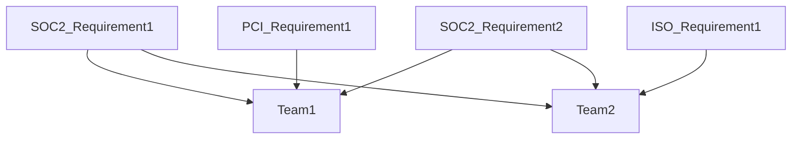
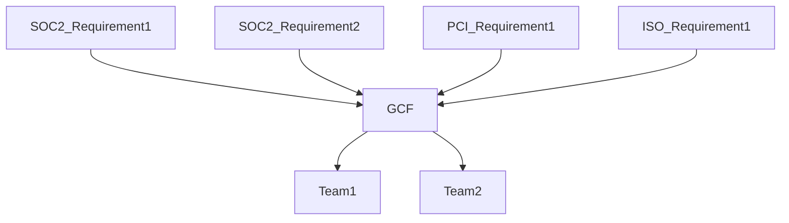
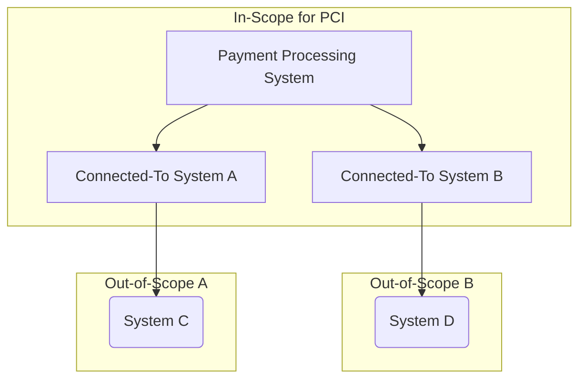

## On this page
{:.no_toc .hidden-md .hidden-lg}

- TOC
{:toc .hidden-md .hidden-lg}

# GitLab's Security Controls

Security controls are a way to state our company's position on a variety of security topics. It's not enough to simply say "We encrypt data" since our customers and teams will naturally want to know "what data do we encrypt?" and "how do we encrypt that data?". When all of our established security controls are operating effectively this creates a security program greater than the sum of its parts that will demonstrate to our stakeholders that GitLab has a mature and comprehensive security program that will provide assurance that data within GitLab is reasonably protected.

## GitLab Control Framework (GCF)

We have tried to take a comprehensive approach to our immediate and future security compliance needs. Older and larger companies tend to treat each security compliance requirement individually which results in independent security compliance teams going out to internal teams with multiple overlapping requests. For example, at such a company you might have one database engineer that is asked to provide evidence of how a particular database is encrypted based on SOC2 requirements, then again for ISO requirements, then again for PCI requirements. This approach can be visualized as follows:

Given our [efficiency value](/handbook/values/#efficiency) here at GitLab we wanted to create a set of security controls that would address multiple underlying requirements with a single security control which would allow us to make fewer requests of our internal teams and efficiently collect all evidence we would need for a variety of audits at once. This approach can be visualized as follows:

Adobe's [open source compliance framework](https://blogs.adobe.com/security/2017/05/open-source-ccf.html) served as the starting point for this efficient method of collecting security control evidence. It has been adapted and expanded as needed and the result is the below list of controls grouped by families and sub-families. 

Clicking a control below that has a link will take you to a page with a variety of information about that control.

## Control Prioritization

There are a number of controls without links due to the way that GitLab has prioritized the documentation of all of these controls. A control without a link should not be taken to mean that GitLab is not in compliance with a specific control’s requirements, but rather that we are not yet tracking evidence of the operation of that control. Supporting documentation for all controls will be built out as we continue to iterate on our compliance program and pursue additional compliance certifications. 

## Control Ownership

Control Owner - Ensures that the design of the control and the control activities operate effectively and is responsible for remediation of any control activities that are required to bring that control into a state of audit-readiness.

Process Owner - Supports the operation of the control and carries out the process designed by the control owner. The process owner is most likely to be interviewed by an auditor to determine whether or not the process is operating as intended.

## What is considered `Production`?

The production environment includes all endpoints and cloud assets used in hosting GitLab.com and its subdomains. This may include third-party systems that support the business of GitLab.com.

|  **Functions to run gitlab.com** | **Production** | **Rationale for Determination** | **Location** |
| --- | --- | --- | --- |
|  gitlab\-ops (ops.gitlab.net) | YES | host of the Chef cookbooks and metadata | GCP |
|  gitlab\-production (gitlab.com) | YES | host of live \.com SaaS website and end user OAuth | GCP |
|  gs\-production | YES | host of GitLab version checker \- version\-gitlab\-com | GCP |
|  Route 53 | YES | host of DNS | AWS |
|  Chef server | Yes | host of chef server | Digital Ocean |
|  gitlab\-ci | LIMITED | hosts runner managers | GCP |
|  dev\-gitlab\-org | Yes | host of OAuth | Azure |

|  **Sub-functions of gitlab.com** | **Production** | **Rationale for Determination** | **Location** |
| --- | --- | --- | --- |
|  gemnasium\-production | YES | hosts services used by dependency scanning | GCP |

|  **Functions that support gitlab.com** | **Production** | **Rationale for Determination** | **Location** |
| --- | --- | --- | --- |
|  customers\-gitlab\-com | YES | host of \.com subscriptions | Azure |
|  license\-gitlab\-com | YES | host of GitLab license management | AWS |

|  **Indirectly supports running of GitLab** | **Production** | **Rationale for Determination** | **Location** |
| --- | --- | --- | --- |
|  gitlab\-security | YES | host of GitLab Security team tools | GCP |
|  DELKE | YES | Third party logging | GCP/Elastic |
|  InfraELK | YES | \.com logging | GCP/Elastic |
|  env\-zero | YES | host of Bootstrap GCP | GCP |
|  gitlab\-dr | YES | production backups | GCP |
|  service\-prod | YES | host of design\-gitlab\-com | GCP |
|  Prometheus | YES | dashboards\-gitlab\-net | GCP |
|  PagerDuty | YES | page on-call engineers | PagerDuty |
|  Fastly | YES | host of CDN | Fastly |

## PCI Segmentation

Determining how a system may interact with the payment processing system is important when defining which systems are in-scope for Payment Card Industry (PCI) compliance.  The following diagram demonstrates in-scope (connected-to) vs. out-of-scope (not connected-to) when defining the PCI environment:

**Please Note:**
*  *Connected-to systems create a buffer for the out-of-scope systems from directly connecting to the payment processing system.*
*  *It does not matter where a system resides (i.e. different cloud environment), if it communicates with the payment processing system, it is in-scope for PCI.*

## Data Classification Policy

For GitLab's data classification policy, please refer to the [data classification page](./data-classification-policy.html).

## Security Controls Feedback

If you have any feedback on any of the security controls or related documentation, please add it as a comment in [this issue](https://gitlab.com/gitlab-com/gl-security/compliance/compliance/issues/218).

## Security Control Changes

The GitLab compliance team is responsible for ensuring the consistency of the documentation of the security controls listed below. While normally we welcome any GitLab team-member to make edits to handbook pages, please be aware that even small changes to the wording of any of these controls impacts how they satisfy the requirements for the security frameworks they map to. Because of this, we ask any changes that need to be made to this page and the underlying guidance pages to start with a comment in [this issue](https://gitlab.com/gitlab-com/gl-security/compliance/compliance/issues/219). The compliance team will then engage with you and make any appropriate changes to these handbook pages.

# List of controls by family:

## Asset Management
* Device and Media Inventory
    * [Inventory Management](./guidance/am.1.01-inventory-management.html)
    * Inventory Management: Payment Card Systems 
    * Inventory Labels - `N/A` (requirement of asset inventory labeling)
* Device and Media Transportation
    * Asset Transportation Authorization - `N/A` (requirement for tracking entry/exit of datacenter)
    * Asset Transportation Documentation - `N/A` (requirement for transportation of physical media)
* Component Installation and Maintenance 
    * Maintenance of Assets - `N/A` (requirement for equipment maintenance, can apply to team member laptops)
    * Tampering of Payment Card Capture Devices - `N/A` (requirement for quarterly inspection of payment card capture devices)

## Backup Management
* Backup
    * [Backup Configuration](./guidance/BU.1.01_backup_configuration.html)
    * [Resilience Testing](./guidance/BU.1.02_resilience_testing.html)
    * [Alternate Storage](./guidance/BU.1.03_alternate_storage.html)

## Business Continuity
* Business Continuity Planning
    * [Business Continuity Plan](./guidance/BC.1.01_business_continuity_plan.html)
    * [Business Continuity Plan: Roles and Responsibilities](./guidance/BC.1.02_business_continuity_roles_responsibilities.html)
    * [Continuity Testing](./guidance/BC.1.03_continuity_testing.html)
    * [Business Impact Analysis](./guidance/BC.1.04_business_impact_analysis.html)

## Change Management
* Change Management
    * [Change Management Workflow](./guidance/CM.1.01_change_management_workflow.html)
    * [Third-Party Change Management Workflow](./guidance/CM.3.01_third_party_change_management_workflow.html)
    * [Change Approval](./guidance/CM.1.02_change_approval.html)
* Segregation of Duties
    * [Segregation of Duties](./guidance/CM.2.01_segregation_of_duties.html)

## Configuration Management
* Baseline Configurations
    * [Baseline Configuration Standard](./guidance/CFG.1.01_baseline_configuration_standard.html)
    * Default "Deny- all" Settings - `N/A` (not required for PCI SAQ-A) PCI only control
    * [Configuration Checks](./guidance/CFG.1.03_configuration_checks.html)
    * [Configuration Check Reconciliation: CMDB](./guidance/CFG.1.04_configuration_check_reconciliation.html)
    * Time Clock Synchronization - `Not yet rolled out` (not required for PCI SAQ-A; cloud-hosted environments)
    * Time Clock Configuration Access - `Not yet rolled out` (required per SOX)
    * [Default Device Passwords](./guidance/CFG.1.07_default_device_passwords.html)
    * Process Isolation - `Not yet rolled out` (required per SOX)

## Data Management
* Data Classification
    * Data Classification Criteria - applicable [Data Classification Policy](https://about.gitlab.com/handbook/engineering/security/data-classification-policy.html)
* Choice and Consent
    * [Terms of Service](./guidance/DM.2.01_terms_of_service.html)
* Data Handling
    * External Privacy Inquiries - applicable [GitLab Privacy Policy](https://about.gitlab.com/privacy/#privacy-policy) states Legal will review all privacy-related emails with subject line "Privacy Concern".
    * Test Data Sanitization - applicable (Red and Orange data is redacted prior to use in non-prod environments)
* Data Encryption
    * [Encryption of Data in Transit](./guidance/DM.4.01_encryption_of_data_in_transit.html)
    * [Encryption of Data at Rest](./guidance/DM.4.02_encryption_of_data_at_rest.html)
    * Approved Cryptographic Technology - applicable (security best practices/minimum data encryption utilized)
* Data Storage
    * Credit Card Data Restrictions - `N/A` (requirement for storing credit card data)
    * Personal Account Number Data Restrictions - `N/A` (requirement for storing (PAN) personal account number data)
* Data Integrity
    * Changes to Data at Rest - `N/A` (not required for PCI SAQ-A) `we do not store PCI data`
* Data Removal
    * [Secure Disposal of Media](./guidance/DM.7.01_secure_disposal_of_media.html)
    * Customer Data Retention and Deletion - `Not rolled out yet` 
* Social Media
    * Social Media - `N/A` (not required for PCI SAQ-A) `PCI only control`

## Identity and Access Management
* Logical Access Account Lifecycle
    * [Logical Access Provisioning](./guidance/IAM.1.01_logical_access_provisioning.html)
    * [Logical Access De-provisioning](./guidance/IAM.1.02_logical_access_deprovisioning.html)
    * [Terminations: People Resource Notifications](./guidance/IAM.1.03_terminations_people_resouce_notifications.html)
    * [Logical Access Review](./guidance/IAM.1.04_logical_access_review.html)
    * [Role Change: Access De-provisioning](./guidance/IAM.1.05_role_change_access_deprovisioning.html)
    * [Shared Logical Accounts](./guidance/IAM.1.06_shared_logical_accounts.html)
    * [Shared Account Restrictions](./guidance/IAM.1.07_shared_account_restrictions.html)
* Authentication
    * [Unique Identifiers](./guidance/IAM.2.01_unique_identifiers.html)
    * [Password Authentication](./guidance/IAM.2.02_password_authentication.html)
    * [Multifactor Authentication](./guidance/IAM.2.03_multifactor_authentication.html)
    * [Authentication Credential Maintenance](./guidance/IAM.2.04_authentication_credential_maintenance.html)
    * Session Timeout - `N/A` (not required for PCI SAQ-A due to utilizing external payment processor)
    * Account Lockout: Cardholder Data Environments - `N/A` (not required for PCI SAQ-A due to utilizing external payment processor)
    * [Account Lockout](./guidance/IAM.2.08_account_lockout.html)
    * [Full Disk Encryption](./guidance/IAM.2.09_full_disk_encryption.html)
* Role-Based Logical Access
    * Logical Access Role Permission Authorization - `N/A` (not required for PCI SAQ-A due to utilizing external payment processor)
    * [Source Code Security](./guidance/IAM.3.02_source_code_security.html)
    * [Service Account Restrictions](./guidance/IAM.3.03_service_account_restriction.html)
    * PCI Account Restrictions - `N/A` (not required for PCI SAQ-A due to utilizing external payment processor)
* Remote Access
    * [Remote Connections](./guidance/IAM.4.01_remote_connections.html)
    * Ability to Disable Remote Sessions - `N/A` (not required for PCI SAQ-A due to utilizing external payment processor)
    * [Remote Maintenance: Authentication Sessions](./guidance/IAM.4.03_remote_maintenance_authentication_sessions.html)
    * Remote Maintenance: Unique Authentication Credentials for each Customer - `N/A` (not required for PCI SAQ-A due to utilizing external payment processor)
* End-user Authentication
    * End-user Environment Segmentation - `N/A` (not required for PCI SAQ-A due to utilizing external payment processor)
* Key Management
    * [Key Repository Access](./guidance/IAM.6.01_key_repository_access.html)
    * Data Encryption Keys - `Not yet rolled out`
    * Key Maintenance - `N/A` (not required for PCI SAQ-A due to utilizing external payment processor)
    * Clear Text Key Management - `N/A` (not required for PCI SAQ-A due to utilizing external payment processor)
* Key Storage and Distribution
    * Key Store Review - `N/A` (not required for PCI SAQ-A due to utilizing external payment processor)
    * Storage of Data Encryption Keys - `N/A` (not required for PCI SAQ-A due to utilizing external payment processor)
    * Clear Text Distribution - `N/A` (not required for PCI SAQ-A due to utilizing external payment processor)

## Incident Response
* Incident Response
    * [Incident Response Plan](./guidance/IR.1.01_incident_response_plan.html)
    * Incident Response Testing - `Not yet rolled out` (not required for PCI SAQ-A) 
    * [Incident Response](./guidance/IR.1.03_incident_response.html)
* Incident Communication
    * [External Communication of Incidents](./guidance/IR.2.01_external_communication_of_incidents.html)
    * [Incident Reporting Contact Information](./guidance/IR.2.02_incident_reporting_contact_information.html)
    * [Incident External Communication](./guidance/IR.2.03_incident_external_communication.html)

## Mobile Device Management
* Mobile Device Security
    * Configuration Management: Mobile Devices - `N/A` (not required for PCI SAQ-A due to utilizing external payment processor)

## Network Operations
* Perimeter Security
    * [Network Policy Enforcement Points](./guidance/NO.1.01_network_policy_enforcement_points.html)
    * Inbound and Outbound Network Traffic: DMZ Requirements - `N/A` (not required for PCI SAQ-A due to utilizing external payment processor) `PCI only control`
    * Ingress and Egress Points - `N/A` (not required for PCI SAQ-A due to utilizing external payment processor) `PCI only control`
    * Non-disclosure of Routing Information - `N/A` (not required for PCI SAQ-A due to utilizing external payment processor) `PCI only control`
    * Dynamic Packet Filtering - `N/A` (not required for PCI SAQ-A due to utilizing external payment processor) `PCI only control`
    * Firewall Rule Set Review - `N/A` (not required for PCI SAQ-A due to utilizing external payment processor) `PCI only control`
* Network Segmentation
    * [Network Segmentation](./guidance/NO.2.01_network_segmentation.html)
    * Card Processing Environment Segmentation - `N/A` (not required for PCI SAQ-A due to utilizing external payment processor) `PCI only control`
* Wireless Security
    * Disable Rogue Wireless Access Points - `N/A` (fully remote company, no company wifi) `PCI only control`
    * Wireless Access Points - `N/A` (fully remote company, no company wifi) `PCI only control`
    * Rogue Wireless Access Point Mapping - `N/A` (fully remote company, no company wifi) `PCI only control`
    * Authentication: Wireless Access Points - `N/A` (fully remote company, no company wifi) `PCI only control`

## People Resources
* On-boarding
    * [Background Checks](./guidance/PR.1.01_background_checks.html)
    * [Performance Management](./guidance/PR.1.02_performance_management.html)
* Off-boarding
    * GitLab Property Collection - `Not yet rolled out`
* Compliance
    * Disciplinary Process - `Not yet rolled out` 

## Risk Management
* Risk Assessment
    * [Risk Assessment](./guidance/RM.1.01_risk_assessment.html)
    * [Continuous Monitoring](./guidance/RM.1.02_continuous_monitoring.html)
    * [Self- Assessments (Not Applicable)](./guidance/RM.1.03_self_assessments.html.md)
    * [Service Risk Rating Assignment](./guidance/RM.1.04_service_risk_rating_assignment.html)
* Internal and External Audit
    * [Internal Audits](./guidance/RM.2.01_internal_audits.html)
* Controls Implementation
    * [Remediation Tracking](./guidance/RM.3.01_remediation_tracking.html)
    * Statement of Applicability - `Not yet rolled out`

## Security Governance
* Policy Governance
    * [Policy and Standard Review](./guidance/SG.1.01_policy_and_standard_review.html)
    * [Exception Management](./guidance/SG.1.02_exception_management.html)
* Security Documentation
    * [Information Security Program Content](./guidance/SG.2.01_information_security_program_content.html)
    * [Control Procedures](./guidance/SG.2.02_procedures.html)
* Privacy Program
    * Privacy Readiness Review - `Not yet rolled out`
* Workforce Agreements
    * Proprietary Rights Agreement - `Not yet rolled out`
    * Review of Confidentiality Agreements - `Not yet rolled out`
    * Key Custodians Agreement - N/A (not required for PCI SAQ-A due to utilizing external payment processor) PCI only control
* Information Security Management System
    * [Information Security Program](./guidance/SG.5.01_information_security_program.html)
    * Information Security Management System Scope - `Not yet rolled out`
    * [Security Roles and Responsibilities](./guidance/SG.5.03_security_roles_and_responsibilities.html)
    * Security Roles and Responsibilities: PCI Compliance - N/A (not required for PCI SAQ-A due to utilizing external payment processor) PCI only control
    * Information Security Resources - `Not yet rolled out`

## Service Lifecycle
* Release Management
    * [Service Lifecycle Workflow](./guidance/SLC.1.01_service_lifecycle_workflow.html)
* Source Code Management
    * Source Code Management - `Not yet rolled out`

## Site Operations
* Physical Security
    * [Secured Facility](./guidance/SO.1.01_secured_facility.html)
    * Physical Protection and Positioning of Cabling - `Not yet rolled out`
* Physical Access Account Lifecycle
    * [Provisioning Physical Access](./guidance/SO.2.01_provisioning_physical_access.html)
    * [De-provisioning Physical Access](./guidance/SO.2.02_de-provisioning_physical_access.html)
    * [Periodic Review of Physical Access](./guidance/SO.2.03_periodic_review_of_physical_access.html)
    * [Physical Access Role Permission Authorization](./guidance/SO.2.04_physical_access_role_permission_authorization.html)
    * Monitoring Physical Access - `Not yet rolled out`
    * Surveillance Feed Retention - `N/A` (not required for PCI SAQ-A due to utilizing external payment processor) PCI only control
    * Visitor Access - `N/A` (not required for PCI SAQ-A due to utilizing external payment processor) `PCI only control`
* Environmental Security
    * Temperature and Humidity Control - `N/A` (fully remote company)
    * Fire Suppression Systems - `N/A` (fully remote company)
    * Power Failure Protection - `N/A` (fully remote company)

## Systems Design Documentation
* Internal System Documentation
    * [System Documentation](./guidance/SDM.1.01_system_documentation.html)
    * System Documentation: Cardholder Environment - `N/A` (not required for PCI SAQ-A due to utilizing external payment processor) `PCI only control`

## Systems Monitoring
* Logging
    * [Audit Logging](./guidance/SYS.1.01_audit_logging.html)
    * [Secure Audit Logging](./guidance/SYS.1.02_secure_audit_logging.html)
    * Audit Logging: Cardholder Data Environment Activity - `N/A` (not required for PCI SAQ-A due to utilizing external payment processor) `PCI only control`
    * Audit Logging: Cardholder Data Environment Event Information - `N/A` (not required for PCI SAQ-A due to utilizing external payment processor) `PCI only control`
    * [Audit Logging: Service Provider Logging Requirements](./guidance/SYS.1.05_audit_logging_service_provider.html)
    * [Log Reconciliation: CMDB](./guidance/SYS.1.06_log_reconciliation_cmdb.html)
    * [Audit Log Capacity and Retention](./handbook/engineering/security/guidance/SYS.1.07_audit_log_capacity_retention.html)
    * [Enterprise Protection Logging](./guidance/SYS.1.08_enterprise_protection_logging.html)
* Security Monitoring
    * [Security Monitoring Alert Criteria](./guidance/SYS.2.01_security_monitoring_alert_criteria.html)
    * Log-tampering Detection - `Not yet rolled out`
    * Security Monitoring Alert Criteria: Failed Logins - `N/A` (not required for PCI SAQ-A due to utilizing external payment processor) `PCI only control`
    * Security Monitoring Alert Criteria: Privileged Functions -`N/A` (not required for PCI SAQ-A due to utilizing external payment processor) `PCI only control`
    * Security Monitoring Alert Criteria: Audit Log Integrity - `N/A` (not required for PCI SAQ-A due to utilizing external payment processor) `PCI only control`
    * Security Monitoring Alert Criteria: Cardholder System Components - `N/A` (not required for PCI SAQ-A due to utilizing external payment processor) `PCI only control`
    * [System Security Monitoring](./guidance/SYS.2.07_system_security_monitoring.html)
    * Intrusion Detection Systems - `N/A` (not required for PCI SAQ-A due to utilizing external payment processor) `PCI only control`
* Availability Monitoring
    * [Availability Monitoring Alert Criteria](./guidance/SYS.3.01_availability_monitoring_alert_criteria.html)
    * [System Availability Monitoring](./guidance/SYS.3.02_system_availability_monitoring.html)

## Third Party Management
* Vendor Assessments
    * [Third Party Assurance Review](./guidance/TPM.1.01_third_party_assurance_review.html)
    * [Vendor Risk Management](./guidance/TPM.1.02_vendor_risk_management.html)
    * Forensic Investigations - `N/A` (not required for PCI SAQ-A due to utilizing external payment processor) `PCI only control`
    * [Vendor Compliance Monitoring](./guidance/TPM.1.04_vendor_compliance_monitoring.html)
* Vendor Agreements
    * Network Access Agreement: Vendors - `Not yet rolled out`
    * [Vendor Non- disclosure Agreements](./guidance/TPM.2.02_vendor_non-disclosure_agreements.html)
    * Cardholder Data Security Agreement - `N/A` (not required for PCI SAQ-A due to utilizing external payment processor) `PCI only control`
    * Network Service Level Agreements (SLA) - `Not yet rolled out`
* Vendor Procurement
    * [Approved Service Provider Listing](./guidance/TPM.3.01_approved_service_provider_listing.html)

## Training and Awareness
* General Awareness Training
    * [General Security Awareness Training](./guidance/TRN.1.01_general_security_awareness_training.html)
    * [Code of Conduct Training](./guidance/TRN.1.02_code_of_conduct_training.html)
* Role-Based Training
    * Developer Security Training - `N/A` (not required for PCI SAQ-A due to utilizing external payment processor) `PCI only control`
    * Payment Card Processing Security Awareness Training - `N/A` (not required for PCI SAQ-A due to utilizing external payment processor) `PCI only control`

## Vulnerability Management
* Production Scanning
    * [Vulnerability Scans](./guidance/VUL.1.01_vulnerability_scans.html)
    * Vulnerability Assessment: Cardholder Data Environment - `N/A` (not required for PCI SAQ-A due to utilizing external payment processor) `PCI only control`
    * Approved Scanning Vendor - `N/A` (not required for PCI SAQ-A due to utilizing external payment processor) `PCI only control`
* Penetration Testing
    * [Application & Infrastructure Penetration Testing](./guidance/VUL.2.01_application_and_infrastructure_penetration_testing.html)
    * Penetration Testing: Cardholder Data Environment - `N/A` (not required for PCI SAQ-A due to utilizing external payment processor) `PCI only control`
* Patch Management
    * [Infrastructure Patch Management](./guidance/VUL.3.01_infrastructure_patch_management.html)
* Malware Protection
    * [Enterprise Protection](./guidance/VUL.4.01_enterprise_protection.html)
    * [Enterprise Protection Tampering](./guidance/VUL.4.02_enterprise_protection_tampering.html)
* Code Security
    * [Code Security Check](./guidance/VUL.5.01_code_security_check.html)
    * Code Security Check: Cardholder Data Environment - `N/A` (not required for PCI SAQ-A due to utilizing external payment processor) `PCI only control`
* External Advisories and Inquiries
    * [External Information Security inquiries](./guidance/VUL.6.01_external_information_security_inquiries.html)
    * External Alerts and Advisories - `Not yet rolled out`
* Program Management
    * [Vulnerability Remediation](./guidance/VUL.7.01_vulnerability_remediation.html)

