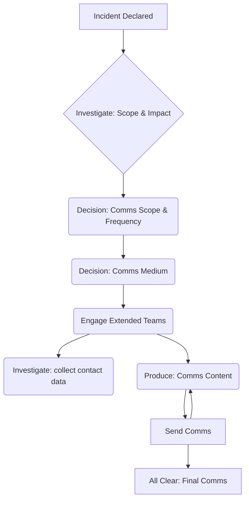

## On this page
{:.no_toc .hidden-md .hidden-lg}

- TOC
{:toc .hidden-md .hidden-lg}

GitLab takes the security of our clients’ information extremely seriously, regardless of whether it’s on GitLab.com or in a self-managed instance. In keeping with GitLab’s [value of transparency](/handbook/values/#transparency) we believe in communicating about security incidents clearly and promptly. 

This communication plan aims to map out the who, what, when, and how of GitLab in notifying internal stakeholders and external customers of security incidents. This plan of action covers the strategy and approach for security events which have a ‘high’ or greater impact as outlined in [GitLab’s risk scoring matrix](https://gitlab.com/gitlab-com/gl-security/compliance/risk-assessments/blob/master/Risk%20Scoring%20Matrix.md#overall-impact).

Security incident communications runbook: *coming soon.*

### What is an incident?
The GitLab Security team identifies security incidents as any violation, or threat of violation, of GitLab security, acceptable use or other relevant policies.  You can learn more about how we identify incidents in the [GitLab security incident response guide](/handbook/engineering/security/sec-incident-response.html#incident-identification).

### Defining the scope/severity of an incident 
The Security Engineer On-Call will determine the scope, severity and [potential impact](https://gitlab.com/gitlab-com/gl-security/compliance/risk-assessments/blob/master/Risk%20Scoring%20Matrix.md#overall-impact) of the security incident.   Once the potential impact has been determined, implementation of the appropriate internal and external communications strategy should begin.

## Security incident roles and responsibilities

### Security team roles and responsibilities
**Security Engineer On Call (SEOC):** This is the on-call Security Operations Engineer. The individual is the first to act, validate, and begin the process of determining severity and scope.

**Security Incident Manager On Call (SIMOC):** This is a Security Engineering Manager and is engaged when incident resolution requires coordination across multiple parties. The Incident Manager is the tactical leader of the incident response team, typically not engaged to perform technical work. The Incident Manager assembles the incident team by engaging individuals with the skills, access, and information required to resolve the incident. The primary focus of the Incident Manager is to keep the incident moving towards resolution.

**Communications Manager On Call (CMOC):** This individual will coordinate external communications efforts according to this security incident response plan and liaise across the extended GitLab teams to ensure all parties are activated, updated and aligned.

### Extended team roles, responsibilities and points of contact
**Marketing Programs:** Responsible for sending incident-related email to impacted parties of a security incident. Marketing programs can send these emails through Mail Chimp (users, but not customers) or Marketo (customers and prospects). This group is engaged by creating an issue using the `Email-Request-mpm template` and [pinging team members in `#marketing-programs` in Slack](/handbook/marketing/revenue-marketing/digital-marketing-programs/marketing-programs/#holiday-coverage-for-s1-security-vulnerabilities-email-communication).

**Marketing Ops:** If a new, custom distribution list needs to be created, Marketing Ops will work closely with Marketing Programs and generate the distribution list for the incident-related email. Contact this group via: `@mktg-ops` in slack. For urgent issues, like a security incident, page the on-call marketing ops via `/pd-emergency-ops` in the incident response slack channel.

**Support Team:** Using background information and prepared responses provided by the Security Engineer On Call and Communications Manager On Call, our Support Team will triage and respond to customer communications stemming from the security incident. [Contact the on-call manager via `#support-managers` in Slack](/handbook/support/internal-support/#support-chat-channels). If it's urgent [page the Support Manager On-call](/handbook/support/on-call/#paging-the-on-call-manager)

**Community Advocates:** May need to respond to customers and the general public via social channels, as such should be engaged before public-facing materials are released. Any prepared responses or FAQs should be provided to assist with their interactions. [Contact this group in `#community-advocates` or any Slack channel by pinging `@advocates`](/handbook/marketing/community-relations/community-advocacy/#emergency-contact).

## Communicating internally
Security incidents can be high-pressure, high-stress situations.  Everyone is anxious to understand the details around the investigation, scope, mitigation and more. Ensuring that stakeholders across security, infrastructure, engineering and operations teams are informed and engaged is one of the chief responsibilities of the Security Incident Manager On Call. The Security Incident Manager should focus on providing high-level status updates without delving too deeply into the technical details of the incident, including:
* Current Risk
* Users Impacted (some, many, all?)
* Timeline of events
* Mitigation steps that have been taken
* Current status of the incident
* Next steps
 
### Incident response channel on Slack
Setting up a public to GitLab incident response Slack channel will be one of the first actions taken by the Security Engineer On Call. This Slack channel will allow for continuous engagement and updates. All security incident team members and extended POCs should be invited.  The link to this channel should also be shared in `#security-department` to increase visibility within Security.

### Key internal stakeholders and when/how to engage

| Group & Contacts | When to Engage | DRI to Engage | At what Cadence | In what Channel |
| ------ | ------ | ------ | ------ | ------ |
| Sr. Director of Security | For high-severity (or higher) incidents | Security Incident Manager On Call | 1 hour intervals (unless otherwise requested) | Slack direct message |
| Broader e-group | Immediately in cases of a data breach or an RCE with evidence of exploitation | Sr. Director of Security | 1 hour intervals (unless otherwise requested) | `#e-group` Slack channel |
| Sr. Director of Corporate Marketing and PR Manager | Immediately, if the incident has been publicly reported or if there is a regulatory requirement to make an announcement. In other cases, once the full impact and associated risk has been determined. | Communications Manager On Call | Continuous | In incident response Slack channel |
| Legal | If GitLab EE customers are impacted, or if the security incident includes a data breach including but not limited to:   Exposure of PII / Personal Data   Private Projects   Financial Information | Sr. Director of Security | Continuous | incident response Slack channel |

## Communicating externally

External communications should happen as soon as possible after the scope and impact of the security incident is determined, using concise and clear language. The first external communications should always be directed to customers. 

The chart below illustrates the process flow between incident and impact investigation and the communications decisions and actions needed:

### On-going, live incidents on GitLab.com

For on-going, live site incidents on GitLab.com, updates are provided by the Communications Manager On Call through status.io to [https://status.gitlab.com/](https://status.gitlab.com/) and the [@GitLabStatus](https://twitter.com/GitLabStatus) twitter handle. 

### Channels and responses for use in a security incident

| Communications Channels | Purpose/Message | Additional Details |
| ------ | ------ | ------ |
| Incident Response Customer Email | Provides incident background, response, potential, impact, follow-up actions, and who to contact with questions | Drafted by Incident Manager On-Call and reviewed by Sr. Director of Security. Sent by Marketing Program Manager. Sent from [security@gitlab.com](mailto:security@gitlab.com) with reply to [security@gitlab.com](mailto:security@gitlab.com). Should be in **plain text** with **no link tracking**. |
| Mitigation and response blog post | Details the background, GitLab response and any action required by our customers | Prepared by Security Engineer On-Call with feedback from impacted/involved teams |
| GitLab Security Release Alert/Email | Indicates required action for customers and links to related mitigation and response blog. | Email sent to opt-in security notices distribution list. Prepared and sent by Communications Manager on Call, Sent to Security Notices distro through Marketo. Users can sign up for this distribution list through our [Communication Preference Center](/company/preference-center/). |
| Customer Frequently Asked Questions (FAQs) | List of early customer questions and responses, or probable questions and responses. | Created by Communications Manager on Call and SecOps Team. Provided to appropriate [Support group](/handbook/support/#channels) |
| Social media post | For distribution of related blog post, details our response to X issue. | Communications Manager on Call engages `@advocates` in the incident response Slack channel. Provides advocates with tweet text and blog link. |

### Press releases, statements and other public-facing official communications 
Depending on scope, impact or risk associated with the incident, our PR and Marketing team may determine that additional outreach is necessary. Any official statements about the security incident would be made by GitLab’s Public 
Relations Manager, Sr. Director of Marketing or CMO.  
