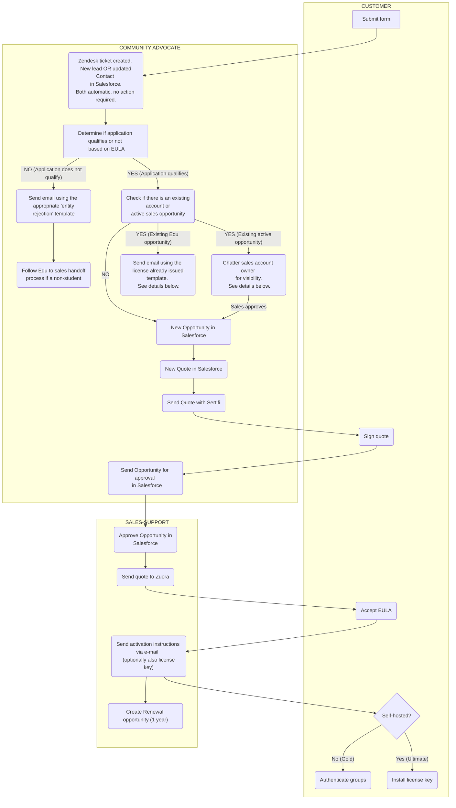

## On this page
{:.no_toc .hidden-md .hidden-lg}

- TOC
{:toc .hidden-md .hidden-lg}

## Overview

Workflow for our complimentary initiatives:
1. [GitLab for Education](/solutions/education/)
1. [GitLab Open Source Program](/solutions/open-source/program/)
1. [GitLab Startups Program](/solutions/startups/)

Managing these programs include monitoring of:
1. SFDC chatter tab - for mentions of `@Community Advocate` inside SFDC
1. Zendesk views: *Education*, *Open Source*, *E-mail*, *Suspended tickets* (for `File {FileExternalID2} has been signed at GitLab` notifications)
1. Slack channels: `#education-oss`
1. Email aliases: education@gitlab.com, opensource@gitlab.com, and startups@gitlab.com. 
    * Follow the [steps to set up the `education@gitlab.com` email alias in your inbox](/handbook/marketing/community-relations/community-advocacy/workflows/e-mail/#setting-up-aliases). If you do not have access please submit an [access request](/handbook/business-ops/it-ops-team/access-requests/#open-an-access-request). 

The priorities for the daily workflow are as follows:
1. Renewal applications should have the highest priority in the queue because their license may be close to expiring. 
1. If there has already been some communication with the applicant, these tickets should be processed first. These tickets will appear in the following views in Zendesk:
   - *Education* view for describing the use case for a new license or verifying the use case for a renewal license.
   - *Suspended tickets* view for if a quote has been returned with a signature and is ready to be sent for approval.
1. New applications should be left until all tickets in the process have been moved forward. 

## Workflow

### Tools

We use several different tools to manage these programs:
1. [Community Advocacy Zendesk](/handbook/marketing/community-relations/community-advocacy/#zendesk), particularly *Education*, *Open source*, *E-mail* and *Suspended tickets* views
1. [Salesforce](/handbook/marketing/community-relations/community-advocacy/#salesforce)
1. [Email aliases](/handbook/marketing/community-relations/community-advocacy/workflows/e-mail/index.html#setting-up-aliases) for education@gitlab.com, opensource@gitlab.com and startups@gitlab.com
1. [Customers portal](/handbook/marketing/community-relations/community-advocacy/#customers-portal)
1. [LicenseApp](/handbook/marketing/community-relations/community-advocacy/#licenseapp)

### Determine if the application is valid

#### Education program

1. The Customer will submit the application form.
1. A Zendesk Ticket is automatically created and either a New Lead or the existing Contact is updated in SFDC.
1. View the applicant's form in Zendesk.
   - The data from the form will be forwarded to SFDC as LEAD/CONTACT object.
   - If an applicant selects `Role` = `Student` an automated email from *Marketo* is sent informing them of available options to students & how to encourage the University to apply. Use the the ['License' macro in Zendesk](/handbook/marketing/community-relations/community-advocacy/tools/zendesk/#current-macro-stack-descriptions) to close the ticket. There are no further steps. 
1. Check the applicant's email address to verify that it is from the same domain as the institution noted in the application. 
   - We cannot issue licenses to email domains outside of the applying institution. If the applicant uses a gmail or other non-related domain, please send the [Requesting email domain template](/handbook/marketing/community-relations/community-advocacy/workflows/education-oss-startup/#requesting-email-domain).
   - If the applicant has a .gov or .mil email domain, please follow the [Federal Sector Exemption steps](/handbook/marketing/community-relations/community-advocacy/workflows/education-oss-startup/#federal-sector-exception). 
1. Verify that the educational institution is an actual accredited, academic, **non-profit** institution. 
   - If the region is within the U.S., go to the [National Center for Education Statistics database](https://nces.ed.gov/globallocator/) and search by the name of the educational institution. The results will list the type of institution (public, private, for-profit).  Any institutions that are categorized as 'for-profit' do not qualify. 
   - If the region is not within the U.S., search for the institution on the web and view the institution's about page. Generally, the description will indicate if it is a non-profit institution. If you are unable to determine whether or not the institution is non-profit, email the applicant from the education@ email alias using the ['Requesting non-profit verification' template](/handbook/marketing/community-relations/community-advocacy/workflows/education-oss-startup/#requesting-non-profit-verification). 
   -  If the institution does not qualify, use the ['Rejecting applicants based on academic use case' rejection template](/handbook/marketing/community-relations/community-advocacy/workflows/education-oss-startup/#rejecting-applicants-based-on-academic-use-case) to notify the applicant and follow the [Education to sales handoff process](/handbook/marketing/community-relations/community-advocacy/workflows/education-oss-startup/#education-to-sales-handoff-process).
   - Note: Non-profit entities regularly apply to the Education Program that are not primarily an educational institution and/or wish to use the license for uses cases outside of the EULA. At this time, we do not have a formal non-profit program. These requests are handled on a case-by-case basis by the DRI (the appropriate sales team member for that region and their manager). In these cases, follow the [Education to sales handoff process](/handbook/marketing/community-relations/community-advocacy/workflows/education-oss-startup/#education-to-sales-handoff-process).We cannot guarantee that non-profit requests will be granted as the decision is at the discretion of the DRI. 
1. Check the applicant's form in Zendesk to view the `Use Case` and `Use Case Notes` response from the form submission. 
   - If the response = `Instructional Use` or `Non-Commercial Academic Research` the use case is acceptable and you can proceed to the next step. 
   - Note: If the applicant mentions anything in the `Use Case Notes` field indicating IT professional use, administrative use, or anything else questionable, you will need to follow up directly. Start by sending the ['Collecting participants usage data' email template](/handbook/marketing/community-relations/community-advocacy/workflows/education-oss-startup/#collecting-participants-usage-data) via the education@ email alias to get more information about their GitLab usage and to make sure they are aligned with our Education program terms.
      - Verifying the use case may take several back and forth emails with the applicant. If the first email does not contain sufficient information needed to verify the use case, send the ['Second email asking for participants usage data' template](/handbook/marketing/community-relations/community-advocacy/workflows/education-oss-startup/#second-email-asking-for-participants-usage-data). If you are unsure if the use case meets the terms, please reach out to the Education Program Manager or to the [Community Advocate, Education Expert](/handbook/marketing/community-relations/community-advocacy/#expertises) for assistance via the [#edu-oss slack channel](https://gitlab.slack.com/messages/edu-oss). It is better to qualify the lead now than issue a license in error.
      - Once you have verified that the use case is acceptable continue to the next step.   
    - If the the response = `IT Professional Services` the use case is not acceptable under our terms. Change the lead status to unqualified and send the ['Rejecting applicants based on academic use case' rejection template](/handbook/marketing/community-relations/community-advocacy/workflows/education-oss-startup/#rejecting-applicants-based-on-academic-use-case) via Zendesk. Then follow the [Education to Sales Handoff process](/handbook/marketing/community-relations/community-advocacy/workflows/education-oss-startup/#education-to-sales-handoff-process). 
1. Check SFDC to see if there is an existing account and/or opportunity for this educational institution.
     - Note: If you notice that there is a duplicate account for the same educational institution, please follow the steps for [merging duplicated accounts](/handbook/marketing/community-relations/community-advocacy/workflows/education-oss-startup/#merging-duplicated-accounts). It is acceptable for separate entities within a single educational institution to have separate accounts. For example, it is acceptable for  *University of Missouri Hospital and Clinics* and *University of Missouri Astrophysics Center* to have separate accounts But it is not acceptable to have separate accounts for *University of Wisconsin Madison* and *UW Madison*. 
     - If there is an existing account with an active sales opportunity (stage = anything less than Closed-Won), chatter the account owner in SFDC directly from the account to let them know of the application and make sure there are no conflicts with the issuing the license. Wait 2 days to hear back. If there is no conflict, proceed with issuing the Education license.
     - Make sure that we didn't already issue an Education license to that institution. Go to SFDC and search by their email address domain or the institution name. If we already provided them with an Education license, send the ['Notifying that Edu license already issued' email template'](handbook/marketing/community-relations/community-advocacy/workflows/education-oss-startup/#notifying-that-the-education-license-has-already-been-issued) via the education@ email alias to let them know. They may respond and ask for an exemption. We evaluate [requests for multiple license per institution](/handbook/marketing/community-relations/community-advocacy/workflows/education-oss-startup/#requests-for-multiple-license-per-institution) on case by case basis.
1. Once you have verified the **educational institution**, **use case**, and **existing account status** proceed to [Processing approved applications](/handbook/marketing/community-relations/community-advocacy/workflows/education-oss-startup/#processing-approved-applications) below. 
  
#### Open Source program

1. The Customer will create a Merge Request [against our OSS project](https://gitlab.com/gitlab-com/marketing/community-relations/gitlab-oss/-/merge_requests/) and submit the [application form](https://about.gitlab.com/solutions/open-source/program/).
1. A Zendesk Ticket is automatically created and the data from the form will be forwarded to SFDC either as a New Lead or as an update to the existing Contact.
1. Follow the link from the SFDC object to the related Merge Request. Make sure that the Merge Request's description contains a link to their GitLab repository and that the project is licensed under an OSI approved license.
   - If something needs to be added or updated, communicate to the user on the Merge Request.
   - If the address format is invalid, or other personal details are missing follow up with the user using the opensource@gitlab.com email alias.
1. Once you have completed steps above, merge the related Merge Request and proceed to [Processing approved applications](/handbook/marketing/community-relations/community-advocacy/workflows/education-oss-startup/#processing-approved-applications) section. 

#### Startups program

- Make sure they were part of the current or two most recent [YCombinator batches](https://www.ycombinator.com/companies/). If they are not on that list, follow up with [Asking for a proof for the current batch participants](/handbook/marketing/community-relations/community-advocacy/workflows/education-oss-startup/#asking-for-a-proof-for-the-current-batch-participants) email template.
- Search [Crunchbase](https://www.crunchbase.com) by startup name to check if they raised less than $3M in revenue.

### Handoff Process to Sales
If an applicant does not meet the program terms, the account should be transferred over to the appropriate sales account representative by following these steps:
1. Identify the [appropriate sales territory and vertical of the entity](https://about.gitlab.com/handbook/sales/territories/#territories). 
    - If the entity is a public educational institution in the US, the vertical is [Public Sector](https://about.gitlab.com/handbook/sales/territories/#territories). 
    - If the entity is a private educational institution, the vertical is generally [MidMarket](https://about.gitlab.com/handbook/sales/territories/#territories).
    - Some territories may not have a Public Sector Vertical, in this case, use MidMarket.
1. Identify the appropriate sales representative for that Region/Vertical from the sales territory table. Note: Depending on the territory, size of the institution, and existing contact with the institution, the appropriate sales represenative could be a sales development represenative (SDR), inside sales representative (ISR), or the strategic account owner themselves (SAL). 
    - If you are unable to easily determine who the approproate sales owner is, please post the SFDC link in the appropriate slack channel (for example the US Public Sector SLED channel is [#public-sector-sled](https://gitlab.slack.com/archives/CRM6JS5L0)) and ask for guidance on who the account should be transferred to. 
1. Reassign the lead to the appropriate sales representative for the Region/Vertical in SFDC. 
1. Chatter the sales representative in SFDC directly from the account to let them know the lead has been reassigned and there is no current action item.
    - If the lead responds to the offer in the 'academic use case' rejection template for an introduction to a sales representative using the ['Handing off to sales team' email template](/handbook/marketing/community-relations/community-advocacy/workflows/education-oss-startup/#Handing-off-to-sales-team), then chatter the sales representative to set up a call. 
1. Any relevant emails regarding the use case or the scope of the opportunity should be tracked within SFDC in the account's activity history. Follow [these steps](https://about.gitlab.com/handbook/customer-success/using-salesforce-within-customer-success/#tracking-emails-within-salesforce) to forward any relevant email correspondance to SFDC. 
    -  Note: If the person you are contacting is not yet a contact associated with an opportunity or account in SFDC you will need to search for the email by pasting the applicant email address in the SFDC search bar, finding the email in the list, and then manually associate the email to the appropriate account in SFDC.

### Processing approved applications

- There are extra constraints and [rules of engagement](/handbook/sales/public-sector/#federal-government-rules-of-engagement) for customers whose email address ends in `mail.mil` or `.gov`
- Make sure to hand them over to the [US Public Sector team](/handbook/business-ops/#public-sector) for a review
- This is extremely important because they probably aren't qualified for this program even if it looks like they are. We could also end up in a legal violation of the US law if treated carelessly.

#### Step 1: Create an opportunity

1. Navigate to the Account using the name and/or email address from the Zendesk ticket.
    - If the applicant is not already in SFDC, the search results will have a *Lead* object in the results list. Click on the *Lead* from the list, view the record to make sure it matches the application, and then click *Convert*.
      - Click on *Account Name*. A drop down menu will appear. If there is already an account in SFDC for this institution choose the option to *Attach to Existing: {Account Name}*. If there is not an account choose *Create New Account:{Account Name}*. 
      - Then name the opportunity accordingly *CompanyName-NumberOfUsers Product Program [w/ Support]* (e.g. `ABC University-100 Ultimate EDU` or `ABC University-100 Ultimate YCStartups w/ Support`).
      - Turn off the *Reminder*
      - Then click *Convert* 
      - The *Opportunity* will then be created and appear under the Account. 
   - If the applicant was already in SFDC as a **Contact** click on *New Opportunity*. 
   - In either case, you'll now be in the *Opportunity* view for the following steps.
1. Set the *Initial Source* to Education/OSS (only when working with an existing Contact)
1. *Type*:
   - New Business = if it is a brand new request
   - Add-On Business = if they are adding seats or changing the amount of seats
   - Renewal = if they are renewing
1. *Close date* - Today
1. *Stage* - '6-Awaiting Signature'
1. Set the *Amount* to $0.00 if they didn't purchase support or the annual amount of the support price if they did.
1. Click *Save*

#### Step 2: Create a new Quote

1. If prompted, choose *New Billing Account*
1. *Quote Template* - `NEW CUSTOMER ORDER FORM V1.05 EDU ` / `NEW CUSTOMER ORDER FORM V1.05 OSS` / `NEW CUSTOMER ORDER FORM V1.05 YC`
1. *Sold to* and *Bill to Contacts* are the Primary Contact
1. *Start Date* - Today
1. Turn off *Auto Renew* and click *Next*
1. *Add base product* - `Ultimate - 1 Year (EDU or OSS)` / `Ultimate - 1 Year (Y Combinator)`) or `Gold Plan - 1 Year (EDU or OSS)` / `Gold Plan - 1 Year (Y Combinator)` with or without support and click *Save*. Note: In order to see the license type and number of seats, view the opportunity record. The opportunity name will list the liscense type and the number of seats will be listed in the qualifications section. 
1. *Quantity* - enter the number of seats and click *Submit*

#### Step 3: Send the quote to the customer

1. Navigate to the created Quote and click *Generate PDF*. A confirmation that the PDF has been created will appear in a separate tab. Close the tab and return to the Quote view.
1. Send the Quote to the customer by clicking on the *Sertifi eSign* button. 
    - In the *Email Invite Message* window paste the ['Sending a quote to the customer through Sertifi' response template](/handbook/marketing/community-relations/community-advocacy/workflows/education-oss-startup/#sending-a-quote-to-the-customer-through-sertifi).
    - The correct participant should appear in the list. If there is not a participant in the list, search for the participant in the *Add Participants* section and add them. Then click *Next*. 
    - Next to *Related Notes and Attachments* select the newly created PDF. Then preview the PDF and verify it is rendered properly by clicking on *Preview*.
    - Double-check the quote to make sure the following is correct: Sold To Details, Subscription Details (product, quantity, total), and Edu terms. 
    - Click *Send for Signature".
1. Notify the customer that their application was approved and the quote was sent by replying in Zendesk with the ['Approval from Zendesk' response template](/handbook/marketing/community-relations/community-advocacy/workflows/education-oss-startup/#approval-from-zendesk). Submit the ticket as closed in Zendesk. Note: We send this additional email because the quote will come directly from Sertifi eSign and we want to make sure they are aware it is coming from a different sender and it could get blocked by spam filters. 
1. After the customer receives the quote, we will receive the `Delivery Receipt For File` email notification. Use the ['License' macro in Zendesk](/handbook/marketing/community-relations/community-advocacy/tools/zendesk/#current-macro-stack-descriptions) and change related ticket's status to *Solved*. The [signed quote can be viewed](/handbook/marketing/community-relations/community-advocacy/tools/zendesk/#viewing-a-signed-quote). 
1. The quote may need to be signed manually or without Sertifi for a number of reasons. For example, it is fairly common that the Sertifi email was blocked by spam filters or the applicant was unable to sign electronically. To send the quote for signature via email:
    - Navigate to the *Opportunity* in SFDC. 
    - In the *Google Docs, Notes & Attachments* section, the preview.pdf quote generated earlier will be available. Click the preview link and then click on the link for *View file*. The PDF of the quote will open and you can download it from your browser. 
    - Download the PDF to your local machine and attach it to an email. Use the ['Sending a quote via email' template](/handbook/marketing/community-relations/community-advocacy/workflows/education-oss-startup/#sending-a-quote-via-email).

#### Step 4: Submitting the Opportunity for the approval

1. When the customer signs the quote, we will receive the notification that will end up in the *Suspended tickets* view in Zendesk and will look like this: `File {FileExternalID2} has been signed at GitLab`. 
   - If the quote was returned via email, download the quote, name the quote with the proper Opportunity naming convention, and add 'signed' to the end. Then upload the quote to the Opportunity in the *Google Docs, Notes & Attachments* section. 
   - In either case, find the related Opportunity in SFDC, update the *Close date* to today and click on *Submit for Approval*. Note - do not change the stage, only Deal Desk and Billing have permission to do that. 
   - In order to verify that the opportunity was submitted for approval, view the [*Approval History*](/handbook/marketing/community-relations/community-advocacy/workflows/education-oss-startup/#check-approval-history).
1. Delete the related *Suspended Tickets* from Zendesk. Note that there will be two tickets, one indicating that the quote was signed and one indicating that the opportunity was submitted for approval. 
1. Once approved, sales-support will send the quote to Zuora, and the click-through EULA will be automatically sent. After it is accepted, the license key will be sent (for Ultimate), or instructions for authenticating a group (for Gold). Also, a renewal opportunity will be created.  

### Renewal process
Note: All Education and Open Source renewals should be handled by Community Advocates directly because **we verify the use case before granting the renewal**. Use cases may have changed in one year and it is important to verify that the customer still meets the EULA. Please ping us on the [#education-oss](https://gitlab.slack.com/messages/education-oss) Slack channel if you have any questions. If the Opportunity is assigned to someone other than a community advocate and it is time to start the renewal process, please reassign the renewal opportunity to Community Advocate, but leave the related Account assigned to Sales Account Leader.

#### In-bound renewals
- A Zendesk notification will appear in the Education view when Sales Support assigns a Community Advocate a renewal opportunity. The renewal opportunity may be assigned well ahead of the actual renewal date. If the date on the renewal is less than three months away, send the [Requesting renewal information template](/handbook/marketing/community-relations/community-advocacy/workflows/education-oss-startup/#requesting-renewal-information) to the customer and submit the Zendesk ticket as *Solved*. If the renewal date is more than three months away, submit the Zendesk ticket as *Solved* and do not contact the customer. Note: Customers will receive 3 and 6 month automatic reminder emails regarding the subscription renewal. 
- A customer may reach out directly to education@gitlab.com inquiring about how to renew their license. In this case, a Zendesk ticket will appear in the Education view. Send the [Requesting renewal information template](/handbook/marketing/community-relations/community-advocacy/workflows/education-oss-startup/#requesting-renewal-information) to the customer and submit the Zendesk ticket as *Solved*.
- If a customer responds to the [Requesting renewal information email](/handbook/marketing/community-relations/community-advocacy/workflows/education-oss-startup/#requesting-renewal-information), proceed with [step 5 to check account activity](/handbook/marketing/community-relations/community-advocacy/workflows/education-oss-startup/#education-program) and verify the use case. If there are no active sales opportunities and the use case is verified, proceed to Step 1: Update the renewal opportunity.   

#### Step 1: Update the renewal Opportunity

1. Find the adequate *Renewal Opportunity* and rename it using this format: *CompanyName-NumberOfUsers Product Program [w/ Support] Renewal RenewalDate* (e.g.*CompanyName-100 Gold EDU Renewal 01/19*). The date is the beginning of the renewal year. If you can't find the appropriate renewal opportunity or the renewal opportunity has expired chatter *@sales-support*.
1. Make sure that the *Opportunity Type* is set to Renewal, set the *Close date* to today and *Stage* to '6-Awaiting Signature'. Also, double-check that the *Amount* is correct and click Save.

#### Step 2: Create the new renewal Quote

1. Click on *New quote*
1. Select appropriate *existing billing account*, select *renew existing subscription for this billing account* and find the Opportunity that you want to renew under *Subscription name*. Then click *Next*. 
1. Update *Sold to* and *Bill to Contact* on the *Provide Quote, Account and Subscription Terms* details page if needed. Everything else should stay the same. Click *Next*
1. Update the number of seats and/or attached product if needed and click *Submit*

#### Step 3: Final steps

- [Send the quote to the customer](/handbook/marketing/community-relations/community-advocacy/workflows/education-oss-startup/#step-3-send-the-quote-to-the-customer) and [submit the opportunity for approval](/handbook/marketing/community-relations/community-advocacy/workflows/education-oss-startup/#step-4-submitting-the-opportunity-for-the-approval) as described in the [Processing approved applications](/handbook/marketing/community-relations/community-advocacy/workflows/education-oss-startup/#processing-approved-applications) section.
- The renewed license will become active only after the original expires (even if the renewal quote is approved before that).

### Creating an amendment for the existing subscriptions (adding more seats)

1. Navigate to the original (Closed Won) **Opportunity** and click *New Add On Opportunity*
   - *Opportunity name* - `CompanyName-Add [Quantity] [Product] EDU` (e.g. Oxford University- Add 25 Ultimate EDU)
   - Update: *Initial Source* to EDU/OSS, *Close date* to Today and *Stage* to '00-Pre Opportunity'
   - Update: *Sold to* and *Bill to* Contact to the Primary Contact
1. Select newly created **Opportunity** and create a new **Quote**:
   - Update: *Select Billing Account* to *existing billing account* and *Choose Quote Type* to *amend existing subscription for this billing account* and click *Next*
   - Click *Next* again (you can change signer if needed)
   - Click on *+ Add Products*, select Ultimate or Gold and click *Save*
   - Adjust the *Quantity* to however NEW users they want to add
   - Find where the old product purchase is listed, click downward arrow and click `Remove` and then `Submit`
1. Generate pdf or Word document and proceed as usual

Once the the quote is singed and approved, the LicenseApp will provision a new key for the increased number of users

## Best Education practices

### How to structure your projects

We drafted a set of best practices for overcoming challenges that you might encounter as a result of our decision to offer only one Education license per institution. There are also a couple of points clarifying who can participate in this offer and under what conditions.
- Only students and faculty directly involved in teaching students can access this subscription.
- This license can only be used during studies, so graduate students that aren't taking courses aren't allowed to use the instance.
- Student research that is part of their educational program and professor non-profit research with students participating is allowed.
- Seats are generic and are not specific to a user, as GitLab does not use a named license model. If a user doesn't need access anymore, it can be removed or blocked in order to free the seat. This seat can then be used by another user.
- Although we offer only one license key for the self-hosted solutions, it can be installed on multiple independent instances. Meaning that you can run two separate servers with the same license key. The only caveat is that currently there isn't an easy way to calculate the total number of consumed seats across all instances.
- You can manage the visibility of your projects with GitLab groups. A member of the parent group automatically has access to all descendants. GitLab doesn't support having the subgroup be more restrictive than its parent. However, being a part of a subgroup does not grant you access to the parent group. The best way to organize your work is to make everyone a member of their respective subgroup having only admins in the organizational (top-level) group.
- Please also see our [licensing and subscription FAQ](/pricing/licensing-faq/) section for more details.

### Federal Sector exception

- If the educational institution is a Federal entity in the United States, for example if it has the words "U.S.", "Military", "Naval", "Airforce", and/or the applicant email has a .mil or .gov domain, there are additional constraints and [rules of engagement](/handbook/sales/public-sector/engaging-public-sector.html) for issuing a liscense. 
- Make sure to follow the sales handoff process and send the account over to the [US Public Sector team](/handbook/business-ops/#public-sector) for a review before proceeding.
- This is extremely important because the US Federal government has various entities that may have the words "School" or "College" in them but they are actually part of a military entity. An example would be the "Army Cyberschool" or the "National Geospatial Intelligence Agency College". These entities are likely not qualified for the Education Program liscense under the EULA.  

## Common Requests

### Requests for multiple Education licenses per institution
Applicants may request an exemption to the one-license-per-institution policy. 
- If the applicant responds with enough detailed information that an exemption can be made based on the stated criteria, proceed to issue the license. 
- If not enough information was provided, send the [Request for exemption details email template](/handbook/marketing/community-relations/community-advocacy/workflows/education-oss-startup/#request-for-exemption-details).
- If you are unsure on granting the exemption, please reach out to the Education Program Manager or to the [Community Advocate, Education Expert](/handbook/marketing/community-relations/community-advocacy/#expertises) for assistance via the [#edu-oss slack channel](https://gitlab.slack.com/messages/edu-oss).

The criteria for determining if an exception will be made is based on the following:
- Is the applying entity a designated unit separate from the entity with an existing license? For example, if an additional application is from a formal research lab, institute, center, college, or other division within the educational institution, there may be institutional barriers that prohibit the license from being shared. In this case, we grant an exception. 
- Is the applying entity within the same department at the educational institution? For example, if two faculty members apply from the same department, we generally will not make an exception. 
- Is the applying entity within the same major academic division such as a college (a college here refers to a division within not the institution itself) at the educational institution? For example, the Department of Computer Science and Department of Ecology may both be the College of Science at the University of Missouri. In this case, it may be easier for the two departments to share a license whereas if one department is in the College of Natural Science and one is in the College of Technology, software licenses may be managed separately. 
- In general, we grant exceptions with legitimate reasons. 

### Switch licenses from one type to another

If a user ask us to switch from self-hosted to GitLab.com or vice-versa during the Subscription Term, please follow the [amendment rules](/handbook/sales/field-operations/sales-operations/deal-desk/#2-amend-subscription-quote) per 2B.

### EULA modification requests

- At this time we are not contemplating modifications to the EULA.
- If we already approved EULA changes last year and the university wants to renew under the same terms, we can agree to that.

### Resend EULA 
The applicant may email educuation@gitlab.com indicating that they have not recieved the EULA. In this case, Open an issue with the [`I need a EULA sent/resent template`](/handbook/support/internal-support/#i-need-an-eula-sentresent). Email the customer letting them know we are working with GitLab fullfillment to resend the EULA. 

### Refund process

- Send an email to ar@gitlab.com with a link to the appropriate **Opportunity** and ask them to provide a refund request (they will create a refund opportunity)
- Communicate to the customer that they should see that payment reflect back to their records within 5-7 business days
- Proceed with new quotes/opportunities only when the refund process is done

### Processing tax exemption certificates

1. Attach these documents in the notes and attachments section of the opportunity
1. Enter the tax certificate ID in the Zuora quote. This should automatically remove the tax from the quote
1. CC sales-support for them to approve

### Adding Credit Card details

- The customer cannot pay directly by credit card. Rather, they need to add their credit card details on [customers.gitlab.com](https://customers.gitlab.com/).
- To do so, they need to follow these instructions:
  - Log into your account at [GitLab Subscription Manager](https://customers.gitlab.com/customers/sign_in)
  - Click on *Payment Methods* at the top of the page
  - Click on *Add new payment method*
  - Select *Credit Card* as the type
  - Enter the details and submit
  - Please send an e-mail to ar@gitlab.com once the credit card has been added and we will process the payment.
  
### Resolving users over license issue

If users used more seats during the previous year than they paid for, this error will appear:
- `During the year before this license started, this GitLab installation had X active users, exceeding this licenses limit of Y by Z users. Please upload a license for at least X users or contact sales at renewals@gitlab.com`
To resolve this issue, follow these steps:
  1. Go to the [LicenseApp](https://license.gitlab.com/licenses/) and find the particular license that needs to be changed
  1. Click on *Duplicate license*
  1. *Users count* - the number of seats they requested
  1. *Trueup count* - the maximum number of users during the previous year
  1. Click on *Create license* and the updated license will automatically be sent to the user

### Payment options for support 

Once the quote is approved and the license has been delivered, the billing department will send an invoice where users can choose to pay via credit card, wire transfer or PO. 

## Common errors

#### Quote Errors
- Error:`Insert failed. First exception on row 0; first error: INSUFFICIENT_ACCESS_ON_CROSS_REFERENCE_ENTITY, insufficient access rights on cross-reference id...`can be encountered while trying to send generated quote through Sertifi.
  1. Check to see if you are the owner of the related Opportunity and Account objects. If not, change the owner to yourself. 
- Error: `Please obtain the necessary approvals before generating document(s)` can be encountered while generating .pdf or Word file of the quote.
  1. Update *Submitter Comments* field on the quote object.
  1. Click on *Submit for Approval* on the quote object.
- Error:`The Zuora GetTax Call to Avalara returned the following errors(s): Address not geocoded. (Address cannot be geocoded). An exact street name match could not be found.......` can be encountered after choosing the product on the quote and clicking submit. 
  1. Scroll down on the Quote view and click on the name of *Sold to Contact* to view the account details. On the account view, scroll down to the *Address information* section. Inspect the address to determine if the applicant included an actual street number and name. Commonly, applicants will list enter  *Mailing Street: Department of Computer Science*. This type of address cannot be geocoded and will prevent the quote from being issued. There may be other issues such as a typo. 
  1. Email the customer from the Zendesk with the [`Requesting valid address' template](/handbook/marketing/community-relations/community-advocacy/workflows/education-oss-startup/#requesting-valid-address-email-template). 
  1. When the customer replies, the ticket will appear in Zendesk. Follow the steps to [update an account address](handbook/marketing/community-relations/community-advocacy/workflows/education-oss-startup/#editing-an-address) and proceed with the [Step 3: Send the quote to the customer.](/handbook/marketing/community-relations/community-advocacy/workflows/education-oss-startup/#step-3-send-the-quote-to-the-customer)
     - Note: The address needs to be updated for both the *Account* and the *Opportunity* for the quote to generate properly. 
- Error encountered while updating **Opportunity Status** from *00-Pre Opportunity* to *6-Awaiting Signature*.
  1. Make sure to initially change the *Opportunity Status* from *00-Pre Opportunity* to *0-Pending Acceptance* and then you'll be able to update it to *6-Awaiting Signature*.

## Common tasks in SFDC

#### Editing an address
1. Navigate to the *Account* view in SFDC. Scroll down to the *Address Information*, *Billing Address*. 
    - Note: The *Billing Address* can also be accessed from the *Contact* view. 
1. Click the edit button to edit the address. Click *OK* to save the changes. 
    - Note: The address should update for the *Account*, *Contact* and *Opportunity*. 

#### Reassign an SFDC object to Community Advocate
1. Click *Change* next to the object owner field and select *Community Advocate*.

#### Merging duplicated accounts
1. Make sure the domain and account names are the same. 
1. Chatter @Sales-Support one of the accounts and request that the accounts be merged. 

#### Viewing a signed quote
1. From the *Opportunity* view click on the appropriate quote under the *Sertifi EContracts* section. Scroll down to the *EDocuments* section. Click on the signed document under ("Signed Link"). 

#### Naming conventions
 [Naming conventions](/handbook/business-ops/resources/#lead--contact-statuses)
  - Lead status: *Accepted* - Advocate reached out to the lead/contact
  - Lead status: *Qualifying* - Advocate is in 2-way conversation with lead/contact
  - Lead status: *Unqualified* - User is not qualified for that program

#### Check Approval History
1. From the *Opportunity* click *Approval History*. 
1. Each step in the process will appear under *Action*. 
1. If the opportunity was approved the *Overall Status* will indicated *Approved*. 
1. If the opportunity appears to be stalled in the process, chatter the person the opportunity is assigned to.   

#### Chatter Notifications
Chatter is the main method of communication between users and groups in SFDC. Chatter can occur at *Account* or *Opportunity* level. 
- Sales team members (operations and account owners) will chatter either the Community Advocate group or individual Community Advocates by name regarding Accounts or Opportunities. 
- When the Community Advocate is chattered the message will appear both at the top of the object from which the chatter initiated, i.e. *Account* or *Opportunity* and it will appear in the *Chatter* tab of SFDC. An email notification is also sent to the community@gitlab.com email address and will appear in Zendesk. 
- In order to chatter someone directly you can type *@{NAME}* in the chatter window and select the name of the person or group you wish to chatter. 
- For most questions related to the EDU-OSS workflow, chatter *@Sales-Support* 

#### Leads or Opportunity Assigned to Community Advocates from Sales Ops
If a lead or opportunity is assigned to the community advocates by the sales team in SFDC, a Zendesk notification will appear in the Education view.
- If a lead is assigned, the lead likely did not fill out the Education Program form but inquired about the program in some other way and needs to be directed to our website. The lead may have originated from our general contact form, customer reference, engagement at an event, etc. Check the lead for any notes and send the [New Education Lead email template](/handbook/marketing/community-relations/community-advocacy/workflows/education-oss-startup/#new-education-lead). Then submit the ticket as closed in Zendesk.
- If a renewal opportunity is assigned, see the [Renewal Process](handbook/marketing/community-relations/community-advocacy/workflows/education-oss-startup/#renewal-process).

## Email templates

Below are email templates that can be used for communicating with Education program participants. Be sure to send these emails from the education@gitlab.com email alias in your gmail or from Zendesk as appropriate. Before sending an email please do the following:
1. Add the name of the contact to the salutation 'Hello <NAME>'. This information is generally found in the Zendesk ticket or the SFDC record. 
1. Add your name to the close 'Best Regards, <YOUR NAME>'.
1. Fill in or change any other details needed such as type of license, department name, or designating EDU / OSS. 

For easy and quick access to template emails that you send on a regular basis, you can add the templates to your gmail inbox by [enabling templates and creating a template](https://support.google.com/a/users/answer/9308990?hl=en). 

### Education program

#### Rejecting Students

Hello {NAME},

Thanks for your interest in GitLab and applying to our Education Program!

We are so excited that you would like to learn about GitLab. Unfortunately, we are unable to accept your application because you do not meet our [eligibility requirements](https://about.gitlab.com/terms/#edu-oss).

Your application indicates that you are currently a student. Our GitLab Education Program only offers a centralized license to the University via a campus faculty or staff member. Please encourage a University representative to apply [here](https://about.gitlab.com/solutions/education/).

In the meantime, please check out our [free subscription](https://about.gitlab.com/pricing/#gitlab-com) for GitLab.com or a [free download](https://about.gitlab.com/pricing/#self-managed) of our core self-managed offering. You can also apply for a [30-day trial](https://gitlab.com/-/trials/new) if you’d like to try out some more advanced features.

We encourage you to check out all of our content at [GitLab Learning Tracks](https://about.gitlab.com/training/) to get started on your GitLab Journey.

Best regards,

{YOUR NAME}

### Requesting email domain 

Hello {NAME},

Thank you for your interest in GitLab and applying to our Education Program! 

In order to qualify for our Education Program, the applicant must use an official email address from the same domain as the institution applying. Please submit the application again using the same email domain as the institution. 

Best regards, 

{YOUR NAME}

#### Requesting non-profit verification 

Hello {NAME},

Thank you for your interest in GitLab and applying to our Education Program! 

In order to qualify for our Education Program, we need to verify that the Educational Institution you are applying on behalf of is a non-profit entity. Applications from for-profit educational entities are not acceptable in our Education Program under our [EULA](https://about.gitlab.com/terms/#edu-oss). 

Please respond to this email with proof that the Educational Institution you are applying on behalf of is a non-profit entity. Acceptable proof can consist of a webpage on your institution's domain or an official document. 

Best regards, 

{YOUR NAME}

#### Rejecting applicants based on academic use case

Hello {NAME},

Thank you for the additional details regarding your proposed use of GitLab. Unfortunately, the use case you described does not fall within the end-user license agreement for our Education Program. As specified in the agreement, the Education License granted includes access and/or use by IT professionals employed or contracted by Customer, solely for the purposes of providing administrative support to the Students and/or Faculty using the software in a classroom or research setting directly at non-profit Universities. 

All activities that fall outside of the purposes of teaching, learning, and research and/or activities conducted at a for profit University fit within a general separate academic license for IT professional. We are happy to connect you with a sales representative within your region to discuss our academic license options. 

Would you like us to connect you with our sales team? 

Thanks again,

{YOUR NAME}

#### Request for exemption details

Hello {NAME},
 
Thanks for your reply. We do occasionally allow exemptions to our one-license-per-institution policy on a case-by-case basis. 
 
In order to determine if we can make an exemption, please reply to this email and provide the following details:
  * The specific reason for requiring a separate license. 
  * The organizational relationship to the entity at your institution that has already been issued a license. 
 
After receiving this information we will evaluate if we are able to make an exemption. 
 
Best regards, 
{YOUR NAME}

#### Collecting participants' usage data

Hello {NAME}, 

Thanks for your interest in GitLab and applying to our Education Program! 

In order to qualify for a free Educational Program License, we need to verify that your use case meets the requirements of our [End User License Agreement](/terms/#edu-oss). Note that infrastructure operations and information technology operations do not fall within the stated terms of the Education Program. See our [FAQ section](/solutions/education/#FAQ) for additional details. 

Also, note that we generally issue only one Education Program license per campus. We recommend coordinating with other departments and requesting the total number of seats needed at this time. The primary contact will be able to request additional seats if more are needed at a future date. 

Lastly, once we receive verification of the use case and number of seats we will send a quote with the End User License Agreement attached. Only signatures by faculty or staff with proper signing authority on behalf of the University will be accepted. If you do not meet these requirements, please include the contact information of the authorized representative. 

In order to proceed:
* Please reply to this email and **describe how the license will be used at your educational institution**.  
* Please include any adjustments needed to the number of seats or primary contact information.

Once we receive the above information, we will process your request and return a renewal quote for signature. Please allow a minimum of 10 business days for return. 

Please email us at education@gitlab.com with any questions. 

Best regards, 

{YOUR NAME}

#### Second email asking for participants usage data

Hello {NAME}, 

Thanks for your reply. In order to process your application we need more details on how the license will be used at your educational institution. 

In order to proceed:
* Please reply to this email and **describe how the license will be used at your educational institution**.  
* Please include any adjustments needed to the number of seats or primary contact information.

Once we receive the above information, we will process your request and return a renewal quote for signature. Please allow a minimum of 10 business days for return. 

Please email us at education@gitlab.com with any questions. 

Best regards, 

{YOUR NAME}

#### Edu license already issued

Hello {NAME}, 

Thank you for applying for the GitLab Education program! 

Our records indicate that {Department Name*} already has been issued an Education license at the {University Name}. At this time, we are only able to issue one license per University. 

We encourage you to reach out to {Department Name/Contact Name*} to coordinate an email request for additional seats under the existing license to accommodate your use case. Please note that the additional seats must also meet the [End User License Agreement](https://about.gitlab.com/terms/#edu-oss). Note that University infrastructure operations and information technology operations do not fall within the stated terms of the license agreement. If your use case does not meet the terms, we are happy to connect you with our sales team. 

Please feel free to reach out to us with additional questions. 

Best regards, 

{YOUR NAME}

*You can use the Contact Name from the existing account if the email came from the same domain (ie cmu.edu). If the applicant email is coming from a different domain, you cannot use the name of the existing contact we have in SFDC for privacy reasons. In this case use the name of the Department for which the license was issued. 

#### Requesting valid address

Hello {NAME},

In order to process your application, we need a valid street address on the educational institution campus with a number and a street name. 

{The name of your department is not an acceptable postal address in our system.} 
{It appears that there is a typo error in the address you provided.}

Please reply to this email with a standard postal address for the campus. We will not send physical mail to this address, it is just for our record keeping system.

Best regards, 

{YOUR NAME}

#### Approval from Zendesk

Hello,

Thank you for clarifying your use case for this license.

Your application has been approved and I've emailed a quote for you to sign via *Sertifi eSign*. Please feel free to email education@gitlab.com if you have any additional questions or need support with the quote. Be sure to check your spam folder for the quote if you do not receive it shortly. 

Best regards,

{YOUR NAME}

#### Requesting renewal information

Hello {NAME}, 

Thank you for being a valued GitLab Education Program participant! 

We noticed that your Education License is set to expire soon. We hope you choose to renew and would like to assist you in the process. 

In order to renew, please reply directly to this email with the following information: 
 - Number of seats desired for education license renewal.
 - Describe your use case for the educational license.
 - Primary contact's full name, email and phone information. 

Please note that we need to verify that your use case meets our [End User License Agreement](/terms/#edu-oss). Professional IT and infrastructure operations do not fall within the stated terms of the Education Program. See the [FAQ here](/solutions/education/#FAQ). 

Once we receive the above information, we will process your request and return a renewal quote for signature. Please allow a minimum of 2 business days for return. 

Please email us at education@gitlab.com with any questions. 

Best regards, 

{YOUR NAME}

#### Providing basic program information

Hello {Name},

Thanks for your interest in our Education Program at GitLab! 

If you would like to learn more about our program please visit our [Education Program Website](https://about.gitlab.com/solutions/education/), our [FAQs](https://about.gitlab.com/solutions/education/#FAQ), and [End User License Agreement](https://about.gitlab.com/terms/#edu-oss). We encourage you to apply to our program by filling out the [application form](https://about.gitlab.com/solutions/education/). Once you apply, one of our team members will reach out to you directly! 

If you have any additional questions please feel free to contact us at education@gitlab.com. 

We look forward to hearing from you!

Best regards, 
The Education Program Team

### Open Source program

#### Providing basic program information

Hello {Name},

Thanks for your interest in our Open Source Program at GitLab! 

If you would like to learn more please visit our [Open Source Program Website](https://about.gitlab.com/solutions/open-source/program/) (make sure to also check the FAQ section at the bottom of the page) and the [End User License Agreement](https://about.gitlab.com/terms/#edu-oss). We encourage you to apply to our program by filling out the [application form](https://about.gitlab.com/solutions/open-source/program/). Once you apply, one of our team members will reach out to you directly! 

If you have any additional questions please feel free to contact us at opensource@gitlab.com. 

We look forward to hearing from you!

Best regards, 
{YOUR NAME}

#### Requesting valid address

Hello {NAME},

In order to process your application, we need a valid street address with a number and a street name.

Please reply to this email with a standard postal address. We will not send physical mail to this address, it is just needed as an administrative tool to process your order.

Best regards, 
{YOUR NAME}

#### Requesting renewal information

Hello {NAME}, 

Thank you for being a valued GitLab Open Source Program participant! 

We noticed that your Open Source License is set to expire soon. We hope you choose to renew and would like to assist you in the process. 

In order to renew, please reply directly to this email with the following information: 
 - The number of seats desired for open source license renewal
 - Primary contact's full name, email and phone information

Once we receive the above information, we will process your request and return a renewal quote for signature. Please allow a minimum of 2 business days for return. 

Please email us at opensource@gitlab.com with any questions. 

Best regards, 
{YOUR NAME}

### Startups program

#### Asking for a proof for the current batch participants

Hello {NAME},

Thank you for your interest in GitLab and for applying to our Startups Program!

Currently, only members of the current or two most recent YCombinator batches can apply (currently w2019, and s2019, w2020).

If you are a member of the current batch and haven't yet presented on the Demo Day, please send us a screenshot of your Bookface home page or some other kind of proof.

Best regards,
{YOUR NAME}

#### Providing basic program information

Hello {Name},

Thanks for your interest in our Startups Program at GitLab! 

If you would like to learn more please visit our [Startups Program Website](https://about.gitlab.com/solutions/startups/), and the [FAQ section](https://about.gitlab.com/solutions/startups/#FAQ). We encourage you to apply to our program by filling out the [application form](https://about.gitlab.com/solutions/startups/). Once you apply, one of our team members will reach out to you directly! 

If you have any additional questions please feel free to contact us at startups@gitlab.com. 

We look forward to hearing from you!

Best regards, 
{YOUR NAME}

### Common templates

#### Handing off to sales team

Hello {NAME},

Thanks for your reply. I have shared your contact information with our sales representative for your region, {NAME}. {NAME} is copied here and will be following up to schedule a call with you. 

{I am happy to continue to work with you and your institution on any further needs you have regarding the [GitLab Education Program](https://about.gitlab.com/solutions/education/). Please do not hesitate to reach back out to us at education@gitlab.com}
{I am happy to continue to work with you and your institution on any further needs you have regarding the [GitLab Open Source Program](https://about.gitlab.com/solutions/open-source/program/). Please do not hesitate to reach back out to us at opensource@gitlab.com}

{Please let me know if you have any other questions regarding our [Startups Program](https://about.gitlab.com/solutions/startups/). Please do not hesitate to reach back out to us at startups@gitlab.com}
Best regards,  
{YOUR NAME}

#### Instructions for authenticating Gold groups

Information for GitLab.com Gold Upgrades: Groups must follow these instructions to authenticate.

Your subscription has been uploaded and you may follow these instructions to authenticate your groups:

1. Please visit https://customers.gitlab.com/customers/password/new to reset your account password
2. After logging in, please access the "Subscriptions" menu
3. You'll be able to click on "Edit" over a subscription
4. You'll be redirected to GitLab.com for OAuth login
5. At this point, you need to make sure you're logging in using the account you want to license on GitLab.com
6. Please select the Group you want to license then click onto "Update"

Please let me know if you have any questions, always happy to help.

Best Regards,  
{YOUR NAME}

#### Sending a quote to the customer through Sertifi

Hello {NAME},

We’re excited to inform you that your application for the GitLab {EDU/OSS/YC} program has been approved and processed.

This is the quote that you need to sign. After you sign, you’ll receive the End-User License Agreement (EULA) that you need to accept via email. Then, we'll either send your license key via email (for Ultimate), or further instructions on how to authenticate your groups (for Gold).

If you'd like to help us promote this program, we would really appreciate if you sent a tweet using the #movingtogitlab hashtag!

Best regards,  
{YOUR NAME}

#### Sending a quote via email

Hello {NAME},

We’re excited to inform you that your {application or renewal} for the GitLab {EDU/OSS/YC} program has been approved and processed.

Please sign the attached quote and return it via this email address. After you sign, you’ll receive the End-User License Agreement (EULA) that you need to accept via email. Then, we'll either send your license key via email (for Ultimate), or further instructions on how to authenticate your groups (for Gold).

If you'd like to help us promote this program, we would really appreciate if you sent a tweet using the #movingtogitlab hashtag!

Best regards,  
{YOUR NAME}