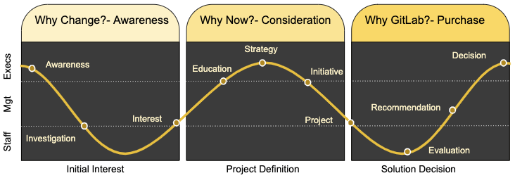

<!--

## On this page
{:.no_toc .hidden-md .hidden-lg}

- TOC
{:toc .hidden-md .hidden-lg}
-->

## UseCase driven Go to market

The [Customer Use-Cases](/handbook/use-cases/) page defines 8 customer use cases which are the typical problems that a customer selects Gitlab to solve. In product marketing we a focus on GitLab stages **and** we also develop and curate collateral that aligns with a buyer's journey supporting the use cases.

## Buyer's journey and typical collateral

As a prospect is determining that they have a specific problem to solve, they typically go through several stages of a [buyer's journey](/handbook/marketing/corporate-marketing/content/#content-stage--buyers-journey-definitions) which we hope ultimately leads them to selecting GitLab as their solution of choice.

| **Awareness** | **Consideration** | **Decision/Purchase** |
|----|----|----|
| Collateral and content designed to reach prospects in this stage of their journey should be focused on **educating them about the problems they are facing**, the business impact of their problems, and the reality that others are successfully solving the same problem | Collateral and content designed to reach prospects in this stage of their journey should be focused on **positioning GitLab as a viable and compelling solution to their specific problem.** | Collateral and content designed to reach prospects in this stage of their journey should be focused on key information that a buyer needs to **justify GitLab as their chosen solution**. |
| Typical **Awareness** Collateral | Typical **Consideration** Collateral | Typical **Decision/Purchase** Collateral |
|  **-** White papers describing the problem space   **-** Infographics illustrating the impact of the problem/challenge   **-** Analyst reports describing the problem/domain    **-** Webinars focusing on the problem and how can be solved   **-** Troubleshooting guides to help overcome the problem    **-** Analysis of public cases where the problem impacted an organization (i.e. outage, data loss, etc) | **-** White papers describing the innovative solutions to the problem   **-** Infographics illustrating the success and impact of solving the problem   **-** Analyst reports comparing different solutions in the market (MQ, Waves, etc)   **-** Webinars focusing on the success stories and how gitlab helped solve the problem   **-** Customer Case Studies, Videos, Logos, etc   **-** Solution Check Lists / Plans for how to solve the problem   **-** Comparisons between GitLab and other solutions | **-** ROI calculators   **-** Use case specific implementation guides   **-** Use Case migration guides (from xyz to GitLab)   **-** Getting Started info   **-** References and case studies |

## Buyer's Journey - Audience

There are different audiences in an organization with different needs at different times. The general model for the buyer's journey outlines kinds of collateral that is needed at different stages of the buying cycle. It is incredibly important to understand the needs of the audience when creating collateral. Executives, managers, and individual contributors will need different information to support their specific work.

- **Executives** will need information about business value, risk, cost, and impact to support strategic objectives
- **Managers** will need more detailed information to drive planning, justification, and migration details.
- **Contributors** need technical details about how it works, how it's better, and how it's going to help them in the future.

### UseCase GTM Bill of Material Priorities

<iframe width="1300" height="1100" src="https://docs.google.com/spreadsheets/d/e/2PACX-1vTptvo1N7m8tjLSgJFOoy8l2fhnJmlyS83JhsT2DU6Ki3x1tcJ0Jd4Y4nvDnz0EbLEddAzpWHQYMWVs/pubhtml?gid=925009631&amp;single=true&amp;widget=true&amp;headers=false"></iframe>

https://docs.google.com/spreadsheets/d/1K78pI_sqS91o8fpMReCF5n7gf7tZjCFxU4PjX2uddxk/edit#gid=2033522968

### Tracking Progress

We will use Epics and Milestones to track our overall progress of creating and activating these usecases.

1. This [Epic Roadmap](https://gitlab.com/groups/gitlab-com/marketing/-/roadmap?label_name%5B%5D=usecase-gtm&layout=MONTHS&scope=all&sort=start_date_asc&state=opened&utf8=%E2%9C%93_ ) view shows the current Epics that are actively being workd.
1. This [Milestone](https://gitlab.com/gitlab-com/marketing/product-marketing/-/milestones/9) is tracking all the issues in the UseCase GTM Sprint #1 (Feb 2020)

Overview of the setup in GitLab

